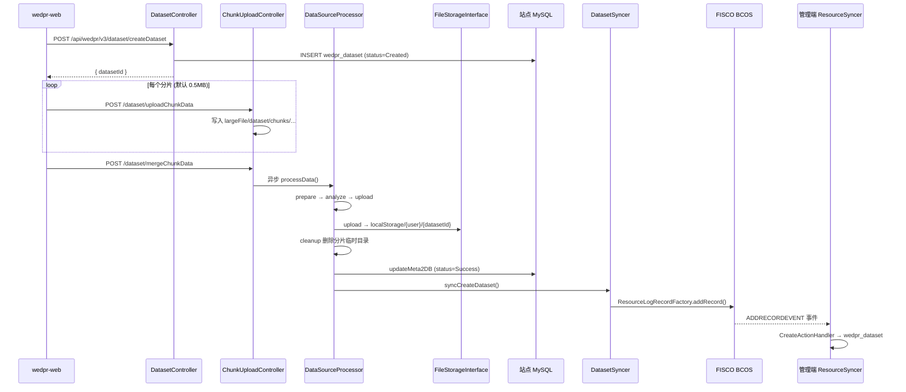
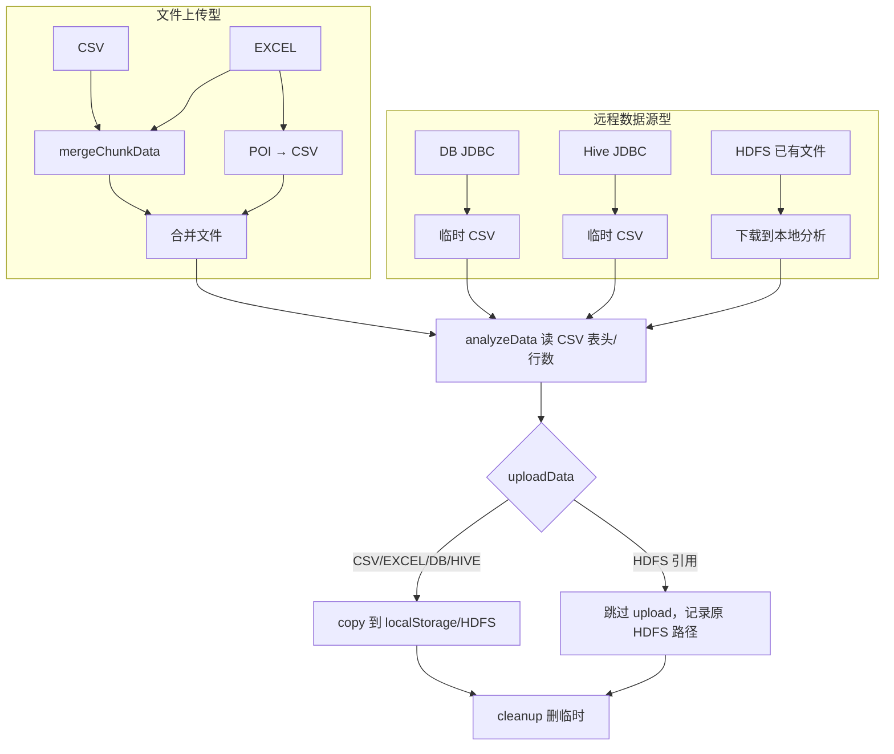

# Phase3：站点端数据上传全流程

> 本文档基于 WeDPR 源码，详细说明**站点端数据上传**的完整链路（本地落盘、区块链存证、元数据同步），以及**不同格式数据在参与隐私计算任务时的统一输入/输出接口规范**。  
> 前置阅读：[`phase1_admin_site_integration.md`](phase1_admin_site_integration.md)、[`phase2_site_runtime.md`](phase2_site_runtime.md)。

---

## 1. 文档范围与核心结论

### 1.1 范围

| 模块 | 代码路径 | 说明 |
|------|---------|------|
| 数据集 API | `wedpr-components/dataset/controller/*` | 创建、分片上传、下载 |
| 数据源处理器 | `wedpr-components/dataset/datasource/processor/*` | 五种格式解析与落盘 |
| 存储抽象 | `wedpr-components/storage/*` | LOCAL / HDFS |
| 链上同步 | `wedpr-components/dataset/sync/*` + `wedpr-components/sync/*` | 元数据存证 |
| 任务调度 | `wedpr-components/scheduler/*` | PSI / MPC / ML / PIR 读数 |
| 前端上传 | `wedpr-web/src/mixin/uploadFile.js` | 分片与 MD5 |

### 1.2 核心结论

1. **原始数据文件始终落在站点端**（LOCAL 或 HDFS），**不会** HTTP 上传到管理端。
2. 除 HDFS「引用已有 CSV 文件」外，**所有格式最终归一化为 CSV** 再分析和持久化；隐私计算任务**只读 CSV 形态**的存储文件（**不支持图片、视频等非结构化媒体**，详见 §1.3）。
3. 处理成功后，站点通过 `DatasetSyncer` 将 **Dataset 元数据 JSON** 写入 FISCO BCOS 合约；管理端/其他站点通过 `ResourceSyncer` 订阅链上事件，镜像到本地 `wedpr_dataset`。
4. 链上同步会 **剥离 `dataSourceMeta`**（DB 密码、SQL 等敏感连接信息不上链）。
5. 任务侧统一通过 **`FileMeta` + `datasetID`** 引用数据集；运行时 `obtainDatasetInfo()` 从 DB 解析 `datasetStoragePath`，再 `FileStorageInterface.download()` 读本地/HDFS 文件。

### 1.3 支持的数据形态与边界说明

> **一句话**：WeDPR 当前版本是**表格型（Structured / Tabular）隐私计算平台**，不是通用的非结构化媒体存储或深度学习数据管道。

> **源码核实结论（2026-06，已逐文件确认）**：「不支持图像/视频」属实，证据链如下：
> 1. **枚举封闭**：`DataSourceType`（`db-mapper/dataset/.../DataSourceType.java`）只有 `CSV, EXCEL, DB, HDFS, HIVE` 五值，`fromStr()` 对未知类型直接 `throw new DatasetException("Unsupported data source type")`。
> 2. **分发器封闭**：`DataSourceProcessorDispatcher` 构造时只 `registerDataSourceProcessor` 这五种，且 static 块对每种类型预检；无任何 IMAGE/VIDEO 处理器，目录下也仅有 Csv/Xlsx/DB/Hdfs/Hive 五个 Processor。
> 3. **分析阶段强制按 UTF-8 文本解析**：所有 Processor 的 `analyzeData()` 最终走 `CsvUtils.readCsvHeader()`，内部 `Files.newBufferedReader(path, StandardCharsets.UTF_8)` + `CSVReader`。二进制媒体（PNG/MP4）会触发 `MalformedInputException` 或解析出乱码表头 → 数据集进 `Failure`，无法 `Success`，故不能参与任务。
> 4. **前端入口封闭**：`wedpr-web/src/views/dataCreate/index.vue` 上传控件 `accept=".csv"` / `accept=".xls,.xlsx"`，下拉仅 CSV/EXCEL/DB/HDFS/HIVE 分支，无图像/视频入口。
> 5. **全仓无媒体处理代码**：Java 侧搜索 `IMAGE/VIDEO/AUDIO/multimodal/tensor/embedding` 仅命中登录验证码（`image-code`），与数据集管道无关。


#### 1.3.1 支持 vs 不支持

| 类别 | 是否支持 | 说明 |
|------|---------|------|
| CSV 文本表格 | ✅ | 原生支持，直接上传 |
| Excel 表格（.xlsx 等） | ✅ | 上传后 POI 转为 CSV |
| 关系型数据库表（MySQL/PostgreSQL/达梦等） | ✅ | JDBC 导出为 CSV |
| Hive 表（SQL 查询结果） | ✅ | Hive JDBC 导出为 CSV |
| HDFS 上的 **CSV 文件** | ✅ | 引用已有路径，不复制 |
| 图片（PNG/JPG/GIF/WebP 等） | ❌ | 无数据源类型、无解码器 |
| 视频（MP4/AVI 等） | ❌ | 同上 |
| 音频、PDF、Word、二进制模型权重等 | ❌ | 同上 |
| JSON Lines / Parquet / ORC 等 | ❌ | 枚举与 Processor 均未实现 |

源码硬编码的数据源枚举（`DataSourceType`）仅有五种：

```java
public enum DataSourceType {
    CSV, EXCEL, DB, HDFS, HIVE;
}
```
站点前端「数据来源」下拉（`wedpr.dataset.dataSourceType` 配置）与此完全一致，**不包含** IMAGE、VIDEO 等选项。

#### 1.3.2 「归一化为 CSV」的准确含义

文档 §1.2 第 2 点应理解为两层含义：

| 层次 | 含义 |
|------|------|
| **产品能力** | 只接受**结构化表格数据**（行 + 列 + 字段名） |
| **内部实现** | 除 HDFS「引用已有 CSV 文件」外，其余来源在 `prepareData` 阶段都会**生成 CSV 文件**再落盘；任务侧统一用 `CSVFileParser` / `CsvUtils.readCsvHeader` 读取 |

因此：**不是「能存图片但不能算」，而是从上传入口到 PSI/MPC/ML/PIR 执行，整条链路都未为非表格媒体设计。**

#### 1.3.3 HDFS 也不能绕过表格限制

HDFS 类型语义是「引用 HDFS 上**已有的 CSV 文件**」，而非任意对象存储：

- `HdfsDataSourceProcessor.prepareData()` 将 HDFS 文件下载到本地临时目录
- `analyzeData()` 调用 `CsvUtils.readCsvHeader()` 解析表头

若在 HDFS 上放置 PNG/MP4 并填写其路径，**analyzeData 阶段会失败**，数据集无法进入 `Success` 状态，不能参与任务。

#### 1.3.4 强行上传非表格文件会怎样

| 途径 | 结果 |
|------|------|
| 通过 CSV 入口上传图片/视频 | 分片合并可能成功，但 `readCsvHeader` / 行数统计失败 → `status=Failure` |
| 通过 HDFS 引用二进制文件 | 下载后 CSV 解析失败 → 同上 |
| 数据集未 Success | `DatasetStoragePathRetriever` 拒绝被任务引用 |

#### 1.3.5 任务层对数据形态的假定

所有内置隐私计算任务均按 **CSV 列** 处理数据：

| 任务 | 读数方式 | 数据模型 |
|------|---------|---------|
| PSI | `CSVFileParser.extractFields(idFields)` | 按列名提取关联键 |
| MPC | `MpcUtils.makeDatasetToMpcDataDirect()` | 数值/文本列 → MPC 份额 |
| ML | `datasetPath` + `idFields` / `labelField` | 联邦表格机器学习 |
| PIR | `CSVFileParser.processCsvContent()` 逐行 INSERT | 键值型表格查询 |

没有图像解码、视频帧提取、Embedding 管道或多模态 Tensor 交换逻辑。

#### 1.3.6 若业务需要图片/视频/非结构化数据

标准产品**不提供**开箱能力，但有四条二次开发路径（按改动量从小到大）：

| 路径 | 工作量 | 能否复用现有 PSI/MPC/ML |
|------|--------|------------------------|
| ① 站外特征化为 CSV（**强烈推荐**） | 小 | ✅ 完全复用 |
| ② 扩展 `DataSourceProcessor`（落盘仍为 CSV） | 中 | ⚠️ 取决于落盘格式 |
| ③ HDFS 存原始媒体 + 旁路 Worker | 大 | ❌ 另起管道 |
| ④ 联邦大模型 / 多模态 | 很大 | ❌ 另起管道 |

> 完整方案（每条的改动点、隐私语义、选型建议）见 **§8.4 接入图像/视频/非结构化数据**。

---

## 2. 数据上传全流程总览

### 2.1 端到端时序（以 CSV 文件上传为例）


### 2.2 两类入口

源码：`DataSourceType.isUploadDataSource()` 仅 **CSV、EXCEL** 为文件上传型。

| 分类 | 类型 | 创建数据集后 | 触发 `processData` |
|------|------|-------------|-------------------|
| **文件上传型** | CSV、EXCEL | 返回 `datasetId`，等待分片 | `mergeChunkData` 接口 |
| **远程数据源型** | DB、HDFS、HIVE | `createDataset` 后立即异步处理 | `DatasetServiceImpl.createDataset()` 内线程池 |
| **动态数据源** | DB/HIVE（`dynamicDataSource=true`） | 直接 Success，不跑 processData | **任务执行时** `DatasetStoragePathRetriever` |

### 2.3 统一处理管道

所有 Processor 实现 `DataSourceProcessor.processData()`，模板方法固定如下顺序（`DataSourceProcessor.java:33`）：

```
prepareData()                          →  准备（合并分片 / 格式转换 / 拉取远程数据）
analyzeData()                          →  分析（表头、行数、MD5、文件大小）
DifferentialPrivacyProcessor.applyIfEnabled()       →  可选：差分隐私加噪（落盘前对指定数值列加噪，详见 §4.4）
uploadData()                           →  持久化到 FileStorageInterface
DifferentialPrivacyProcessor.uploadNoisedFileIfNeeded()  →  可选：HDFS 引用型在加噪后补落盘
cleanupData()                          →  清理临时文件（finally 块保证执行）
```

> 差分隐私加噪夹在 **analyze 与 upload 之间**：必须先拿到表头才能定位加噪列，且加噪在持久化前完成，因此存储层落盘的已是加噪后数据。仅 `differentialPrivacyMeta.enabled=true` 时生效，默认关闭。

分发器：`DataSourceProcessorDispatcher`

| dataSourceType | Processor |
|----------------|-----------|
| CSV | `CsvDataSourceProcessor` |
| EXCEL | `XlsxDataSourceProcessor` |
| DB | `DBDataSourceProcessor` |
| HDFS | `HdfsDataSourceProcessor` |
| HIVE | `HiveDataSourceProcessor` |

---

## 3. 站点端 API 规范

**前缀**：`/api/wedpr/v3/dataset`（`DatasetConstant.WEDPR_DATASET_API_PREFIX`）

### 3.1 创建数据集

**接口**：`POST /createDataset`

**请求体**（`CreateDatasetRequest`）：

| 字段 | 必填 | 说明 |
|------|------|------|
| `datasetTitle` | 是 | 标题 |
| `datasetDesc` | 否 | 描述 |
| `datasetLabel` | 否 | 标签 |
| `datasetVisibility` | 是 | 0=私有，1=公开 |
| `datasetVisibilityDetails` | 公开时必填 | JSON，可见范围 |
| `dataSourceType` | 是 | CSV/EXCEL/DB/HDFS/HIVE |
| `dataSourceMeta` | 视类型 | JSON 字符串，见 §4 |
| `approvalChain` | 是 | 审批链 JSON |

**响应**（`CreateDatasetResponse`）：`{ "datasetId": "d-xxxx" }`

**DB 初始状态**：

- 上传型（CSV/EXCEL）：`status = Created(1)`，等待分片
- 静态远程型：`status = Created`，异步处理后变 `Success(0)`
- 动态远程型：`status = Success(0)`，无 storagePath

### 3.2 分片上传（仅 CSV/EXCEL）

**接口**：`POST /uploadChunkData`（`multipart/form-data`）

| 字段 | 说明 |
|------|------|
| `datasetId` | 数据集 ID |
| `identifier` | 文件 MD5（前端 SparkMD5 计算） |
| `index` | 分片序号，从 0 开始 |
| `totalCount` | 分片总数 |
| `filesChunk` | 二进制分片 |

**接口**：`POST /mergeChunkData`（JSON）

| 字段 | 说明 |
|------|------|
| `datasetId` | 数据集 ID |
| `identifier` | 与上传时一致的 MD5 |
| `totalCount` | 分片总数 |

合并成功后 **异步** 执行 `processData()`，并在 finally 中 `updateMeta2DB` + `syncCreateDataset`。

### 3.3 前端分片策略

源码：`wedpr-web/src/mixin/uploadFile.js`

- 分片大小：**0.5MB**（`DefualtChunkSize = 0.5 * 1024 * 1024`）
- 全文件 MD5 作为 `identifier`
- 并发上传上限：**3**，失败重试最多 **5** 次

### 3.4 其余数据集接口

除创建/分片/合并外，`DatasetController` / `DownloadController` 还提供（前缀同为 `/api/wedpr/v3/dataset`）：

| 方法 | 路径 | 用途 |
|------|------|------|
| GET | `/getDataUploadType` | 返回支持的数据源类型（即五种枚举） |
| GET | `/queryDataset` | 查询单个数据集元数据 |
| POST | `/queryDatasetList` | 批量查询 |
| GET | `/listDataset` | 分页列表，支持多条件筛选 |
| GET | `/previewDatasetData` | 分页预览 CSV 原始数据（`pageSize` 默认 20、上限 100，走 `CsvUtils.readCsvPage`） |
| POST | `/updateDatasetMeta` / `/updateDataset` / `/updateDatasetList` | 更新元数据 / 单个 / 批量 |
| POST | `/deleteDataset` / `/deleteDatasetList` | 删除单个 / 批量 |
| GET | `/getDatasetStoragePath` | 取存储路径（任务侧引用用） |
| GET | `/getFileShardsInfo` | 下载前获取文件分片信息 |
| POST | `/downloadFileShardData` | 分片下载文件数据 |

- 批量操作（删除/更新）受 `wedpr.dataset.maxBatchSize`（默认 **32**）限制，超出抛异常。
- 下载分片大小由 `wedpr.storage.download.shardSize`（默认 **20MB**）控制。
- 单文件上传受 `spring.servlet.multipart.max-file-size`（默认 **20MB**）限制；分片机制使大文件能绕过单请求体限制。

> **关于 `approvalChain`**：源码核实，`createDataset` 要求该字段非空并落库（`Dataset.approvalChain`），但**数据集进入 `Success` 不依赖任何审批动作**——处理完成即自动置 Success。审批链字段供上层授权/审计流程消费，不构成数据上传的阻塞门槛。

---

## 4. 不同格式的解析与落盘

### 4.1 存储目录配置

站点配置（`wedpr-site/conf/application-wedpr.properties`）：

```properties
wedpr.dataset.largeFileDataDir=./wedpr/largeFile/     # 分片与临时 CSV
wedpr.storage.type=LOCAL                                 # 或 HDFS
wedpr.storage.local.basedir=./wedpr/localStorage/      # 正式数据
wedpr.datasource.datasetHash=SHA-256                   # 版本哈希算法
wedpr.dataset.datasource.excel.defaultSheet=0          # Excel 默认 Sheet
```
**路径规则**（`DatasetConfig`）：

| 用途 | 路径 |
|------|------|
| 分片目录 | `{largeFileDataDir}/dataset/chunks/{datasetId}/{identifier}/{totalCount}-{index}` |
| 合并临时文件 | `.../chunks/{datasetId}/{identifier}/merged-{identifier}` |
| 远程拉取临时 CSV | `{largeFileDataDir}/dataset/{datasetId}` |
| 正式存储（静态） | `{local.basedir}/{user}/{datasetId}` |
| 正式存储（动态 DB/Hive） | `{local.basedir}/{user}/dy/{timestamp}/{datasetId}` |

### 4.1.1 存储后端如何选定（LOCAL vs HDFS）

「正式存储」落在本地磁盘还是 HDFS，**完全由每个站点自己的配置项 `wedpr.storage.type` 决定**，与上传时选的 `dataSourceType` 无关。

选型链路（源码核实）：

```
wedpr.storage.type=LOCAL/HDFS
        │
        ▼
StorageBuilder.getInstance(type)          // storage/builder/StorageBuilder.java
   ├── "LOCAL" → LocalFileStorage          // 写站点服务器本地磁盘
   └── "HDFS"  → HDFSStorage               // 写远端 HDFS 集群
```

- `HDFSStorage` 上标注 `@ConditionalOnProperty(value = "wedpr.storage.type", havingValue = "HDFS")` + `@Component("fileStorage")`，仅当配置为 HDFS 时才作为 `fileStorage` Bean 注入。
- `HDFSStorage` 通过 Hadoop `FileSystem` 连接 `wedpr.storage.hdfs.url` 指向的 NameNode；支持 Kerberos（`wedpr.storage.hdfs.enableKrb5Auth=true` 时用 `loginUserFromKeytab`，否则用 `createRemoteUser(user)` 的弱身份）。
- `CsvDataSourceProcessor.uploadData()` 调用的是注入的 `FileStorageInterface.upload()`，因此**同一份上传代码**在 LOCAL 配置下写本地、在 HDFS 配置下写远端，processor 本身不感知差异。

> **关键区分**：`dataSourceType=HDFS`（§4.2 HDFS）是「引用 HDFS 上已有 CSV」，其 `uploadData()` 为**空操作**、不复制文件；而「把上传的数据真正存进 HDFS」靠的是全局 `wedpr.storage.type=HDFS`。两者是正交的概念，勿混淆。

### 4.1.2 客户端不直连存储

浏览器/客户端**永远不直接写 HDFS**。数据流固定为两段：

```
客户端浏览器 ──分片HTTP上传──> 站点端本地临时目录(largeFileDataDir) ──FileStorage.upload()──> LOCAL磁盘 / 远端HDFS
```

1. **第一段（恒走站点本地磁盘）**：前端按 0.5MB 分片 + 全文件 MD5 上传到 `/uploadChunkData`，分片先写站点服务器 `largeFileDataDir`；`mergeChunkData` 合并并校验 MD5。
2. **第二段（走哪取决于 `wedpr.storage.type`）**：合并后异步 `processData()` 的 `uploadData()` 阶段，由注入的 `FileStorageInterface` 决定落 LOCAL 还是 HDFS。

因此「客户端上传的数据能否到远端 HDFS」的答案是：**配 `wedpr.storage.type=HDFS` 即可，但必经站点端中转，客户端只和站点 HTTP 接口交互。**

### 4.2 各格式处理差异


#### CSV

| 阶段 | 行为 |
|------|------|
| prepareData | `ChunkUploadImpl.mergeChunkData()` 合并分片，校验 MD5 |
| analyzeData | `CsvUtils.readCsvHeader()` + `FileUtils.getFileLinesNumber()` |
| uploadData | `LocalFileStorage.upload()` → `{user}/{datasetId}` |
| cleanupData | `cleanChunkData()` 删除 chunks 目录 |

合并时 MD5 校验（`ChunkUploadImpl`）：合并过程中对分片字节流计算 digest，与前端 `identifier` 比对，不一致则 `Hash value mismatch`。

`mergeChunkData()` 的健壮性细节（`ChunkUploadImpl.java`）：

- **完整性检查**：按 `0..totalCount-1` 逐个核对分片文件存在，缺片直接报错。
- **并发保护**：合并时用 `FileChannel.tryLock()` 对合并文件加锁，防止重复触发。
- **双哈希**：同时累计 `identifier`（与前端 MD5 比对）和 `datasetVersionHash`（按 `wedpr.datasource.datasetHash` 算法，作为版本哈希落库）。
- 兼容 `0x` 前缀的十六进制 identifier。

#### EXCEL

继承 CSV，额外在 `prepareData` 中：

```java
CsvUtils.convertExcelToCsv(mergedFilePath, cvsFilePath, excelDefaultSheet);
```
- 使用 Apache POI 读取指定 Sheet（默认第 0 个）
- 按单元格类型（STRING/NUMERIC/BOOLEAN/BLANK）写入 CSV
- 后续分析与存储针对 **转换后的 CSV**

#### DB

**dataSourceMeta**（`DBDataSource` JSON）：

```json
{
  "dbType": "MYSQL",
  "dbIp": "127.0.0.1",
  "dbPort": 3306,
  "database": "test",
  "userName": "<加密>",
  "password": "<加密>",
  "sql": "SELECT id, name FROM t_user",
  "dynamicDataSource": false,
  "verifySqlSyntaxAndTestCon": true,
  "encryptionModel": true
}
```
| 阶段 | 行为 |
|------|------|
| parseDataSourceMeta | 解密账号密码；可选 SQL 校验 + 连通性测试；仅允许单条 SELECT |
| prepareData | `CsvUtils.convertDBDataToCsv(jdbcUrl, user, passwd, sql, tmpPath)` |
| analyzeData | 读 CSV 表头、行数、MD5、文件大小 |
| uploadData | 上传到 `{user}/{datasetId}` 或 `{user}/dy/{ts}/{datasetId}` |
| cleanupData | 删除 `{largeFileDataDir}/dataset/{datasetId}` 临时目录 |

#### HIVE

**dataSourceMeta**（`HiveDataSource`）：

```json
{
  "sql": "SELECT id, feature FROM hive_table",
  "dynamicDataSource": false
}
```
- JDBC 连接来自站点 `HiveConfig`（非 dataSourceMeta）
- 处理流程与 DB 相同：`convertDBDataToCsv` → analyze → upload → cleanup

#### HDFS

**dataSourceMeta**（`HdfsDataSource`）：

```json
{
  "filePath": "/user/wedpr/agency0/data.csv"
}
```
**前置条件**：`wedpr.storage.type` 必须为 **HDFS**，且文件已存在于 HDFS。

| 阶段 | 行为 |
|------|------|
| parseDataSourceMeta | 校验 HDFS 文件存在 |
| prepareData | `fileStorage.download(hdfsPath → 本地临时)` |
| analyzeData | 读 CSV 表头/行数；**直接设置 storagePath 为原 HDFS 路径** |
| uploadData | **空操作**（不复制文件） |
| cleanupData | 删除本地临时下载 |

### 4.3 落盘后的 Dataset 元数据字段

处理成功写入 `wedpr_dataset` 的关键字段：

| 字段 | 来源 |
|------|------|
| `datasetFields` | CSV 表头，逗号分隔 |
| `datasetColumnCount` | 列数 |
| `datasetRecordCount` | 行数（不含表头） |
| `datasetVersionHash` | 文件内容哈希（SHA-256 或配置算法） |
| `datasetSize` | 字节大小 |
| `datasetStorageType` | LOCAL 或 HDFS |
| `datasetStoragePath` | JSON，如 `{"storageType":"LOCAL","filePath":"/abs/path/..."}` |
| `status` | 0 = Success |

### 4.4 差分隐私加噪（落盘前可选环节）

源码：`DifferentialPrivacyProcessor.java` + `DifferentialPrivacyUtils.java`。在 `processData()` 的 **analyze 与 upload 之间**对指定数值列加噪（见 §2.3）。

**配置（`differentialPrivacyMeta`，建数据集时随请求传入，存 `wedpr_dataset.differential_privacy_meta`）**：

| 字段 | 默认 | 说明 |
|------|------|------|
| `enabled` | `false` | 总开关，关闭则整段跳过 |
| `mechanism` | `laplace` | `laplace` 或 `gaussian` |
| `epsilon` | 无（必填） | 隐私预算，必须 > 0 |
| `delta` | 无 | 仅高斯机制需要，须 ∈ (0,1) |
| `sensitivity` | `1.0` | 敏感度，必须 > 0 |
| `columns` | `[]` | 加噪目标列名，必须存在于表头 |

**加噪算法（`DifferentialPrivacyUtils.sampleNoise`）**：

- 拉普拉斯：`scale = sensitivity / ε`，噪声 `= -scale · sign(u) · ln(1-2|u|)`，`u ~ U(-0.5, 0.5)`
- 高斯：`σ = sensitivity · √(2·ln(1.25/δ)) / ε`，噪声 `= N(0,1) · σ`

**处理细节**：

- 逐行读 CSV，仅对 `columns` 命中的列加噪；**非数值单元格跳过**（`NumberFormatException` 记 warn），空值跳过。
- 加噪写入 `csvPath + ".dp.tmp"`，再 `Files.move` 覆盖原文件；随后 `refreshDatasetFileMeta` **重算 `datasetSize` 与 `datasetVersionHash`**（哈希基于加噪后内容）。
- **HDFS 引用型的特殊处理**：HDFS 数据源 `uploadData()` 本是空操作（只引用原文件），但一旦加噪，原 HDFS 文件不能被改写，故 `uploadNoisedFileIfNeeded()` 把加噪后的本地文件**额外落盘到用户存储目录**，并把 `datasetStoragePath` 改指向这份新文件。这正是 `processData()` 在 upload 后还要再调一次该方法的原因。

> 含义：开启差分隐私后，**存储层及后续所有任务读到的都是加噪数据**，原始精确值不再参与计算；隐私预算 ε 越小噪声越大。

### 4.5 DB/Hive 凭据的 SM2 加解密

DB 数据源 `dataSourceMeta` 里的 `userName`/`password` 为**前端 SM2 加密**后传入（`encryptionModel=true` 时）：

- 解密：`DBDataSourceProcessor.parseDataSourceMeta()` 调 `PasswordHelper.decryptPassword(cipher, privateKey)`，内部 `SM2Helper.decrypt`；私钥取自 `UserJwtConfig.getPrivateKey()`。
- 前端 JS 的 SM2 密文后端需补 `04` 前缀再解密（`PasswordHelper.java:18` 注释）。
- 落库前 `SQLUtils.clearDbDataSource()` 清理敏感连接信息；且链上同步会整体剥离 `dataSourceMeta`（§5.1），故 DB 密码/SQL 既不明文落库也不上链。

---

## 5. 区块链存证与元数据同步

### 5.1 站点端写入链

处理成功后（`ChunkUploadController.mergeChunkData` 或 `DatasetServiceImpl.createDataset` 异步回调）：

```java
datasetSyncer.syncCreateDataset(userInfo, dataset);
```
`DatasetSyncer.syncCreateDataset()`：

1. `dataset.resetMeta()` — **清空 `dataSourceMeta`**，保留 storagePath、fields、hash 等
2. 序列化 `Dataset` 为 JSON
3. 构建 `ResourceActionRecord`（agency + resourceType=Dataset + action=CREATE）
4. 调用 `ResourceSyncer.sync()` → `BlockChainResourceSyncImpl`

链上写入（`BlockChainResourceSyncImpl.sync()`）：

```
resourceLogRecordFactoryContract.addRecord(record.serialize(), version, callback)
```
状态流转：`WAITING_SUBMIT_TO_CHAIN` → `SUBMITTED_TO_CHAIN` → `SUBMITTED_TO_CHAIN_SUCCESS/FAILED`

### 5.2 订阅端消费（管理端 / 其他站点）

Leader 节点通过 `EventSubscribe` 订阅 `ADDRECORDEVENT`，`ResourceSyncEventHandler` 解析事件后调用已注册的 `CommitHandler`。

数据集处理器：`DatasetSyncerCommitHandler`

- **忽略本机构消息**：`if (agency.equals(myAgency)) return;`（防止重复写入）
- **CREATE** → `CreateActionHandler` → `transactionalAddDataset()` 写入本地 DB
- **UPDATE** → `UpdateActionHandler`
- **REMOVE** → `RemoveActionHandler`

### 5.3 管理端可见 vs 不可见

| 同步到管理端 | 不同步 |
|-------------|--------|
| datasetId、title、desc、label | 原始文件内容 |
| datasetFields、recordCount、columnCount | dataSourceMeta（DB 密码/SQL） |
| datasetVersionHash（链上存证哈希） | 分片临时文件 |
| datasetStorageType、datasetStoragePath（路径描述） | — |
| ownerAgencyName、ownerUserName、visibility | — |

管理端 API（只读）：`GET /api/wedpr/v3/admin/listDataset`、`GET /api/wedpr/v3/admin/queryDataset`

> 管理端 `datasetStoragePath` 仅为**路径描述**，文件仍在站点磁盘/HDFS，管理端无法通过标准接口读取原始内容（详见 phase1 §6.3）。

### 5.4 多站点部署下的存储隔离（数据不出域）

多个企业各自部署 wedpr-site 时，**原始数据文件不会跨机构流动**。这由两个事实保证：

1. **存储后端是「每站点私有配置」**：`wedpr.storage.type` / `wedpr.storage.hdfs.url` 是每个站点自己 `serviceConfigPath` 下的配置，平台**没有全局共享存储**概念，也没有把原始文件跨站点复制的逻辑。站点 A 的 `FileStorage` 只连 A 配置的存储，永不解析、连接 B 的 HDFS。
2. **跨机构只有两条通道，均不碰原始文件**：
   - **元数据**：走 FISCO BCOS，仅同步字段名/行数/哈希/路径描述，且剥离 `dataSourceMeta`（§5.1）。
   - **隐私计算**：走统一网关（`ppc-gateway-service`，gRPC），交换密文/中间产物。

| 部署拓扑 | 后果 |
|---------|------|
| 每企业指向自己域内 HDFS（推荐） | 原始数据只进本企业 HDFS，他方拿不到 —— 符合「数据不出域」 |
| 多企业共用同一 HDFS 集群（错误） | 该 HDFS 物理持有所有企业明文，掌控者可读全部数据，隐私边界被破坏 |

> **互通关系**：HDFS 之间**不需要也不应互通**；需要互通的是**网关之间**（gRPC 跨机构路由，只传密文）与**区块链**（接入同一条链同步元数据）。
> **安全建议**：即便在自己域内，跨企业生产部署应开启 `wedpr.storage.hdfs.enableKrb5Auth=true`，避免 `createRemoteUser` 弱身份导致内部人员直读明文。

---

## 6. 隐私计算任务如何消费数据集

数据集入库（`status=Success`）后，隐私计算任务通过 **`FileMeta` + `datasetID`** 引用它，运行时 `obtainDatasetInfo()` 从本站点 DB 解析 `datasetStoragePath`，再由各 Executor Hook `download` 到本地缓存参与计算。PSI / MPC / ML / PIR 四类任务的统一数据模型、各自的输入/输出规范、中间产物与文件命名、以及「各数据源格式 → 任务输入」的对照，已独立成篇：

> **详见 [`Phase4_隐私计算任务详解.md`](Phase4_隐私计算任务详解.md)**

要点速览：

- 任务侧**只消费已落盘的 CSV**，不感知原始 `dataSourceType`；创建任务只需传 `datasetID` 与列配置（`idFields` / `labelField`）。
- 每方只读**自己站点**的数据集，prepare 阶段做字段最小化（如 PSI 仅抽 `idFields`），跨机构经网关交换的只有密文/中间产物。
- 只有 `status=Success(0)` 的数据集可被任务引用（见 §7 状态机）。

---

## 7. Dataset 状态机

| code | 枚举 | 含义 |
|------|------|------|
| 0 | Success | 可用，可参与任务 |
| 1 | Created | 已创建，等待上传/处理 |
| -1 | Failure | 失败，可重试 |
| -2 | Fatal | 致命失败 |
| 2–8 | DataAnalyzing / Uploading / Merging 等 | 处理中间态 |

任务读取数据集前会校验（`DatasetStoragePathRetriever`）：

```java
if (status != DatasetStatus.Success.getCode()) {
    throw new DatasetException("dataset is not available status");
}
```
---

## 8. 二次开发指引

### 8.1 新增数据源格式

1. 实现 `DataSourceProcessor` 四阶段，**prepareData 阶段归一化为 CSV**
2. 在 `DataSourceProcessorDispatcher` 注册
3. 在 `DataSourceType` 枚举中添加类型
4. 任务侧 **无需修改**（自动通过 FileMeta 读 CSV）

### 8.2 差分隐私 / 联邦大模型微调

- **数据上传链路**：复用现有 Processor + Storage，无需改管理端
- **任务 I/O**：在 `ModelJobParam` / Executor Hook 中扩展 prepare 逻辑；输入仍为 CSV path，输出写入 `{user}/MPC|ML/{jobId}/`
- **管理端**：继续只同步元数据；若需平台级模型 registry，可新增 ResourceType 走同一套 ResourceSyncer

### 8.3 管理端读取原始数据

标准架构 **不支持**。若业务必须，需自行实现站点代理下载 API，不在本文档范围内。

### 8.4 接入图像/视频/非结构化数据

承接 §1.3.6。四条路径按「改动量从小到大 / 推荐度从高到低」排列；前两条不动平台核心，后两条属于新算子级开发。

| 路径 | 改动范围 | 工作量 | 能否复用现有 PSI/MPC/ML | 隐私语义 |
|------|---------|--------|------------------------|---------|
| ① 站外特征化为 CSV（**强烈推荐**） | 仅站外预处理 | 小 | ✅ 完全复用 | 不变（仍是表格密态计算） |
| ② 扩展 `DataSourceProcessor` | 新增 Processor + 枚举 + 前端入口 | 中 | ⚠️ 取决于落盘是否仍为 CSV | 视实现而定 |
| ③ HDFS 存原始媒体 + 旁路 Worker | 新 JobParam + Hook + Gateway 协议 + C++ 算子 | 大 | ❌ 另起管道 | 需自行设计 |
| ④ 联邦大模型 / 多模态 | 全链路新设计 | 很大 | ❌ 另起管道 | 需自行设计 |

**① 站外特征化后再入库（推荐）**
在站点外完成预处理（CNN 提 Embedding、视频抽帧再提特征、音频转 MFCC 等），把结果写成 CSV（每行一个样本，列为特征向量分量 + 关联键 + 可选标签），再走现有 CSV 上传 + PSI/MPC/ML 流程。
- **优点**：零平台改动；隐私语义不变，跨机构仍只交换密文；与现有审批、链上存证、调度完全兼容。
- **代价**：特征工程在域内自行完成；图像/视频原文件不纳入 WeDPR 管理。
- 适用绝大多数「多方样本对齐 + 联合建模」场景。

**② 扩展 `DataSourceProcessor`（保持表格语义的前提下）**
若希望把「上传媒体 → 自动特征化」收进平台，可新增 Processor（与 §8.1 同一套扩展点）：
1. `DataSourceType` 枚举加 `IMAGE`/`VIDEO`；
2. 实现 `XxxDataSourceProcessor`，**在 `prepareData()` 内完成解码 + 特征提取，落盘仍为 CSV**（关键：让 `analyzeData()` 的 `readCsvHeader` 能正常解析）；
3. `DataSourceProcessorDispatcher.registerDataSourceProcessor()` 注册；
4. 前端 `dataCreate/index.vue` 加上传入口与 `accept`。
- **任务侧无需改动**：只要 `uploadData()` 产出的是 CSV，PSI/MPC/ML 通过 `FileMeta` 读到的仍是 CSV。
- **注意**：若想保留原始媒体二进制，需同时调整 `uploadData`/存储路径策略，且任务侧不会直接消费二进制。

**③ HDFS 存原始媒体 + 旁路 Worker（新算子）**
原始二进制放 HDFS，新增自定义任务类型在 Worker 中读取并计算。
- 需重新定义 `JobParam`、Executor `Hook`、Gateway 传输协议与对应 C++ 算子；
- `FileMeta` 可指向 HDFS 二进制路径，但 `CSVFileParser` 不再适用，需自写解析；
- 本质是「在 WeDPR 调度框架内挂一个新算子」，与现有 PSI/MPC 管道并行而非复用。

**④ 联邦大模型 / 多模态**
不能复用「CSV → FileMeta → CSVFileParser」管道。需在站点端单独设计参数格式、分片传输与 C++ 推理接口；数据上传链路可部分复用（Processor + Storage），但任务 I/O 与跨机构协议要重做（参见 §8.2）。

> **选型建议**：除非有「原始媒体必须由平台统一托管/审计」的硬需求，否则优先选 ①——它用最小成本拿到 WeDPR 的全部隐私保障；②适合产品化收口；③④仅在确需在密态下直接处理非结构化数据时才投入。


---

## 9. 关键源码索引

| 主题 | 路径 |
|------|------|
| 创建数据集 | `dataset/service/DatasetServiceImpl.java` |
| 分片上传 | `dataset/controller/ChunkUploadController.java` |
| 分片合并 | `dataset/service/ChunkUploadImpl.java` |
| CSV Processor | `dataset/datasource/processor/CsvDataSourceProcessor.java` |
| 处理管道模板 | `dataset/datasource/processor/DataSourceProcessor.java` |
| 差分隐私加噪 | `dataset/datasource/processor/DifferentialPrivacyProcessor.java` + `utils/DifferentialPrivacyUtils.java` |
| 差分隐私元数据 | `dataset/datasource/DifferentialPrivacyMeta.java` |
| DB 凭据 SM2 解密 | `crypto/PasswordHelper.java`（`DBDataSourceProcessor` 调用） |
| 数据集接口 | `dataset/controller/DatasetController.java` + `controller/DownloadController.java` |
| 存储后端选型 | `storage/builder/StorageBuilder.java` |
| HDFS 存储实现 | `storage/impl/hdfs/HDFSStorage.java` |
| HDFS 存储配置 | `storage/config/HdfsStorageConfig.java` |
| 链上同步 | `dataset/sync/DatasetSyncer.java` |
| 链订阅消费 | `dataset/sync/DatasetSyncerCommitHandler.java` |
| 区块链写入 | `sync/impl/BlockChainResourceSyncImpl.java` |
| 前端上传 | `wedpr-web/src/mixin/uploadFile.js` |

> 任务侧源码（`FileMeta`、PSI/MPC/ML 的 JobParam、PIR 构建、`DatasetStoragePathRetriever` 等）索引见 [`Phase4_隐私计算任务详解.md`](Phase4_隐私计算任务详解.md) §6。

---

## 10. 相关文档

- [隐私计算任务详解](Phase4_隐私计算任务详解.md) — PSI/MPC/ML/PIR 的数据 I/O 规范（本文档 §6 的展开）
- [管理端与站点端接入规范](phase1_admin_site_integration.md) — 元数据同步通道、管理端 API
- [站点端运行机制](phase2_site_runtime.md) — 启动、调度、API 分层
- [WeDPR 系统架构说明](WeDPR系统架构说明.md) — 整体架构
