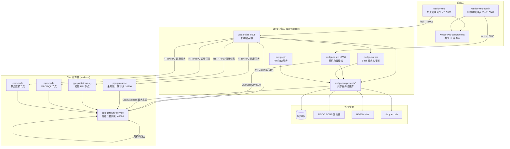
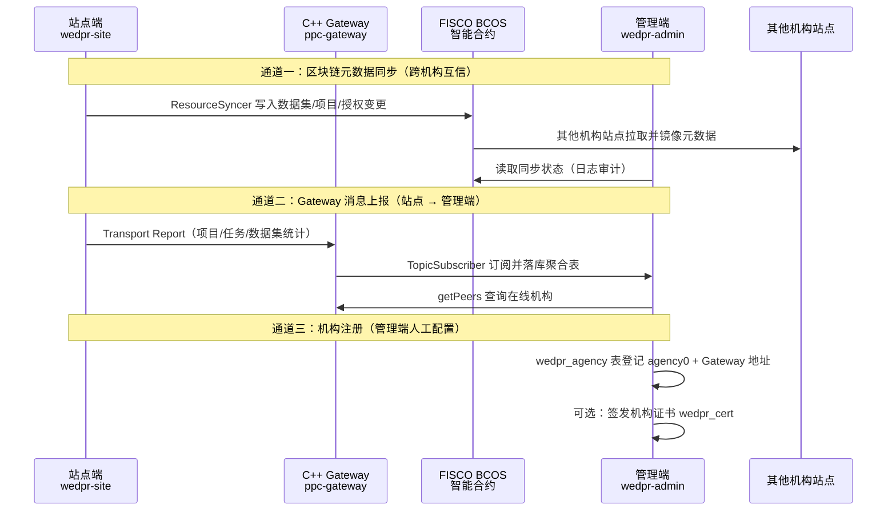
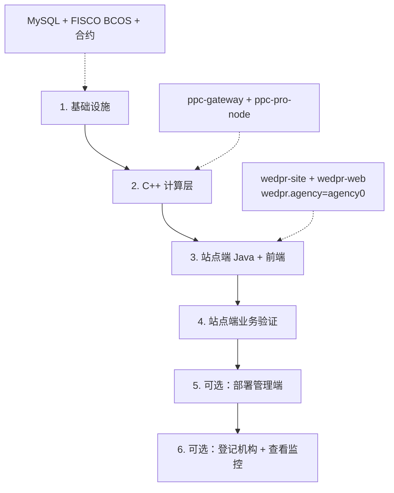
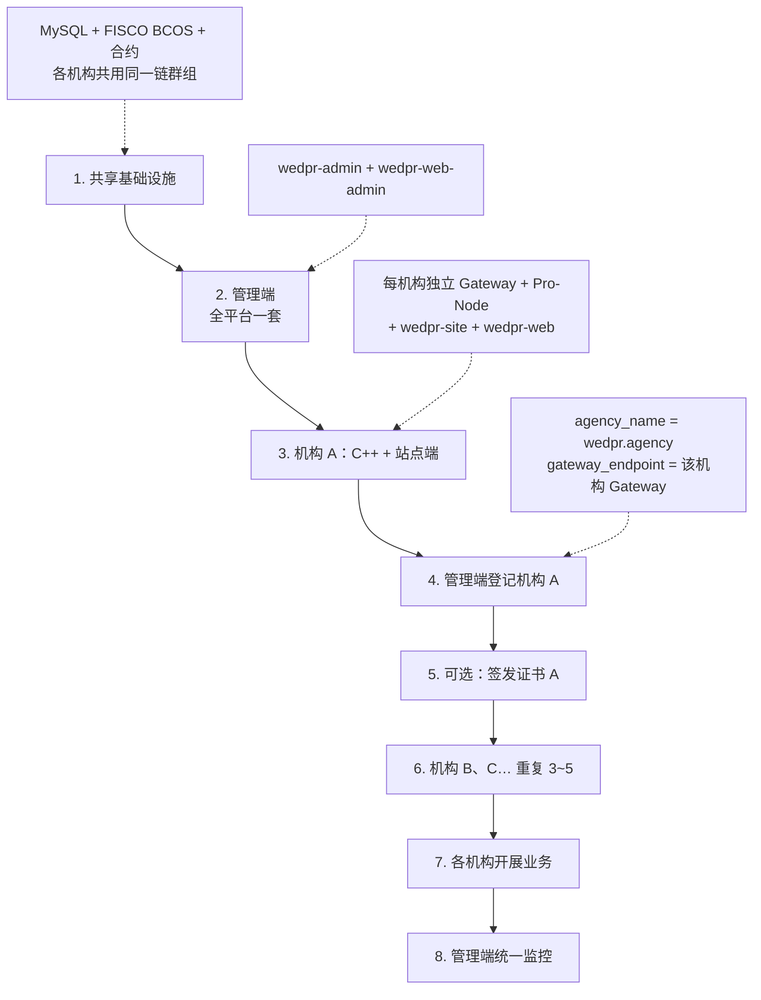
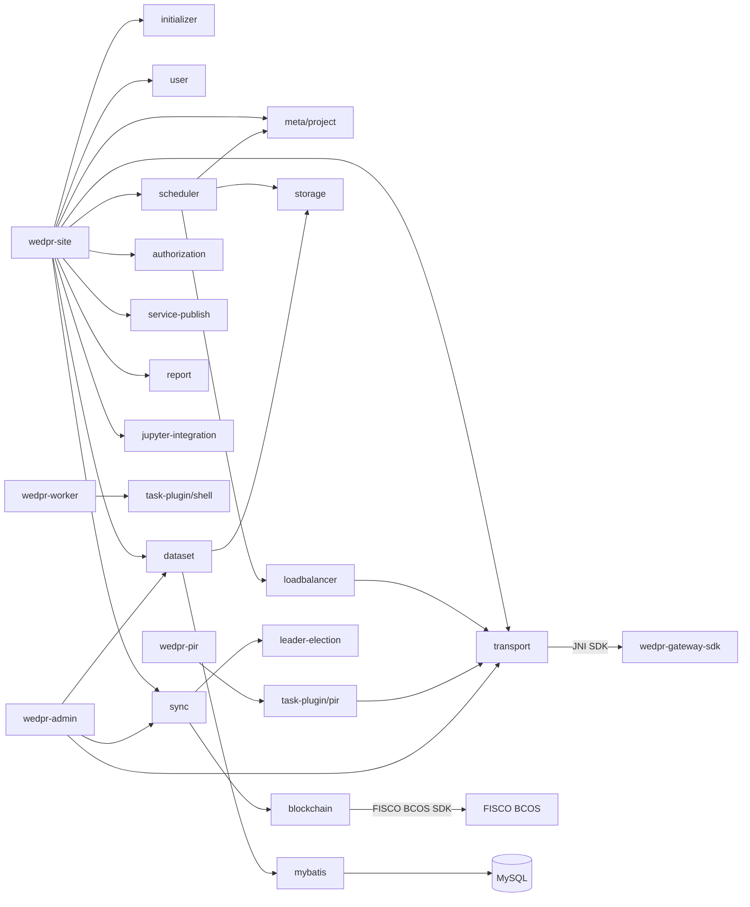

# WeDPR 系统架构说明

WeDPR 是微众银行开源的多方大数据隐私计算平台，采用**「前端管理台 + Java 业务层 + C++ 计算引擎 + 区块链跨机构同步 + 统一网关」**的分层微服务架构。工作区顶层由三个目录组成：

| 顶层目录 | 定位 |
|---------|------|
| ``frontend/ | Java 后端 + Vue 前端 + 智能合约 + 构建脚本 |
| ``backend/ | C++ 隐私计算核心（PSI/PIR/MPC/建模等） |
| `wedpr-cpp-deploy/` | C++ 节点运行时部署目录（gateway / pro-node 配置与启动脚本） |

---

## 一、整体架构视图


**架构模式总结：**

1. **模块化单体 + 可独立部署服务**：Java 侧用 Gradle 多模块共享 `wedpr-components`，各服务（site/admin/worker/pir）按需组合组件后独立启动。
2. **薄 Controller + 厚组件库**：`wedpr-site` 只做 API 暴露，核心业务逻辑在 `wedpr-components` 中复用。
3. **插件化任务执行**：通过 `task-plugin`（SPI 机制）扩展 PSI/PIR/Shell 等任务类型。
4. **网关中心化服务发现**：C++ 节点向 Gateway 注册，Java 侧通过 JNI Transport SDK + LoadBalancer 动态发现计算节点。
5. **区块链驱动的跨机构元数据同步**：机构间项目/任务/授权等资源变更通过 FISCO BCOS 智能合约（`wedpr-sol`）同步。

---

## 二、站点端与管理端

WeDPR 在业务上拆分为**站点端（Site）**与**管理端（Admin）**两套独立的前后端组合。二者**不是**「一个写业务、一个只读镜像」的简单关系，而是通过**区块链同步、网关消息上报、机构注册表**三条通道间接协作。

### 2.1 定位对比

| 维度 | 站点端（Site） | 管理端（Admin） |
|------|---------------|----------------|
| **部署数量** | 每个参与机构各部署一套 | 全平台通常只部署一套 |
| **前端** | `wedpr-web` `:3000` | `wedpr-web-admin` `:3001` |
| **后端** | `wedpr-site` `:8005` | `wedpr-admin` `:6850` |
| **核心职责** | 本机构业务运营：数据、项目、任务、审批、服务发布 | 跨机构治理与监控：机构注册、证书、全局大屏、审计 |
| **机构标识** | `wedpr.agency=agency0`（本机构英文名） | `wedpr.agency=WeBank`、`wedpr.admin_agency=ADMIN`（平台侧标识） |
| **登录角色** | `admin_user` / `group_admin` / `original_user` | `agency_admin` |
| **是否执行计算** | 是，调度 C++ 节点跑 PSI/PIR/MPC 等 | 否，不参与任务计算 |
| **数据库** | 本机构全量业务表（数据集、项目、任务、用户等） | 机构注册表（`wedpr_agency`）、证书表（`wedpr_cert`）及站点上报的聚合表 |

> **重要**：站点端在 `wedpr.properties` 里配置的 `wedpr.agency` **不会**自动出现在管理端机构列表；管理端需要在「机构管理」中**手动登记**，且机构名与 Gateway 地址必须与站点端实际配置一致。

### 2.2 功能说明

#### 站点端功能（`wedpr-web` 菜单）

站点端是各参与机构的**业务工作台**，面向本机构用户完成隐私计算全流程：

| 模块 | 路由 | 功能说明 |
|------|------|---------|
| **平台首页** | `/home` | 用户/用户组/数据/项目/服务数量概览，常用功能快捷入口 |
| **数据资源** | `/dataManage` | 数据集上传、元数据管理、授权申请与详情 |
| **项目空间** | `/projectManage` | 跨机构/本机构项目创建，向导模式与专家模式任务编排 |
| **服务发布** | `/serverManage` | PIR 匿踪查询、联合建模等对外服务发布与管理 |
| **凭证管理** | `/accessKeyManage` | API 访问密钥（AccessKey）管理 |
| **审批中心** | `/approveManage` | 数据集授权等审批流处理 |
| **消息通知** | `/messageManage` | 系统消息与待办提醒 |
| **日志审计** | `/logManage` | 本机构操作与任务审计日志 |
| **用户管理** | `/tenantManage` | 用户组、组内用户、角色与权限管理 |

**站点端后端额外能力**（无独立菜单，支撑上述功能）：

- 任务调度引擎（`scheduler`）→ 调用 C++ 计算节点
- 跨机构资源同步（`sync`）→ 写入 FISCO BCOS 智能合约
- Jupyter 专家模式（`jupyter`）
- 向管理端上报项目/任务/数据集统计（Transport Report Topic）

#### 管理端功能（`wedpr-web-admin` 菜单）

管理端是平台级**治理与监控中心**，面向平台运营人员：

| 模块 | 路由 | 功能说明 |
|------|------|---------|
| **数据总览大屏** | `/screen` | 跨机构数据集/任务/机构在线状态等全局可视化 |
| **数据资源** | `/dataManage` | 查看各机构同步/上报的数据集元数据（只读聚合） |
| **项目空间** | `/projectManage` | 查看各机构项目与任务运行概况（只读聚合） |
| **日志审计** | `/logManage` | 跨机构区块链同步记录（`wedpr_sync_status_table`）查询 |
| **证书管理** | `/certificateManage` | 机构 CSR 签发、证书启用/禁用、过期管理 |
| **机构管理** | `/agencyManage` | 登记参与机构、配置 Gateway 地址、启用/禁用机构 |

**管理端后端额外能力**：

- `TopicSubscriber`：经 Gateway 订阅站点端上报的 Project / Job / JobDataset 消息，写入管理端聚合表
- `WedprAgencyService.getAgencyStatistics()`：通过 Gateway `getPeers` 检测机构在线/故障
- 机构与证书的 CRUD（`WedprAgencyController`、`WedprCertController`）

#### 账号与权限分工（推荐实践）

站点端与管理端使用**不同角色**，不要混用同一账号：

| 端 | 推荐账号 | 角色 | 说明 |
|----|---------|------|------|
| 站点端 `:3000` | `admin` | `admin_user` | 本机构管理员，拥有全部站点菜单权限 |
| 管理端 `:3001` | `platform_admin` | `agency_admin` | 平台管理员，拥有机构/证书/大屏等管理端权限 |

### 2.3 站点端与管理端交互流程

站点端与管理端**之间没有直接的 HTTP 互调**；协作依赖以下三条通道：


#### 通道一：区块链元数据同步

- **触发方**：各站点端在创建/变更数据集、项目、授权等资源时，由 `ResourceSyncer` 写入链上合约（`wedpr-sol`）。
- **消费方**：其他机构站点通过 Sync 模块拉取并镜像到本地；管理端在「日志审计」中查询 `wedpr_sync_status_table` 查看同步状态。
- **配置要求**：所有站点端与管理端须连接**同一 FISCO BCOS 群组**，且 `wedpr.sync.recorder.factory.contract_address`、`wedpr.sync.sequencer.contract_address` 一致。

#### 通道二：Gateway Transport 上报

- **触发方**：站点端 `wedpr-site` 通过 JNI Transport SDK 连接本机构 Gateway，定期/事件驱动上报项目、任务、任务-数据集关系等统计。
- **消费方**：管理端 `TopicSubscriber`（`wedpr-admin/transport/TopicSubscriber.java`）注册 Report 组件，订阅 `PROJECT_REPORT`、`JOB_REPORT`、`JOB_DATASET_REPORT` 等 Topic，写入 `wedpr_project_table`、`wedpr_job_table` 等管理端聚合表，供大屏与列表展示。
- **配置要求**：管理端 `wedpr.transport.gateway_targets` 须能访问各机构 Gateway；站点端 Gateway 须正常运行且机构已在 Gateway 网络中注册。

#### 通道三：机构注册与证书

- **触发方**：平台管理员在管理端「机构管理」手动新增机构。
- **关键字段**：
  - `agency_name`：必须与站点端 `wedpr.agency` **完全一致**（如 `agency0`）
  - `gateway_endpoint`：站点端 Gateway 对外地址（如 `127.0.0.1:40600`）
- **证书**（生产环境推荐）：管理端「证书管理」为机构签发 TLS/身份证书；本地开发可关闭 SSL 跳过。

#### 典型业务时序（单机构接入后）

```
1. 管理端登记 agency0（Gateway 地址正确、状态启用）
2. 站点端 admin 登录，上传数据集、创建项目
3. 站点端 ResourceSyncer 将元数据写入区块链
4. 站点端 Transport 向 Gateway 上报项目/任务统计
5. 管理端 TopicSubscriber 接收上报 → 大屏/列表可见数据
6. 站点端发起 PSI 任务 → Scheduler 经 Gateway 调度 C++ 节点执行
7. 管理端「日志审计」可查看链上同步记录；「数据总览」展示聚合指标
```
### 2.4 部署与接入顺序

两种场景的推荐顺序不同。**共同前提**：无论哪种场景，都必须先就绪 MySQL、FISCO BCOS（含 `wedpr-sol` 合约部署）以及本机构的 C++ Gateway + 计算节点，站点端才能跑通隐私计算任务。

#### 2.4.1 单机构开发（本地验证）

适用：开发者在本机验证 PSI/PIR 等业务，**管理端可选**，不强制接入平台治理层。


| 步骤 | 组件 | 说明 |
|------|------|------|
| **1** | MySQL + FISCO BCOS | 建库建表；部署智能合约，记录合约地址到站点端配置 |
| **2** | C++ Gateway + Pro-Node | 本机至少一套 Gateway（如 `:40600`）和 pro-node（如 `:10200`） |
| **3** | 站点端 | 配置 `wedpr.agency`、MySQL、合约地址、Gateway 地址；启动 `wedpr-site` + `wedpr-web` |
| **4** | 业务验证 | 登录站点端，上传数据、建项目、跑 PSI 等任务，确认 C++ 层与区块链同步正常 |
| **5**（可选） | 管理端 | 需要查看全局大屏或练习机构管理时再部署 `wedpr-admin` + `wedpr-web-admin` |
| **6**（可选） | 登记接入 | 在管理端「机构管理」登记 `agency0`，管理端方可看到该机构上报数据 |

**特点**：

- 站点端**可先独立运行**，不依赖管理端启动或登记。
- 跨机构业务在本场景下通常只有一家机构，区块链同步链路可先验证，不必等管理端。
- 同机若后续补部署管理端，注意错开端口（前端 3000/3001，Transport 6001/6002）。

#### 2.4.2 多机构生产（正式组网）

适用：多个参与机构接入同一隐私计算平台，需要统一治理、监控与证书管理。**推荐先部署管理端，再逐家部署站点端并登记接入**。


| 步骤 | 组件 | 说明 |
|------|------|------|
| **1** | 共享基础设施 | 平台级 MySQL（或分库）、FISCO BCOS 群组、`wedpr-sol` 合约；各机构站点端与管理端使用**同一套合约地址** |
| **2** | 管理端 | 全平台部署**一套** `wedpr-admin` + `wedpr-web-admin`；配置 `gateway_targets` 预留各机构 Gateway 地址 |
| **3** | 各机构 C++ + 站点端 | 每个机构独立部署 Gateway（端口各机构不同）、计算节点、`wedpr-site` + `wedpr-web`；`wedpr.agency` 各机构唯一（如 `agency0`、`agency1`） |
| **4** | 机构登记 | 每部署完一家，即在管理端「机构管理」新增记录：`agency_name` 与站点端 `wedpr.agency` 一致，`gateway_endpoint` 指向该机构 Gateway 对外地址 |
| **5** | 证书（生产推荐） | 管理端「证书管理」为该机构签发证书；开发/测试环境可跳过 |
| **6** | 滚动接入更多机构 | 机构 B、C… 重复步骤 3~5；管理端无需重复部署 |
| **7** | 各机构业务 | 各站点端独立运营：上传数据、建项目、发起跨机构任务 |
| **8** | 平台监控 | 管理端通过 Gateway 上报 + 区块链同步记录，在大屏/审计中查看全局状态 |

**特点**：

- 管理端**先于各站点端**就绪，机构注册表、证书流程、监控能力从第一家机构上线起即可用。
- 站点端仍可在无管理端时启动，但**未登记前**管理端看不到该机构，也无法做在线检测与证书管理。
- 每个机构一套 C++ + 站点端；管理端始终只有一套，统一登记所有机构。
- 机构间跨机构计算依赖：**同一区块链群组** + **Gateway 网络互通** + **链上元数据同步**，与管理端是否登记无直接耦合，但生产环境应同步完成登记。

#### 2.4.3 两种场景对比

| 维度 | 单机构开发 | 多机构生产 |
|------|-----------|-----------|
| **管理端** | 可选，可后补 | **必须先部署**（步骤 2） |
| **站点端与管理端顺序** | 站点端优先 | 管理端优先 |
| **机构登记** | 可选 | **每机构必做**（部署后立即登记） |
| **证书** | 通常跳过 | 生产环境推荐 |
| **管理端数量** | 0 或 1 | 固定 1 套 |
| **站点端数量** | 1 | N（每参与机构 1 套） |
| **能否跑通 PSI** | 仅站点端即可 | 各机构站点端 + C++ 即可，与管理端无关 |

**共同注意事项**：

1. **管理端不能替代站点端**：管理端不做任务计算，也不自动发现机构，必须人工登记。
2. **接入管理端 ≠ 自动注册**：站点端配置 `wedpr.agency` 后，须在管理端手动新增同名机构并填写 Gateway 地址。
3. **同机多组件部署**：前端端口（3000/3001）、Transport 端口（6001/6002）、各机构 Gateway 端口均须错开。
4. **数据库**：开发环境站点端与管理端可共用 `wedpr` 库；生产环境可按平台规范分库，但合约地址与链群组必须一致。

### 2.5 关键配置对照

| 配置项 | 站点端示例 | 管理端示例 | 说明 |
|--------|-----------|-----------|------|
| `wedpr.agency` | `agency0` | `WeBank` | 站点为本机构名；管理端为平台侧标识 |
| `wedpr.admin_agency` | — | `ADMIN` | 仅管理端，标识平台管理机构 |
| `wedpr.transport.gateway_targets` | `ipv4:127.0.0.1:40600` | `ipv4:127.0.0.1:40600` | 管理端需能连到各机构 Gateway |
| `wedpr.transport.listen_port` | `6001` | `6002` | 同机部署时错开 |
| `wedpr.sync.*.contract_address` | 与链上部署一致 | 与链上部署一致 | 区块链同步前提 |
| 机构表 | `wedpr_agency_table`（站点元数据） | `wedpr_agency`（平台注册表） | **两张不同的表**，勿混淆 |

---

## 三、顶层功能模块与代码目录映射

### 3.1 可部署服务（运行时进程）

| 功能角色 | 入口文件 | 默认端口 | 核心依赖模块 |
|---------|---------|---------|-------------|
| **机构站点端** | `frontend/wedpr-site/.../SiteServiceApplication.java` | 8005 | 几乎全部 `wedpr-components` |
| **跨机构管理端** | `frontend/wedpr-admin/.../WedprAdminApplication.java` | 6850 | sync, dataset, transport, token-auth 等 |
| **Shell 任务 Worker** | `frontend/wedpr-worker/.../WorkerApplication.java` | 可配置 | task-plugin-shell |
| **PIR 独立服务** | `frontend/wedpr-pir/.../PirApplication.java` | 可配置 | task-plugin-pir |
| **站点管理台（前端）** | `frontend/wedpr-web/src/main.js` | 3000 | wedpr-web-components |
| **管理台（前端）** | `frontend/wedpr-web-admin/src/main.js` | 3001（开发环境，避免与站点端冲突） | wedpr-web-components |
| **隐私计算网关** | `backend/cpp/wedpr-main/gateway/main.cpp` → `ppc-gateway-service` | transport :40600 | wedpr-transport/ppc-gateway |
| **全功能计算节点** | `backend/cpp/wedpr-main/pro-node/main.cpp` → `ppc-pro-node` | RPC :10200 | wedpr-computing/* + wedpr-crypto |
| **轻量 PSI 节点** | `backend/cpp/wedpr-main/air-node/main.cpp` → `ppc-psi` | 可配置 | wedpr-computing/ppc-psi |
| **MPC 计算节点** | `backend/cpp/wedpr-main/mpc-node/main.cpp` | 可配置 | wedpr-computing/ppc-mpc |
| **联合建模节点** | `backend/cpp/wedpr-main/cem-node/main.cpp` | 可配置 | wedpr-computing/ppc-cem |

**统一 Java 启动框架：**

所有 Java 服务均通过 `frontend/wedpr-components/initializer/.../WeDPRApplication.java` 启动，使用 `@ComponentScan(basePackages = {"com.webank"})` 自动扫描并装配全部 Spring Bean。

---

### 3.2 业务功能模块 → 代码目录

#### A. 公共基础层

| 功能 | 代码目录 | 说明 |
|-----|---------|------|
| 公共协议定义 | `frontend/wedpr-common/protocol` | JobType、ServiceName、TaskResponse 等跨模块协议 |
| 公共工具 | `frontend/wedpr-common/utils` | 常量、配置读取、异常、响应封装 |
| 应用初始化 | `frontend/wedpr-components/initializer` | Spring Boot 统一启动器 |
| MyBatis 集成 | `frontend/wedpr-components/mybatis` | 数据库 ORM 框架封装 |
| SPI 扩展点 | `frontend/wedpr-components/spi` | 任务插件 SPI 接口 |
| Hook 机制 | `frontend/wedpr-components/hook` | 业务钩子扩展 |

#### B. 身份认证与权限

| 功能 | 代码目录 | API 入口 |
|-----|---------|---------|
| 用户/角色/权限 | `wedpr-components/user` | `WedprUserController` 等（组件内 REST） |
| JWT Token 认证 | `wedpr-components/token-auth` | 全局 Token 拦截 |
| 安全拦截 | `wedpr-components/security` | Spring Security 配置 |
| 数据授权审批 | `wedpr-components/authorization` | `wedpr-site/controller/AuthorizationController` |
| API 凭证管理 | `wedpr-components/api-credential` | `wedpr-site/controller/ApiCredentialController` |
| 密钥生成 | `wedpr-components/key-generator` | 凭证密钥工具 |

#### C. 数据资源管理

| 功能 | 代码目录 | API 入口 |
|-----|---------|---------|
| 数据集 CRUD/上传 | `wedpr-components/dataset` | `DatasetController`, `ChunkUploadController` |
| 数据集授权 | `wedpr-components/dataset` | `DatasetAuthController` |
| 数据下载 | `wedpr-components/dataset` | `DownloadController` |
| 数据集 DB Mapper | `wedpr-components/db-mapper/dataset` | MyBatis Mapper |
| 文件存储 | `wedpr-components/storage` | 本地/HDFS 存储抽象 |

**前端对应：** `wedpr-web/src/views/dataManage`, `dataCreate`, `dataApply` 等

#### D. 项目与任务管理

| 功能 | 代码目录 | API 入口 |
|-----|---------|---------|
| 项目 CRUD | `wedpr-components/meta/project` | `wedpr-site/controller/ProjectController` |
| 机构信息 | `wedpr-components/meta/agency` | `wedpr-site/controller/AgencyController` |
| 任务模板 | `wedpr-components/meta/setting-template` | `wedpr-site/controller/TemplateSettingController` |
| 任务调度引擎 | `wedpr-components/scheduler` | `wedpr-site/controller/SchedulerController` |
| 定时任务 | `wedpr-components/quartz` | Quartz 定时调度 |
| 系统配置 | `wedpr-components/meta/sys-config` | `wedpr-site/controller/SystemConfigController` |
| 资源跟随 | `wedpr-components/meta/resource-follower` | 跨机构资源镜像 |

**前端对应：** `wedpr-web/src/views/projectManage`, `projectCreate`, `jobDetail`, `leadMode`（向导模式）

**支持的任务类型**（定义于 `wedpr-common/protocol/JobType.java`）：

| 任务类型 | 目标 C++ 服务 | C++ 模块 |
|---------|-------------|---------|
| PSI / ML_PSI / MPC_PSI | ServiceName.PSI | `wedpr-computing/ppc-psi` |
| MPC / SQL | ServiceName.MPC | `wedpr-computing/ppc-mpc` |
| PIR | ServiceName.PIR | `wedpr-computing/ppc-pir` |
| XGB/LR 训练/预测/预处理 | ServiceName.MODEL | `wedpr-computing/ppc-cem` |

#### E. 跨机构同步与区块链

| 功能 | 代码目录 | 说明 |
|-----|---------|------|
| 资源同步引擎 | `wedpr-components/sync` | `ResourceSyncer` 跨机构元数据同步 |
| 区块链集成 | `wedpr-components/blockchain` | FISCO BCOS Java SDK 封装 |
| Leader 选举 | `wedpr-components/leader-election` | 多实例选主，避免重复同步 |
| 智能合约 | `frontend/wedpr-sol/` | `ResourceSequencer.sol`, `ResourceLogRecord.sol`, `ResourceLogRecordFactory.sol` |

**API 入口：** `wedpr-site/controller/SyncController`

**配置项**（`wedpr-site/conf/wedpr.properties`）：`wedpr.chain.group_id`, `wedpr.sync.recorder.factory.contract_address` 等

#### F. 服务发布与调用

| 功能 | 代码目录 | API 入口 |
|-----|---------|---------|
| 服务发布管理 | `wedpr-components/service-publish` | `WedprPublishedServiceController` |
| 服务调用记录 | `wedpr-components/service-publish` | `WedprServiceInvokeTableController` |
| PIR 服务 SDK | `wedpr-components/service-sdk/pir` | 对外 PIR 查询客户端 |
| PIR 任务插件 | `wedpr-components/task-plugin/pir` | `PirController` |
| 负载均衡/服务发现 | `wedpr-components/meta/loadbalancer` | 从 Gateway 拉取存活节点 |

**前端对应：** `wedpr-web/src/views/serverManage`, `pirServerCreate`, `modelServerCreate`

#### G. 网关通信

| 功能 | 代码目录 | 说明 |
|-----|---------|------|
| Java Transport 封装 | `wedpr-components/transport` | 封装 `wedpr-gateway-sdk`（JNI） |
| C++ 网关核心 | `backend/cpp/wedpr-transport/ppc-gateway` | 路由转发、服务注册发现 |
| C++ 前端通信 | `backend/cpp/wedpr-transport/ppc-front` | 节点与网关的消息 front |
| C++ RPC/HTTP | `backend/cpp/wedpr-transport/ppc-rpc`, `ppc-http` | 计算节点 RPC 接口 |
| C++ 协议层 | `backend/cpp/wedpr-protocol` | gRPC/Protobuf 消息协议 |
| C++ 框架层 | `backend/cpp/ppc-framework` | 通用 task/crypto/io 框架 |

#### H. 专家模式与报表

| 功能 | 代码目录 | API 入口 |
|-----|---------|---------|
| Jupyter 集成 | `wedpr-components/env-integration/jupyter` | `wedpr-site/controller/JupyterController` |
| 报表/审计 | `wedpr-components/report` | 定时生成报表 |
| HTTP 客户端 | `wedpr-components/http-client` | 对外 HTTP 调用 |

**前端对应：** 项目详情中的专家模式编辑器（Monaco Editor，支持 Python/SQL）

#### I. 管理端专属

| 功能 | 代码目录 | API 入口 |
|-----|---------|---------|
| 跨机构仪表盘 | `wedpr-admin/controller/` | `WedprDashboardController` |
| 跨机构数据集查看 | `wedpr-admin/controller/` | `WedprDatasetController` |
| 跨机构项目/任务 | `wedpr-admin/controller/` | `WedprProjectTableController`, `WedprJobTableController` |
| 审计日志 | `wedpr-admin/controller/` | `WedprAuditLogController` |
| 证书管理 | `wedpr-admin/controller/` | `WedprCertController` |

#### J. 辅助工具

| 功能 | 代码目录 | 说明 |
|-----|---------|------|
| 部署构建 | `frontend/wedpr-builder/` | Python 部署脚本 `build_wedpr.py` |
| Python 工具 | `frontend/python/`, `backend/python/` | MPC 生成器、ML 工具包 |
| Docker 镜像 | `frontend/docker-files/`, `backend/docker-files/` | 容器化部署 |
| 共享 UI 组件 | `frontend/wedpr-web-components/` | 发布为 `webank-wedpr-ui` npm 包 |
| C++ 构建工具 | `backend/cpp/tools/` | ppc-builder 等 |

---

## 四、前后端集成方式

### 4.1 前端 → 后端调用链

```
wedpr-web (Vue2 + ElementUI + webank-wedpr-ui)
    │
    ├── src/apis/*.js          → REST API 封装
    ├── src/router/index.js    → 路由/权限控制
    └── vue.config.js proxy    → /api → http://127.0.0.1:8005
                                        │
                                        ▼
                              wedpr-site (Spring Boot :8005)
                                        │
                    ┌───────────────────┼───────────────────┐
                    ▼                   ▼                   ▼
            wedpr-site/controller   wedpr-components/user   wedpr-components/dataset
            (薄层 API 暴露)         (组件内 Controller)      (组件内 Controller)
```
**站点端 Controller 层**（`wedpr-site/src/main/java/.../controller/`）：

| Controller | 路由前缀 | 委托组件 |
|-----------|---------|---------|
| `ProjectController` | `/api/project/` | meta/project |
| `AuthorizationController` | `/api/auth` | authorization |
| `AgencyController` | `/api/agency` | meta/agency |
| `SchedulerController` | `/api/scheduler` | scheduler |
| `SyncController` | `/api/sync` | sync |
| `JupyterController` | `/api/jupyter` | env-integration/jupyter |
| `ApiCredentialController` | `/api/credential` | api-credential |
| `SystemConfigController` | `/api/sysConfig` | meta/sys-config |
| `TemplateSettingController` | `/api/template` | meta/setting-template |

**组件内直接暴露的 Controller**（随 `@ComponentScan("com.webank")` 自动注册）：

- `wedpr-components/user/controller/*` — 用户/角色/权限
- `wedpr-components/dataset/controller/*` — 数据集管理
- `wedpr-components/service-publish/controller/*` — 服务发布
- `wedpr-components/task-plugin/pir/controller/PirController` — PIR 任务

### 4.2 管理端前端 → 后端

```
wedpr-web-admin → /api → http://127.0.0.1:6850 → wedpr-admin
```
管理端以前端**只读查看 + 平台治理**为主，Controller 集中在 `wedpr-admin/src/main/java/.../controller/`。站点端业务数据经 Transport 上报与区块链同步后，由管理端聚合展示；机构注册与证书签发仅在管理端操作。详见 [第二章](#二站点端与管理端)。

---

## 五、服务间依赖关系

### 5.1 Java 服务依赖图


### 5.2 任务调度 → C++ 计算节点调用链

这是系统最核心的集成路径：

```
1. 用户在前端创建任务 → wedpr-site ProjectController
2. 任务写入 MySQL → wedpr-components/meta/project
3. SchedulerImpl 定时扫描待运行任务
4. ExecutorManager 按 JobType 选择 Executor（DAG / PIR）
5. LoadBalancer 通过 Gateway SDK 发现存活 C++ 节点
6. Worker（如 PsiWorker/MpcWorker）向 C++ 节点发起 HTTP RPC 调用
7. C++ 节点通过 Gateway 与其他机构节点通信完成 MPC/PSI 协议
8. 任务状态回写 MySQL，跨机构状态通过区块链 Sync 同步
```
**关键配置**（`wedpr-site/conf/wedpr.properties`）：

```properties
# Java 站点连接 Gateway
wedpr.transport.gateway_targets=ipv4:127.0.0.1:40600
wedpr.transport.listen_port=6001

# C++ pro-node 连接 Gateway + 暴露 RPC
# wedpr-cpp-deploy/.../node/node0/config.ini
[rpc] listen_port = 10200
[transport] gateway_target = ipv4:127.0.0.1:40600
```
### 5.3 C++ 层模块依赖

```
wedpr-main/          ← 可执行入口（gateway, pro-node, air-node, mpc-node, cem-node）
    │
    ├── wedpr-computing/    ← 计算算法实现
    │   ├── ppc-psi         ← 隐私求交集（CM2020, RA2018, ECDH-PSI）
    │   ├── ppc-pir         ← 匿踪查询（OT-PIR）
    │   ├── ppc-mpc         ← 安全多方计算 / 隐私 SQL
    │   └── ppc-cem         ← 联合建模（SecureLGB/LR）
    │
    ├── wedpr-crypto/       ← 密码学库 + JNI Java 绑定
    ├── wedpr-transport/    ← 网关 + RPC + HTTP + SDK
    ├── wedpr-protocol/     ← gRPC/Protobuf 协议
    ├── wedpr-storage/      ← C++ 侧存储（MySQL 等）
    ├── wedpr-helper/       ← 通用工具
    └── ppc-framework/      ← 底层框架（task, crypto, io, rpc）
```
### 5.4 外部服务依赖汇总

| 外部服务 | 使用方 | 用途 | 配置位置 |
|---------|-------|------|---------|
| **MySQL** | wedpr-site, wedpr-admin, C++ pro-node | 业务数据、任务状态、C++ 节点任务缓存 | `wedpr.mybatis.url`, node `config.ini [storage]` |
| **FISCO BCOS** | wedpr-components/blockchain + sync | 跨机构资源元数据同步 | `wedpr.chain.*`, `wedpr.sync.*` |
| **HDFS/Hive** | wedpr-components/storage, dataset | 大数据集存储与接入 | `wedpr.storage.hdfs.*`, `wedpr.hive.*` |
| **Jupyter Lab** | wedpr-components/env-integration/jupyter | 专家模式交互式开发 | `wedpr.jupyter.*` |
| **ppc-gateway-service** | wedpr-components/transport (JNI SDK) | 跨机构通信、服务注册发现 | `wedpr.transport.gateway_targets` |
| **ppc-pro-node 等** | wedpr-components/scheduler (HTTP RPC) | 隐私计算任务执行 | LoadBalancer 从 Gateway 动态发现 |

---

## 六、C++ 计算节点类型说明

| 二进制 | 源码入口 | 适用场景 |
|-------|---------|---------|
| `ppc-gateway-service` | `wedpr-main/gateway/` | 跨机构消息路由、服务注册发现，每个机构部署 |
| `ppc-pro-node` | `wedpr-main/pro-node/` | **全功能节点**，集成 PSI + PIR + 数据预处理等，含 RPC 接口 |
| `ppc-psi` | `wedpr-main/air-node/` | **轻量 PSI 专用节点**，仅隐私求交集 |
| `mpc-node` | `wedpr-main/mpc-node/` | **MPC/SQL 专用节点**，安全多方计算与隐私 SQL |
| `cem-node` | `wedpr-main/cem-node/` | **联合建模节点**，SecureLGB/LR 训练与预测 |

本地部署目录 `wedpr-cpp-deploy/agency0/127.0.0.1/` 包含 gateway 和 pro-node 的 `config.ini`、`start.sh` 等运行时配置。

---

## 七、Gradle 模块组织（settings.gradle）

Java 侧共 **40+ Gradle 子模块**，组织原则：

```
frontend/
├── wedpr-common/           # 公共层（utils, protocol）
├── wedpr-components/       # 共享业务组件（30+ 子模块）
│   ├── meta/               # 元数据（project, agency, loadbalancer, sys-config...）
│   ├── task-plugin/        # 任务插件（api, shell, pir）
│   ├── service-sdk/        # 对外服务 SDK（pir）
│   ├── db-mapper/          # 数据库 Mapper
│   └── env-integration/    # 外部环境集成（jupyter）
├── wedpr-site/             # 站点端（组装组件 + 薄 Controller）
├── wedpr-admin/            # 管理端
├── wedpr-worker/           # Shell Worker
├── wedpr-pir/              # PIR 服务
├── wedpr-web/              # 站点前端
├── wedpr-web-admin/        # 管理前端
├── wedpr-web-components/   # 共享 UI
├── wedpr-sol/              # 智能合约
├── wedpr-builder/          # 部署构建
└── python/                 # Python 辅助工具
```
---

## 八、典型请求链路示例

### 场景 1：用户创建 PSI 任务

```
wedpr-web (/projectCreate)
  → POST /api/project/createJob
  → wedpr-site/ProjectController
  → wedpr-components/meta/project (持久化)
  → wedpr-components/sync (区块链同步任务元数据)
  → wedpr-components/scheduler (定时扫描)
  → PsiWorker → LoadBalancer 选择 agency0-psi 节点
  → HTTP RPC → ppc-pro-node:10200
  → ppc-psi 算法执行 + Gateway 跨机构通信
  → 状态回写 MySQL + 区块链 Sync
  → wedpr-web (/jobDetail) 展示结果
```
### 场景 2：发布 PIR 匿踪查询服务

```
wedpr-web (/pirServerCreate)
  → POST /api/service/publish
  → wedpr-components/service-publish
  → wedpr-components/task-plugin/pir (PIR 服务注册到 Gateway)
  → 外部用户通过 wedpr-components/service-sdk/pir 调用
```
### 场景 3：跨机构管理员查看全局数据

```
站点端产生业务数据（数据集/项目/任务）
  → ResourceSyncer 写入 FISCO BCOS（跨机构同步）
  → Transport Report 经 Gateway 上报至 wedpr-admin/TopicSubscriber
  → 写入 wedpr_project_table、wedpr_job_table 等聚合表

wedpr-web-admin
  → GET /api/dashboard/*、/api/admin/getAgencyList
  → wedpr-admin/WedprDashboardController、WedprAgencyController
  → 大屏展示机构/任务/数据集统计；机构管理维护 wedpr_agency 注册表
```
---

## 九、总结

WeDPR 的整体设计思路可以概括为：

1. **双端分离**：站点端（每机构一套，跑业务）与管理端（平台一套，做治理）独立部署，通过区块链同步 + Gateway 上报 + 机构注册表协作，而非直接 HTTP 互调。
2. **前后端分离**：Vue2 双前端（站点 + 管理）+ Spring Boot 双后端（site + admin），通过 `/api` REST 接口通信。
3. **组件化复用**：30+ Java 组件模块按功能域拆分，多个服务按需组合，避免重复开发。
4. **计算与业务解耦**：Java 层负责业务编排、权限、调度；C++ 层负责高性能隐私计算；通过 Gateway SDK + HTTP RPC 松耦合集成。
5. **跨机构信任链**：FISCO BCOS 智能合约 + Leader 选举实现多机构间资源元数据的可信同步。
6. **可扩展任务体系**：SPI + task-plugin 插件机制，新增计算类型只需实现插件并注册 Executor。
