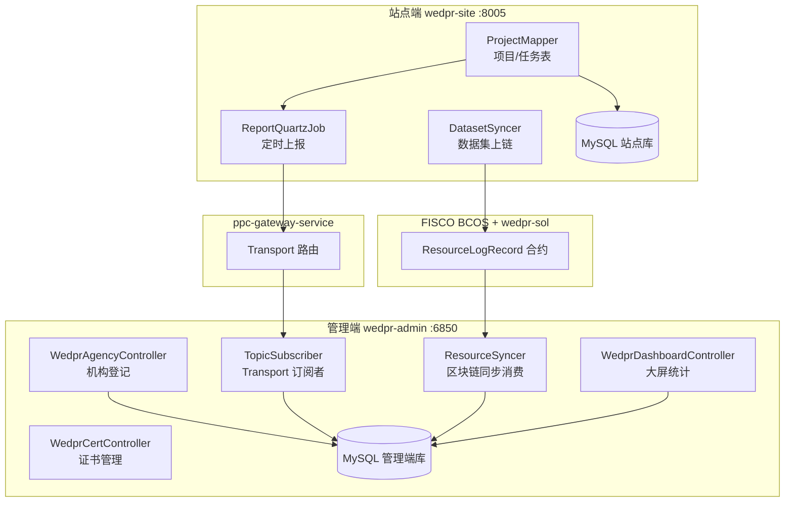
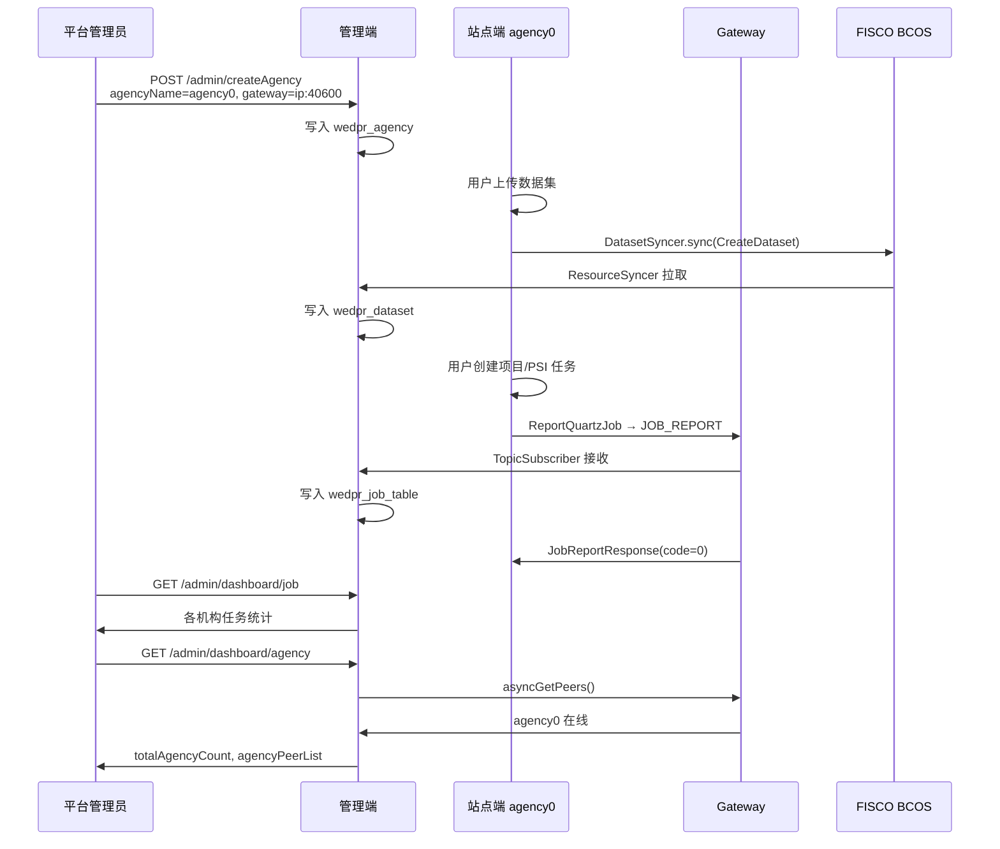

# Phase1：管理端与站点端标准接入规范

> 本文档基于 WeDPR 源码梳理，描述**站点端接入管理端**的标准方式、核心功能模块，以及双方之间的**输入/输出接口规范**。  
> 适用场景：多机构部署时，平台管理端（`wedpr-admin`）接入一个或多个机构站点端（`wedpr-site`），并在配置正确的前提下聚合各机构的数据集元数据、项目与任务统计。

---

## 1. 文档范围与核心结论

### 1.1 范围

| 组件 | 代码路径 | 默认端口 |
|------|---------|---------|
| 管理端后端 | `frontend/wedpr-admin` | 6850 |
| 管理端前端 | `frontend/wedpr-web-admin` | 3001（开发） |
| 站点端后端 | `frontend/wedpr-site` | 8005 |
| 站点端前端 | `frontend/wedpr-web` | 3000 |
| C++ 网关 | `ppc-gateway-service` | 40600（示例） |

### 1.2 核心结论

1. **站点端不会自动注册到管理端**；管理端通过「机构管理」人工登记，登记字段必须与站点端实际配置一致。
2. **管理端与站点端之间没有直接的 HTTP 业务互调**；数据汇聚依赖三条通道：
   - **通道 A**：管理端 REST — 机构/证书治理（人工操作）
   - **通道 B**：Gateway Transport — 项目/任务定时上报（站点 → 管理端）
   - **通道 C**：FISCO BCOS + ResourceSyncer — 数据集等元数据链上同步（站点 → 管理端/其他站点）
3. **理论上**，只要站点端完成登记且网络/区块链配置正确，管理端**可以**看到该机构的数据集元数据、项目与任务统计；但均为**只读聚合视图**，不含原始数据文件，也不能远程操控站点业务。

---

## 2. 接入架构总览


### 2.1 数据可见性矩阵

| 站点端业务 | 管理端是否可见 | 同步通道 | 管理端存储 |
|-----------|--------------|---------|-----------|
| 机构在线状态 | 是（对比登记数与 Gateway peers） | Gateway `getPeers` | 内存计算，不落库 |
| 数据集元数据 | 是（非文件内容） | 区块链 ResourceSyncer | `wedpr_dataset` |
| 项目信息 | 是 | Transport `PROJECT_REPORT` | `wedpr_project_table` |
| 任务信息 | 是 | Transport `JOB_REPORT` | `wedpr_job_table` |
| 任务-数据集关系 | 是 | Transport `JOB_DATASET_REPORT` | `wedpr_job_dataset_relation` |
| 链上同步审计 | 是 | ResourceSyncer 本地记录 | `wedpr_sync_status_table` |
| 原始数据文件 | 否 | — | — |

---

## 3. 标准接入流程（Checklist）

以下为源码隐含的标准接入顺序，多机构生产环境推荐采用。

### 3.1 平台侧（一次性）

| 步骤 | 操作 | 源码/配置依据 |
|------|------|--------------|
| 1 | 部署 MySQL，执行 `wedpr-builder/db/wedpr_ddl.sql` | 管理端/站点端共用表结构 |
| 2 | 部署 FISCO BCOS，部署 `wedpr-sol` 合约，记录合约地址 | `wedpr.sync.*.contract_address` |
| 3 | 启动管理端 `WedprAdminApplication` | 自动启动 `ResourceSyncer` + `LeaderElection` |
| 4 | 启动 `wedpr-web-admin`，使用 `agency_admin` 角色账号登录 | `Utils.checkPermission()` 校验角色 |
| 5 | 配置管理端 Transport 连接各机构 Gateway | `wedpr.transport.gateway_targets` |

### 3.2 每个站点端（按机构重复）

| 步骤 | 操作 | 关键约束 |
|------|------|---------|
| 1 | 部署 C++ Gateway + 计算节点 | Gateway 地址将被登记到管理端 |
| 2 | 配置并启动 `wedpr-site` | `wedpr.agency` 全局唯一，如 `agency0` |
| 3 | 配置 `wedpr-site/conf/wedpr.properties` 与 `application-wedpr.properties` | 见 [§5 站点端输入规范](#5-站点端输入规范) |
| 4 | **管理端「机构管理」登记该机构** | `agency_name` = `wedpr.agency` |
| 5 | （生产）管理端「证书管理」签发证书 | `WedprCertController` |
| 6 | 站点端开展业务（上传数据、建项目、跑任务） | 触发通道 B/C |
| 7 | 管理端验证：机构在线、数据资源、项目空间、大屏 | REST 查询接口 |

### 3.3 接入成功判定条件

同时满足以下条件，管理端**理论上**可看到该站点数据：

```
✓ wedpr_agency 中存在该机构且 agency_status = 0（启用）
✓ gateway_endpoint 与实际 ppc-gateway 地址一致
✓ 管理端 gateway_targets 能连通该 Gateway
✓ 站点端与管理端 wedpr.sync.* 合约地址、chain.group_id 一致
✓ 站点端 ReportQuartzJob 正常运行（wedpr-site 依赖 wedpr-components-report）
✓ 站点端 ResourceSyncer 正常运行（数据集同步）
```
---

## 4. 管理端核心功能模块（源码映射）

### 4.1 模块总览

| 功能域 | Controller | Service | 前端路由 | 职责 |
|--------|-----------|---------|---------|------|
| **机构治理** | `WedprAgencyController` | `WedprAgencyServiceImpl` | `/agencyManage` | 登记/启停机构，Gateway 在线检测 |
| **证书治理** | `WedprCertController` | `WedprCertServiceImpl` | `/certificateManage` | CSR 签发、下载、启禁 |
| **数据资源视图** | `WedprDatasetController` | `WedprDatasetServiceImpl` | `/dataManage` | 查询 `wedpr_dataset` 元数据 |
| **项目视图** | `WedprProjectTableController` | `WedprProjectTableServiceImpl` | `/projectManage` | 查询 `wedpr_project_table` |
| **任务视图** | `WedprJobTableController` | `WedprJobTableServiceImpl` | 项目详情内 | 查询 `wedpr_job_table` |
| **任务-数据集关系** | `WedprJobDatasetRelationController` | `WedprJobDatasetRelationServiceImpl` | — | 按 datasetId 查关联任务 |
| **大屏统计** | `WedprDashboardController` | 多 Service 聚合 | `/screen` | 数据集/任务/机构统计 |
| **日志审计** | `WedprAuditLogController` | `WedprSyncServiceImpl` | `/logManage` | 链上同步状态查询 |
| **系统配置** | `WedprConfigTableController` | — | 登录时加载 | 读取 `wedpr_algorithm_templates` |
| **Transport 接入** | — | `TopicSubscriber` | — | 接收站点上报消息 |
| **区块链同步** | — | `ResourceSyncer`（组件） | — | 消费链上 Dataset 等元数据 |

### 4.2 管理端启动链（自动装配）

```java
// WedprAdminApplication.java
ResourceSyncer resourceSyncer = ...getBean(ResourceSyncer.class);
resourceSyncer.start();
LeaderElection leaderElection = ...getBean(LeaderElection.class);
leaderElection.start();
```
```java
// TopicSubscriber.java — CommandLineRunner
weDPRTransport.registerComponent(TransportComponentEnum.REPORT.name());
subscribeProjectTopic();   // PROJECT_REPORT
subscribeJobTopic();       // JOB_REPORT
subscribeJobDatasetRelationTopic(); // JOB_DATASET_REPORT
```
### 4.3 权限模型

管理端所有 `/api/wedpr/v3/admin/*` 治理与查询接口，通过 `Utils.checkPermission()` 校验：

```java
// 仅 agency_admin 角色可访问
if (!UserRoleEnum.AGENCY_ADMIN.getRoleName().equals(userToken.getRoleName())) {
    throw new WeDPRException("无权限访问该接口");
}
```
- 登录 URL：`/api/wedpr/v3/admin/login`（`Constant.ADMIN_END_LOGIN_URL`）
- 请求头：`Authorization: <JWT>`

---

## 5. 站点端输入规范

站点端接入管理端时需提供的**配置输入**（非 HTTP 请求体，而是部署配置 + 运行时行为）。

### 5.1 必填配置项（`wedpr-site/conf/wedpr.properties`）

| 配置键 | 示例值 | 说明 | 与管理端关系 |
|--------|--------|------|-------------|
| `wedpr.agency` | `agency0` | **机构唯一标识** | 必须与管理端 `wedpr_agency.agency_name` 一致 |
| `wedpr.mybatis.url` | `jdbc:mysql://.../wedpr` | 数据库 | 可与管端共库或分库 |
| `wedpr.chain.group_id` | `group0` | 区块链群组 | 必须与管理端一致 |
| `wedpr.sync.recorder.factory.contract_address` | `0x4721...` | 同步合约 | 必须与管理端一致 |
| `wedpr.sync.sequencer.contract_address` | `0x6849...` | 排序合约 | 必须与管理端一致 |
| `wedpr.transport.gateway_targets` | `ipv4:127.0.0.1:40600` | 本机构 Gateway | 管理端需能访问此 Gateway |
| `wedpr.transport.nodeID` | `wedpr-site-node-agency0` | Transport 节点 ID | 唯一 |
| `wedpr.transport.listen_port` | `6001` | Transport 监听端口 | 多机构/同机需错开 |

### 5.2 上报调度（`wedpr-site/conf/application-wedpr.properties`）

```properties
# 定时上报 Cron，默认每 2 秒扫描未上报记录
quartz-cron-report-job=0/2 * * * * ? *
server.type=site_end
```
上报模块仅在 **wedpr-site** 中引入（`wedpr-site/build.gradle` → `wedpr-components-report`），**wedpr-admin 不含上报发送逻辑**。

### 5.3 站点端运行时输出（主动推送）

站点端通过 `ReportQuartzJob` 向 Gateway 发送三类消息，目标组件为 `TransportComponentEnum.REPORT`：

| 触发条件 | Topic | Payload 类型 | 源码 |
|---------|-------|-------------|------|
| `report_status = 0` 的项目 | `PROJECT_REPORT` | `List<ProjectDO>` JSON | `ReportQuartzJob.reportProjectInfo()` |
| `report_status = 0` 的任务 | `JOB_REPORT` | `List<JobDO>` JSON | `ReportQuartzJob.reportJobInfo()` |
| `report_status = 0` 的任务-数据集关系 | `JOB_DATASET_REPORT` | `List<JobDatasetDO>` JSON | `ReportQuartzJob.reportJobDatasteRelationInfo()` |

上报成功后，站点端将对应记录的 `report_status` 更新为 `1`（`ReportStatusEnum.DONE_REPORT`）。

> **注意**：`ReportQuartzJob` 中实现了 `reportSysConfig()`（`SYS_CONFIG_REPORT`），但 `doReport()` **当前未调用**该方法，算法模板配置不会自动同步到管理端，需手动维护 `wedpr_config_table`。

### 5.4 数据集链上同步输出

站点端创建/更新/删除数据集时，调用 `DatasetSyncer` → `ResourceSyncer.sync()` 写入区块链：

| 动作 | resourceAction | resourceContent |
|------|---------------|-----------------|
| 创建 | `CreateDataset` | `Dataset` 对象 JSON 序列化 |
| 更新 | `UpdateDataset` | `Dataset` 对象 JSON 序列化 |
| 删除 | `RemoveDataset` | 数据集 ID 等内容 |

管理端 `ResourceSyncer` 拉取链上记录后，由 `DatasetSyncerCommitHandler` 写入本地 `wedpr_dataset`（忽略 `agency == myAgency` 的自身消息）。

---

## 6. 管理端输出接口规范（REST API）

**统一前缀**：`/api/wedpr/v3/admin`  
**统一响应**：`WeDPRResponse { code, msg, data }`，成功时 `code = 0`

### 6.1 机构治理接口

**Controller**：`WedprAgencyController`  
**Base Path**：`/api/wedpr/v3/admin`

#### POST `/createAgency` — 登记/更新机构

**请求体**（`CreateOrUpdateWedprAgencyRequest`）：

| 字段 | 类型 | 必填 | 约束 | 说明 |
|------|------|------|------|------|
| `agencyId` | string | 否 | max 64 | 空则新建，非空则更新 |
| `agencyName` | string | **是** | max 64 | **必须等于站点端 `wedpr.agency`** |
| `agencyDesc` | string | 否 | max 1000 | 机构描述 |
| `agencyContact` | string | **是** | max 64 | 联系人 |
| `contactPhone` | string | **是** | — | 联系电话 |
| `gatewayEndpoint` | string | **是** | `ip/domain:port` | 见下方格式 |

**gatewayEndpoint 格式**（`FormatCheckUtils.GATEWAY_ENDPOINT_PATTERN`）：

```
^([a-zA-Z0-9.-]+|\d{1,3}(\.\d{1,3}){3}):\d{1,5}$
示例：127.0.0.1:40600 或 gateway.agency0.com:40600
```
**响应 data**（`CreateOrUpdateWedprAgencyResponse`）：

```json
{ "agencyId": "<UUID>" }
```
#### GET `/getAgencyList` — 机构列表

**查询参数**（`GetWedprAgencyListRequest`）：分页 + 可选过滤

**响应 data**（`GetWedprAgencyListResponse`）：含 `wedprAgencyDTOList`

**WedprAgency 实体字段**（`wedpr_agency` 表）：

| 字段 | 说明 |
|------|------|
| `agencyId` | 机构编号（主键） |
| `agencyName` | 机构名（= 站点 `wedpr.agency`） |
| `agencyDesc` | 描述 |
| `agencyContact` / `contactPhone` | 联系信息 |
| `gatewayEndpoint` | Gateway 地址 |
| `agencyStatus` | 0=启用，1=禁用 |
| `userCount` | 机构用户数（统计字段） |

#### POST `/setAgency` — 启用/禁用机构

**请求体**（`SetWedprAgencyRequest`）：

| 字段 | 类型 | 说明 |
|------|------|------|
| `agencyId` | string | 机构 ID |
| `agencyStatus` | int | 0=启用，1=禁用 |

#### GET `/getAgencyDetail/{agencyId}` — 机构详情

#### GET `/getNoCertAgencyList` — 无证书机构列表

#### POST `/deleteAgency/{agencyId}` — 删除机构

---

### 6.2 证书治理接口

**Controller**：`WedprCertController`

| 方法 | 路径 | 说明 |
|------|------|------|
| POST | `/createCert` | 上传 CSR，创建/更新证书（multipart） |
| POST | `/deleteCert/{certId}` | 删除证书 |
| POST | `/setCert` | 启用/禁用证书 |
| GET | `/getCertList` | 证书列表 |
| GET | `/getCsrDetail/{certId}` | CSR 详情 |
| GET | `/downloadCert/{certId}` | 下载证书 |
| GET | `/downloadCertTool` | 下载证书工具包 |

---

### 6.3 数据资源查询接口

**Controller**：`WedprDatasetController`

#### GET `/listDataset`

**查询参数**（`GetWedprDatasetListRequest`）：

| 参数 | 说明 |
|------|------|
| `ownerAgencyName` | 所属机构（模糊） |
| `datasetTitle` | 数据集标题（模糊） |
| `startTime` / `endTime` | 创建时间范围，`yyyy-MM-dd HH:mm:ss` |
| `pageNum` / `pageSize` | 分页 |

**响应 data**（`ListDatasetResponse`）：`{ totalCount, isLast, content: Dataset[] }`

**Dataset 核心字段**（`wedpr_dataset` 表，来源：区块链同步或共库）：

| 字段 | 说明 |
|------|------|
| `datasetId` | 数据集 ID |
| `datasetTitle` / `datasetDesc` | 标题、描述 |
| `datasetFields` | 字段 schema（JSON 字符串） |
| `datasetVersionHash` | 数据哈希 |
| `datasetSize` / `datasetRecordCount` | 大小、行数 |
| `dataSourceType` | CSV/EXCEL/HDFS/HIVE/DB 等 |
| `ownerAgencyName` / `ownerUserName` | 所属机构与用户 |
| `visibility` / `visibilityDetails` | 可见性策略 |

> 管理端**仅返回元数据**，不提供原始文件下载。

#### GET `/queryDataset?datasetId=xxx` — 单条数据集详情

---

### 6.4 项目 / 任务查询接口

#### GET `/listProject` — 项目列表

**查询参数**（`GetWedprProjectListRequest`）：`ownerAgency`、`id`、`name`、时间范围、分页

**数据来源**：`wedpr_project_table`（Transport 上报写入）

**WedprProjectTable 字段**：

| 字段 | 说明 |
|------|------|
| `id` | 项目 ID |
| `name` | 项目名称 |
| `projectDesc` | 描述 |
| `owner` / `ownerAgency` | 创建人 / 机构 |
| `projectType` | Expert / Wizard |
| `label` | 标签 |
| `createTime` / `lastUpdateTime` | 时间 |

#### GET `/listJob` — 任务列表

**查询参数**（`GetWedprJobListRequest`）：

| 参数 | 必填 | 说明 |
|------|------|------|
| `projectId` | **是** | 项目 ID |
| `ownerAgency` | 否 | 机构过滤 |
| `jobType` | 否 | 任务类型，如 `PSI`、`MPC` |
| `status` | 否 | 任务状态 |
| `startTime` / `endTime` | 否 | 时间范围 |

**数据来源**：`wedpr_job_table`

#### GET `/queryJobsByDatasetId?datasetId=xxx` — 按数据集查关联任务

---

### 6.5 大屏统计接口

**Controller**：`WedprDashboardController`  
**Base Path**：`/api/wedpr/v3/admin/dashboard`

| 方法 | 路径 | 响应类型 | 说明 |
|------|------|---------|------|
| GET | `/dataset` | `GetDatasetStatisticsResponse` | 数据集总量、类型分布、各机构分布 |
| GET | `/dataset-dateline` | `GetDatasetLineResponse` | 数据集增长趋势 |
| GET | `/job` | `GetJobStatisticsResponse` | 任务总量、成功率、类型分布 |
| GET | `/job-dateline` | `GetJobLineResponse` | 任务量趋势 |
| GET | `/agency` | `GetAgencyStatisticsResponse` | 机构在线/故障统计 |

**机构在线检测逻辑**（`WedprAgencyServiceImpl.getAgencyStatistics()`）：

1. 统计 `wedpr_agency` 表总数 → `totalAgencyCount`
2. 调用 `weDPRTransport.asyncGetPeers()` 获取 Gateway 在线机构列表 → `agencyPeerList`
3. `faultAgencyCount = totalAgencyCount - agencyPeerCount`
4. 已登记但不在 peers 中的机构 → `agencyFaultList`

---

### 6.6 日志审计接口

#### GET `/queryRecordSyncStatus`

**查询参数**（`GetWedprAuditLogListRequest`）：

| 参数 | 说明 |
|------|------|
| `ownerAgencyName` | 发起机构（模糊） |
| `resourceAction` | 资源动作 |
| `resourceType` | 资源类型：Dataset / Job / Authorization / Publish |
| `status` | 同步状态 |
| `startTime` / `endTime` | 时间范围 |

**数据来源**：`wedpr_sync_status_table`

---

## 7. Transport 通道接口规范（站点 → 管理端）

站点端与管理端的**非 REST** 接口，经 C++ Gateway 的 JNI Transport 层传递。

### 7.1 协议枚举

```java
// TransportComponentEnum.java
REPORT  // 管理端 TopicSubscriber 注册此组件

// TransportTopicEnum.java
PROJECT_REPORT       // 项目上报
JOB_REPORT           // 任务上报
JOB_DATASET_REPORT   // 任务-数据集关系上报
SYS_CONFIG_REPORT    // 系统配置上报（已实现发送/接收，但定时任务未启用）
```
### 7.2 消息流向

```
站点端 ReportQuartzJob
  → weDPRTransport.asyncSendMessageByComponent(
        topic, srcAgency, "REPORT", payload, timeout, callback)
  → ppc-gateway-service 路由
  → 管理端 TopicSubscriber.onMessage()
  → 落库 wedpr_project_table / wedpr_job_table / wedpr_job_dataset_relation
  → asyncSendResponse() 返回确认
  → 站点端 Handler 更新 report_status = 1
```
### 7.3 上报 Payload 规范

#### PROJECT_REPORT

- **方向**：站点 → 管理端
- **Body**：`List<ProjectDO>` JSON 数组
- **管理端反序列化目标**：`List<WedprProjectTable>`
- **确认响应**：`ProjectReportResponse`

```json
{
  "code": 0,
  "msg": "success",
  "projectIdList": ["<id1>", "<id2>"]
}
```
**ProjectDO 与 WedprProjectTable 字段映射**：

| ProjectDO | WedprProjectTable | 备注 |
|-----------|-------------------|------|
| `id` | `id` | |
| `name` | `name` | |
| `projectDesc` | `projectDesc` | |
| `owner` | `owner` | |
| `ownerAgency` | `ownerAgency` | |
| `type` / `projectType` | `projectType` | Expert/Wizard |
| `label` | `label` | |
| `reportStatus` | `reportStatus` | 0=待上报 |
| `createTime` | `createTime` | |
| `lastUpdateTime` | `lastUpdateTime` | |

#### JOB_REPORT

- **Body**：`List<JobDO>` JSON 数组
- **管理端反序列化目标**：`List<WedprJobTable>`
- **确认响应**：`JobReportResponse { code, msg, jobIdList }`

**JobDO 与 WedprJobTable 字段映射**：

| JobDO | WedprJobTable | 备注 |
|-------|---------------|------|
| `id` | `id` | |
| `name` | `name` | |
| `projectId` | `projectId` | |
| `owner` | `owner` | |
| `ownerAgency` | `ownerAgency` | |
| `jobType` | `jobType` | PSI/MPC/PIR 等 |
| `parties` | `parties` | 参与机构 JSON |
| `param` | `param` | 任务参数 JSON |
| `status` | `status` | |
| `result` / `jobStatusInfo` | `jobResult` | 注意：JobDO 序列化字段名为 `jobStatusInfo` |
| `reportStatus` | `reportStatus` | |
| `createTime` | `createTime` | |
| `lastUpdateTime` | `lastUpdateTime` | |

#### JOB_DATASET_REPORT

- **Body**：`List<JobDatasetDO>` JSON 数组
- **管理端反序列化目标**：`List<WedprJobDatasetRelation>`
- **确认响应**：`JobDatasetReportResponse { code, msg, jobIdList }`

| 字段 | 说明 |
|------|------|
| `jobId` | 任务 ID |
| `datasetId` | 数据集 ID |
| `createTime` | 创建时间 |

### 7.4 上报状态机

```
站点端创建/更新项目或任务
  → report_status = 0 (NO_REPORT)
  → ReportQuartzJob 扫描
  → Transport 发送
  → 管理端落库
  → 响应 code=0 + idList
  → 站点端 report_status = 1 (DONE_REPORT)
```
---

## 8. 区块链同步通道规范（数据集等）

### 8.1 ResourceSyncer 资源类型

```java
// ResourceSyncer.ResourceType
Authorization  // 授权
Job            // 任务
Dataset        // 数据集
Publish        // 服务发布
```
### 8.2 ResourceActionRecord 链上记录结构

| 字段 | 说明 |
|------|------|
| `resourceID` | 资源 ID |
| `agency` | 发起机构（= 站点 `wedpr.agency`） |
| `resourceType` | Dataset / Job / ... |
| `resourceAction` | 如 CreateDataset |
| `resourceContent` | 资源 JSON 内容 |
| `index` / `blockNumber` / `transactionHash` | 链上定位信息 |

### 8.3 管理端消费逻辑

管理端 `DatasetSyncerCommitHandler` 处理规则：

- `agency == myAgency`（管理端配置的 `wedpr.agency`，如 `WeBank`）→ **忽略**（自身消息）
- `agency != myAgency`（如 `agency0`）→ 解析 `resourceContent` 为 `Dataset`，写入 `wedpr_dataset`

因此：**各站点端的数据集元数据，通过链上同步进入管理端本地库**，供 `/listDataset` 和大屏使用。

---

## 9. 多站点接入时的差异与共用

| 维度 | 管理端 | 各站点端 |
|------|--------|---------|
| 部署数量 | **1 套** | **每机构 1 套** |
| `wedpr.agency` | 平台标识（如 `WeBank`） | 机构唯一名（如 `agency0`、`agency1`） |
| Gateway 端口 | 连接所有机构 Gateway | 每机构独立 Gateway |
| Transport 端口 | 如 `6002` | 如 `6001`（同机错开） |
| 数据库 | 可独立库或共库 | 通常每机构独立库；开发环境可共库 |
| 区块链/合约 | **共用** | **共用** |
| 机构登记 | 每上新一家登记一次 | — |

**同一管理端接入 N 个站点端时**，每个站点端只需：

1. 唯一 `wedpr.agency`
2. 独立 Gateway + C++ 节点
3. 在管理端分别登记
4. 共用区块链群组与合约地址

管理端 `TopicSubscriber` 和 `ResourceSyncer` **无需按机构定制**，自动聚合所有已连接站点的上报与链上数据。

---

## 10. 端到端接入时序


---

## 11. 常见问题与源码级说明

### Q1：站点端已跑任务，管理端看不到？

排查顺序：

1. 管理端是否已登记该 `agency_name`
2. `gateway_endpoint` 是否正确，`agency_status` 是否为 0
3. 站点端 `ReportQuartzJob` 是否运行（查 site 日志 `ReportQuartzJob run at`）
4. Gateway 是否连通（管理端 `/dashboard/agency` 中 fault 列表）
5. 任务 `report_status` 是否仍为 0（上报失败）

### Q2：数据集在站点有，管理端没有？

1. 区块链合约地址是否一致
2. 管理端 `ResourceSyncer` 是否启动（`WedprAdminApplication` 日志）
3. 开发环境若分库，需依赖链上同步而非共库
4. 管理端 `wedpr.agency` 不能与站点相同（否则 DatasetSyncerCommitHandler 会 ignore self）

### Q3：管理端能否远程创建站点任务？

**不能**。管理端 Controller 均为查询/治理接口，无任务创建 API。任务仅在站点端 `wedpr-site` 创建。

### Q4：接入是否必须改管理端代码？

**标准 PSI/PIR/MPC 等业务不需要**。只需：

- 登记机构
- 保证配置一致
- （可选）更新 `wedpr_algorithm_templates` 配置与图标

---

## 12. 关键源码索引

| 主题 | 文件路径 |
|------|---------|
| 管理端启动 | `wedpr-admin/.../WedprAdminApplication.java` |
| Transport 订阅 | `wedpr-admin/.../transport/TopicSubscriber.java` |
| 机构登记 API | `wedpr-admin/.../controller/WedprAgencyController.java` |
| 大屏统计 API | `wedpr-admin/.../controller/WedprDashboardController.java` |
| 权限校验 | `wedpr-admin/.../common/Utils.java` |
| 定时上报 | `wedpr-components/report/.../ReportQuartzJob.java` |
| 上报响应处理（站点侧） | `wedpr-components/report/.../handler/JobReportMessageHandler.java` |
| Transport Topic 定义 | `wedpr-common/protocol/.../TransportTopicEnum.java` |
| 数据集链上同步 | `wedpr-components/dataset/sync/DatasetSyncer.java` |
| 管理端消费数据集同步 | `wedpr-components/dataset/sync/DatasetSyncerCommitHandler.java` |
| 区块链同步引擎 | `wedpr-components/sync/ResourceSyncer.java` |
| API 前缀 | `wedpr-common/utils/.../Constant.java` |
| 机构/Gateway 格式校验 | `wedpr-common/utils/.../FormatCheckUtils.java` |
| 站点 Transport 配置 | `wedpr-site/conf/wedpr.properties` |
| 上报 Cron 配置 | `wedpr-site/conf/application-wedpr.properties` |

---

## 13. 版本说明

- 分析基于当前工作区 WeDPR 源码（Java 站点端/管理端 + wedpr-components 共享库）
- Transport 底层依赖 `wedpr-gateway-sdk`（JNI），消息经 `ppc-gateway-service` 路由
- 若后续启用 `SYS_CONFIG_REPORT` 或扩展新 ResourceType，需同步更新本文档
