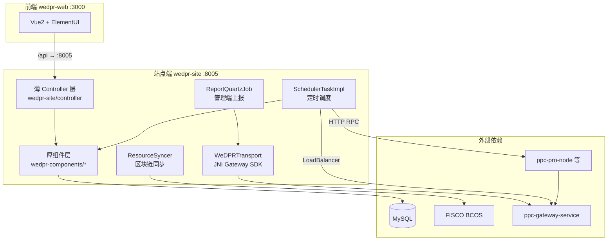
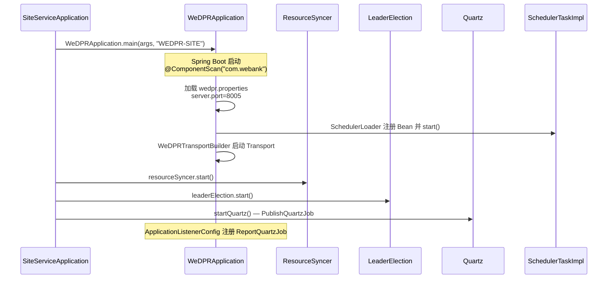
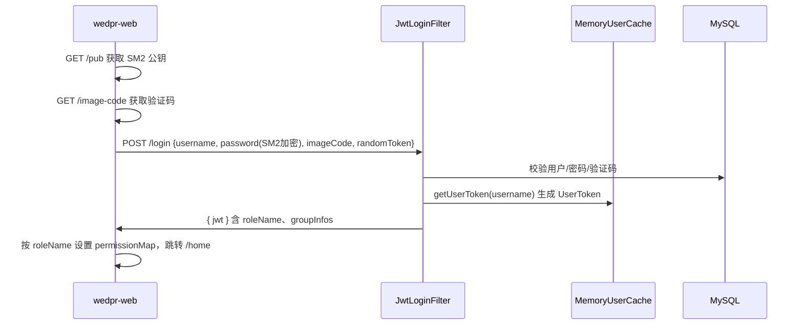
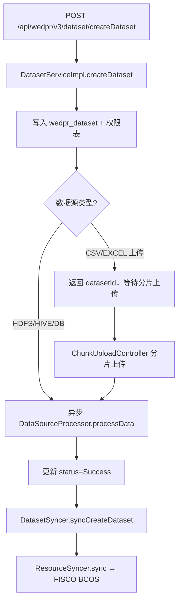
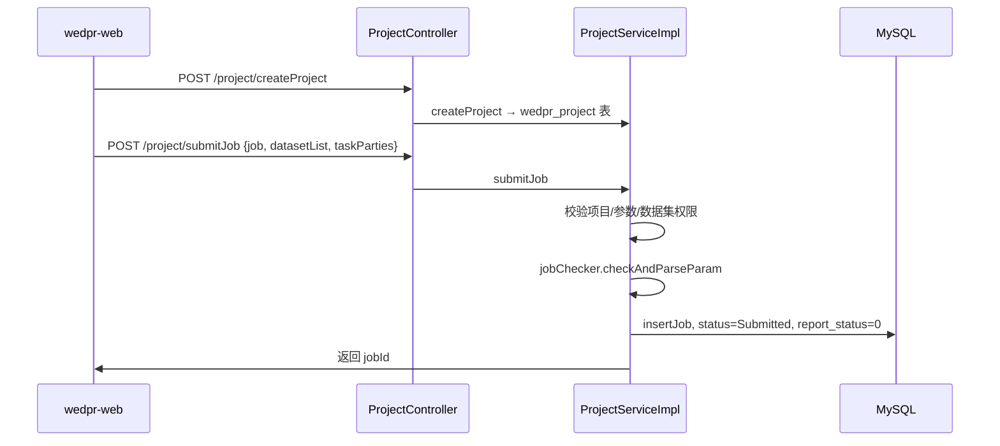
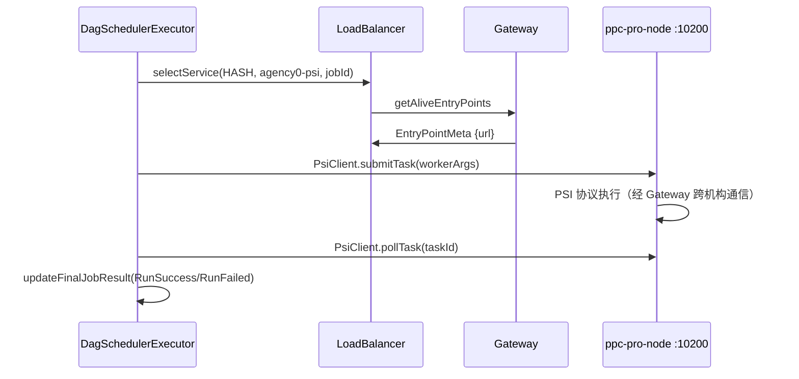

# Phase1：站点端运行机制与源码分析

> 本文档基于 WeDPR 源码，详细说明**站点端（Site）**如何启动、如何对外提供 API、如何调度隐私计算任务，以及如何与 C++ 层、区块链、管理端协作。  
> 站点端是各参与机构的**业务执行主体**，对应 `wedpr-site`（Java :8005）+ `wedpr-web`（Vue :3000）+ 本机构 C++ 计算节点。

---

## 1. 站点端在整体架构中的位置


**与管理端的边界**：站点端负责**写业务、跑任务**；管理端负责**读聚合、做治理**。二者通过 Gateway Transport 上报 + 区块链同步间接协作（详见 [`phase1_admin_site_integration.md`](phase1_admin_site_integration.md)）。

---

## 2. 进程启动与生命周期

### 2.1 启动命令

```bash
cd frontend/wedpr-site/dist
java -Dfile.encoding=UTF-8 \
     -DserviceName=WEDPR-SITE \
     -DserviceConfigPath=$(pwd)/conf \
     -Xmx512m \
     -cp "conf/:apps/*:lib/*" \
     com.webank.wedpr.site.main.SiteServiceApplication
```
### 2.2 启动时序（源码）

`SiteServiceApplication.main()` 的执行顺序：


**关键源码**（`SiteServiceApplication.java`）：

```java
WeDPRApplication.main(args, "WEDPR-SITE");
resourceSyncer.start();      // 区块链资源同步 Worker
leaderElection.start();    // 多实例选主（避免重复同步）
startQuartz();               // 服务发布定时任务 PublishQuartzJob
```
### 2.3 统一启动框架 WeDPRApplication

所有 Java 服务（site/admin/worker）共用 `wedpr-components/initializer/WeDPRApplication.java`：

| 步骤 | 行为 |
|------|------|
| 1 | `@ComponentScan(basePackages = {"com.webank"})` 扫描全部 Spring Bean |
| 2 | 从 classpath 加载 `wedpr.properties`（`-DserviceConfigPath` 指定目录） |
| 3 | `WeDPRConfig.setConfig()` 注入全局配置 |
| 4 | 将以 `spring.` 开头的配置项转为 Spring Boot 命令行参数 |
| 5 | 激活 profile `wedpr`，读取 `application-wedpr.properties` |

站点端 HTTP 端口由 `application-wedpr.properties` 决定：

```properties
server.port = 8005
server.type = site_end
spring.application.name = WEDPR-SITE
```
### 2.4 站点端 Gradle 依赖（组装了哪些能力）

`wedpr-site/build.gradle` 引用的组件模块决定了站点端能力边界：

| 模块 | 能力 |
|------|------|
| `wedpr-components-initializer` | 统一启动 |
| `wedpr-components-security` + `token-auth` + `user` | 登录/JWT/用户权限 |
| `wedpr-components-dataset` | 数据资源管理 |
| `wedpr-components-project` | 项目/任务元数据 |
| `wedpr-components-scheduler` | 任务调度引擎 |
| `wedpr-components-sync` | 区块链元数据同步 |
| `wedpr-components-authorization` | 数据授权审批 |
| `wedpr-components-service-publish` | PIR/建模服务发布 |
| `wedpr-components-transport` | JNI Gateway 通信 |
| `wedpr-components-report` | 向管理端定时上报 |
| `wedpr-components-agency` | 机构元数据 |
| `wedpr-components-jupyter-intergration` | 专家模式 Jupyter |
| `wedpr-components-setting-template` | 任务模板 |

---

## 3. 运行时后台服务（非 HTTP）

站点端启动后，除 Spring MVC 对外提供 REST API 外，还有 **5 类后台常驻服务**：

| 服务 | 触发方式 | 默认间隔 | 源码入口 |
|------|---------|---------|---------|
| **任务调度器** | `ScheduledExecutorService` | `wedpr.scheduler.interval.ms`（默认 30s） | `SchedulerTaskImpl.start()` |
| **区块链同步 Worker** | `ResourceSyncer.start()` | 持续轮询 | `SyncWorker.startWorking()` |
| **Leader 选举** | `LeaderElection.start()` | keep-alive 30s | 仅 Leader 实例执行同步写链 |
| **管理端上报** | Quartz Cron | `quartz-cron-report-job`（默认 2s） | `ReportQuartzJob` |
| **服务发布刷新** | Quartz | Site 启动时注册 | `PublishQuartzJob` |
| **Transport 网关连接** | Bean 初始化 | 常驻 | `WeDPRTransportBuilder.weDPRTransport()` |

---

## 4. HTTP 请求处理链

### 4.1 前端 → 后端

```
浏览器 wedpr-web (:3000)
  → vue.config.js proxy: /api → http://127.0.0.1:8005
  → wedpr-site Spring MVC
```
前端 API 封装在 `wedpr-web/src/apis/*.js`，统一 baseURL 为 `/api`。

### 4.2 安全过滤器链

`WebSecurityConfig`（`server.type=site_end`）配置了三层 Filter，**顺序固定**：

```
请求 → JwtLoginFilter → JwtAuthenticationFilter → APISignatureAuthFilter → Controller
```
| Filter | 作用 | 站点端路径 |
|--------|------|-----------|
| `JwtLoginFilter` | 处理登录 | `POST /api/wedpr/v3/login` |
| `JwtAuthenticationFilter` | 校验 JWT，必要时刷新 Token | 所有带 `Authorization` 头的请求 |
| `APISignatureAuthFilter` | API 凭证（AccessKey）签名认证 | 外部 API 调用 |

**免认证路径**（`WebSecurity.ignoring()`）：

- `/api/wedpr/v3/register`
- `/api/wedpr/v3/pub`（SM2 公钥）
- `/api/wedpr/v3/image-code`（验证码）
- Swagger 文档路径

登录成功后返回 JWT；前端存入 localStorage，后续请求带 `Authorization` 头。站点端角色为 `admin_user` / `group_admin` / `original_user`（与管理端 `agency_admin` 不同）。

### 4.3 API 分层：薄 Controller + 厚组件

站点端自有 Controller 仅 10 个（`wedpr-site/controller/`），其余 API 由 `wedpr-components` 内 Controller 通过 `@ComponentScan` 自动注册。

#### A. 站点薄 Controller（`wedpr-site/controller/`）

| Controller | 路由前缀 | 职责 |
|-----------|---------|------|
| `ProjectController` | `/api/wedpr/v3/project/` | 项目 CRUD、任务提交/查询/终止 |
| `AuthorizationController` | `/api/wedpr/v3/auth` | 数据授权审批 |
| `AgencyController` | `/api/wedpr/v3/agency` | 机构元数据 |
| `SchedulerController` | `/api/wedpr/v3/scheduler` | 任务执行详情查询 |
| `SyncController` | `/api/wedpr/v3/sync` | 同步状态查询 |
| `SystemConfigController` | `/api/wedpr/v3/sysConfig` | 系统配置 |
| `TemplateSettingController` | `/api/wedpr/v3/template` | 任务模板 |
| `ApiCredentialController` | `/api/wedpr/v3/credential` | AccessKey 管理 |
| `JupyterController` | `/api/wedpr/v3/jupyter` | 专家模式 Jupyter |

#### B. 组件内 Controller（随 ComponentScan 自动暴露）

| Controller | 路由前缀 | 职责 |
|-----------|---------|------|
| `WedprUserController` | `/api/wedpr/v3` | 用户、密码、userAgency、userCount |
| `WedprGroupController` | `/api/wedpr/v3/group` | 用户组 |
| `WedprUserRegisterController` | `/api/wedpr/v3/register` | 注册 |
| `DatasetController` | `/api/wedpr/v3/dataset` | 数据集 CRUD |
| `ChunkUploadController` | `/api/wedpr/v3/dataset` | 分片上传 |
| `DatasetAuthController` | `/api/wedpr/v3/dataset` | 数据集授权 |
| `DownloadController` | `/api/wedpr/v3/dataset` | 数据下载 |
| `WedprPublishedServiceController` | `/api/wedpr/v3/service` | 服务发布 |
| `PirController` | `/api/wedpr/v3/pir` | PIR 任务 |

---

## 5. 核心业务运行流程

### 5.1 用户登录


### 5.2 数据上传（数据集创建）


**关键点**：

- 数据集 ID 前缀：`d-`（`DatasetConstant.DATASET_ID_PREFIX`）
- 文件存储：`wedpr.storage.type=LOCAL` 或 `HDFS`（`application-wedpr.properties`）
- 同步的是**元数据**，不是原始文件；跨机构通过区块链 `CreateDataset` 动作传播
- 本地大文件目录：`wedpr.dataset.largeFileDataDir=./wedpr/largeFile/`

### 5.3 项目与任务提交


**任务提交后不会立即执行**，而是等待调度器扫描。

### 5.4 任务调度与执行（核心引擎）

#### 调度循环

`SchedulerTaskImpl` 在启动时注册定时任务（默认每 30 秒）：

```java
workerTimer.scheduleAtFixedRate(() -> schedule(), 0,
    SchedulerTaskConfig.getSchedulerIntervalMs(), TimeUnit.MILLISECONDS);
```
每次 `schedule()` 执行：

1. **killTasks()**：处理 `WaitToKill` 状态任务，经 `JobSyncer` 同步到链上后终止
2. **schedulerAllTypeTasks()**：遍历所有 `JobType`，按类型调度

#### 按 JobType 调度逻辑

```java
for (JobType jobType : JobType.values()) {
    ServiceName serviceType = jobType.getServiceName();
    // 从 Gateway 发现该类型存活 C++ 节点数
    List<EntryPointMeta> endpoints = loadBalancer.selectAllEndPoint(serviceType.getValue());
    int concurrency = endpoints.size() * SchedulerTaskConfig.getJobConcurrency(); // 默认每节点 5 并发
    scheduleTasksToRun(concurrency, jobType);
}
```
**JobType → C++ 服务映射**（`JobType.getServiceName()`）：

| JobType | ServiceName | C++ 节点 |
|---------|-------------|---------|
| PSI / ML_PSI / MPC_PSI | `psi` | ppc-psi / pro-node |
| MPC / SQL | `mpc` | mpc-node |
| PIR | `pir` | pir 服务 |
| XGB/LR 训练/预测/预处理 | `model` | cem-node / pro-node |

#### 任务状态流转

```
Submitted → (需链上同步?) → ChainInProgress → Running → RunSuccess / RunFailed
                         ↘ (不需同步)      ↗
WaitToRetry ──────────────────────────────→ Running
WaitToKill → Killing → Killed / KillFailed
```
- **需链上同步的任务**（`shouldSync=true`，PIR 除外）：先 `JobSyncer.sync(RunAction)` 写入区块链，待其他机构确认后再执行
- **不需同步的任务**（如 PIR）：直接进入 `batchRunJobs`

#### Executor 分发

`SchedulerLoader` 注册两类 Executor：

| ExecutorType | 实现类 | 适用任务 |
|-------------|--------|---------|
| `DAG` | `DagSchedulerExecutor` | PSI/MPC/MPC-PSI/ML 等 DAG 工作流 |
| `PIR` | `PirExecutor` | PIR 匿踪查询 |

`ExecutorManagerImpl.execute(jobDO)` 按 `JobType.getExecutorType()` 选择 Executor。

#### PSI 任务执行示例（DAG → Worker → C++）


**PsiWorker 核心逻辑**（`PsiWorker.onRun()`）：

1. `LoadBalancer.selectService(HASH, "agency0-psi", null, jobId)` 选节点
2. `PsiClient` HTTP RPC 调用 C++ 节点 `submitTask` + `pollTask`
3. 返回 `WorkerStatus.SUCCESS` 或抛异常

MPC/建模类任务走类似路径，使用 `MpcWorker`、`MLWorker` 等。

### 5.5 LoadBalancer 与 Gateway 服务发现

```java
// LoadBalanceConfig.java
return new LoadBalancerImpl(new EntryPointFetcherImpl(weDPRTransport));
```
- 正常运行时从 **Gateway** 动态拉取存活 C++ 节点（`EntryPointFetcherImpl`）
- 调试模式（`wedpr.service.debugMode=true`）从配置文件静态加载节点地址

**Transport 配置**（`wedpr.properties`）：

```properties
wedpr.transport.nodeID=wedpr-site-node-agency0
wedpr.transport.gateway_targets=ipv4:127.0.0.1:40600
wedpr.transport.listen_port=6001
```
`WeDPRTransportBuilder` 在 Bean 初始化时 `transport.start()`，站点端 Java 进程即成为 Gateway 网络中的一个节点。

### 5.6 区块链元数据同步

`ResourceSyncer.start()` 启动 `SyncWorker`，在 **Leader 实例**上：

1. 从 FISCO BCOS 智能合约（`wedpr-sol`）拉取资源变更记录
2. 按 `resourceType` 分发给注册的 `CommitHandler`
3. 写入本地 MySQL + 更新 `wedpr_sync_status_table`

站点端注册的 CommitHandler：

| resourceType | Handler | 行为 |
|-------------|---------|------|
| `Dataset` | `DatasetSyncerCommitHandler` | 镜像其他机构数据集元数据 |
| `Job` | Job 相关 Handler | 跨机构任务状态同步 |
| `Authorization` | `AuthSyncer` | 授权单同步 |
| `Publish` | `PublishSyncerCommitHandler` | 服务发布同步 |

站点端**写入**链上的触发点示例：

- 创建数据集 → `datasetSyncer.syncCreateDataset()`
- 提交需同步的任务 → `JobSyncer.sync(RunAction)`
- 发起授权 → `AuthSyncer.sync()`

### 5.7 向管理端上报

`ReportQuartzJob`（仅 wedpr-site 引入）默认每 2 秒扫描 `report_status=0` 的记录，经 Transport 发送：

| Topic | 数据 |
|-------|------|
| `PROJECT_REPORT` | `List<ProjectDO>` |
| `JOB_REPORT` | `List<JobDO>` |
| `JOB_DATASET_REPORT` | `List<JobDatasetDO>` |

管理端 `TopicSubscriber` 接收并写入聚合表（详见接入规范文档）。

---

## 6. 任务状态与并发控制

### 6.1 JobStatus 枚举

| 状态 | 含义 |
|------|------|
| `Submitted` | 已提交，等待调度 |
| `ChainInProgress` | 链上同步中 |
| `Running` | 执行中 |
| `RunSuccess` / `RunFailed` | 终态 |
| `WaitToRetry` | 等待重试 |
| `WaitToKill` / `Killing` / `Killed` | 终止流程 |

### 6.2 并发控制参数

| 配置键 | 默认值 | 说明 |
|--------|--------|------|
| `wedpr.scheduler.interval.ms` | 30000 | 调度扫描间隔 |
| `wedpr.scheduler.job.concurrency` | 5 | 每个 C++ 节点最大并发任务数 |
| `wedpr.scheduler.query.job.status.interval.ms` | 30000 | 任务状态查询间隔 |

实际并发上限 = `存活 C++ 节点数 × job.concurrency`。

---

## 7. 站点端配置要点

### 7.1 机构标识（全局唯一）

```properties
# wedpr-site/conf/wedpr.properties
wedpr.agency=agency0
```
该值贯穿：JWT 机构信息、任务 `ownerAgency`、Transport 节点标识、区块链同步 `agency` 字段。

### 7.2 关键配置分组

| 分组 | 配置键示例 | 作用 |
|------|-----------|------|
| **数据库** | `wedpr.mybatis.url/username/password` | MySQL 业务库 |
| **区块链** | `wedpr.chain.group_id`, `wedpr.sync.*.contract_address` | 跨机构同步 |
| **Transport** | `wedpr.transport.*` | Gateway 连接 |
| **调度器** | `wedpr.scheduler.*` | 任务调度 |
| **存储** | `wedpr.storage.type`, `wedpr.storage.local.basedir` | 数据集文件 |
| **Executor** | `wedpr.executor.psi.*`, `wedpr.executor.mpc.*` | C++ RPC 超时/连接池 |
| **上报** | `quartz-cron-report-job` | 管理端上报频率 |
| **安全** | `server.type=site_end`, `wedpr.user.jwt.*` | 登录/JWT |

### 7.3 C++ 层配置（与 Java 协同）

Java 站点端不直接启动 C++ 进程，但通过 Gateway 发现并按 HTTP RPC 调用：

```properties
# Java 侧
wedpr.transport.gateway_targets=ipv4:127.0.0.1:40600

# C++ pro-node config.ini（wedpr-cpp-deploy）
[transport] gateway_target = ipv4:127.0.0.1:40600
[rpc] listen_port = 10200
```
---

## 8. 典型端到端场景：PSI 隐私求交

```
1. 用户登录 wedpr-web → JWT (admin_user)
2. 上传 CSV 数据集 → DatasetController → 本地存储 + 链上同步元数据
3. 创建 Wizard 项目 → ProjectController.createProject
4. 向导模式配置 PSI 参与方与参数 → leadMode 前端
5. submitJob → JobDO(status=Submitted, jobType=PSI, report_status=0)
6. SchedulerTaskImpl 扫描到 Submitted 任务
7. JobSyncer 将任务元数据写入 FISCO BCOS（跨机构可见）
8. DagSchedulerExecutor 构建 DAG，PsiWorker 执行
9. LoadBalancer 从 Gateway 选择 agency0-psi 节点
10. PsiClient HTTP RPC → ppc-pro-node 执行 PSI 协议
11. 任务状态 → RunSuccess，结果写入 MySQL
12. ReportQuartzJob 上报任务到管理端
13. 前端 jobDetail 页轮询/queryJobDetail 展示结果
```
---

## 9. 站点端 vs 管理端能力对比

| 维度 | 站点端 | 管理端 |
|------|--------|--------|
| 进程入口 | `SiteServiceApplication` | `WedprAdminApplication` |
| 任务调度 | ✅ `SchedulerTaskImpl` | ❌ |
| 数据集文件存储 | ✅ LOCAL/HDFS | ❌ |
| 任务提交/执行 | ✅ | ❌ |
| C++ 节点调用 | ✅ LoadBalancer + Worker | ❌ |
| 区块链同步写入 | ✅ Leader 写链 | ✅ 仅消费（+审计查询） |
| Transport 上报发送 | ✅ ReportQuartzJob | ❌ |
| Transport 上报接收 | ❌ | ✅ TopicSubscriber |
| 机构登记 | ❌ | ✅ |
| 用户角色 | admin_user 等 | agency_admin |

---

## 10. 关键源码索引

| 主题 | 文件路径 |
|------|---------|
| 站点启动入口 | `wedpr-site/.../SiteServiceApplication.java` |
| 统一 Spring 启动 | `wedpr-components/initializer/.../WeDPRApplication.java` |
| 安全配置/登录 | `wedpr-components/security/.../WebSecurityConfig.java` |
| 项目/任务 API | `wedpr-site/.../ProjectController.java` |
| 任务提交逻辑 | `wedpr-components/meta/project/.../ProjectServiceImpl.java` |
| 调度器注册 | `wedpr-components/scheduler/.../SchedulerLoader.java` |
| 调度主循环 | `wedpr-components/scheduler/.../SchedulerTaskImpl.java` |
| DAG 执行器 | `wedpr-components/scheduler/.../DagSchedulerExecutor.java` |
| PSI Worker | `wedpr-components/scheduler/.../PsiWorker.java` |
| 负载均衡 | `wedpr-components/meta/loadbalancer/.../LoadBalancerImpl.java` |
| Transport 构建 | `wedpr-components/transport/.../WeDPRTransportBuilder.java` |
| 数据集服务 | `wedpr-components/dataset/.../DatasetServiceImpl.java` |
| 数据集 API | `wedpr-components/dataset/.../DatasetController.java` |
| 区块链同步 | `wedpr-components/sync/.../ResourceSyncerImpl.java` |
| 管理端上报 | `wedpr-components/report/.../ReportQuartzJob.java` |
| JobType 定义 | `wedpr-common/protocol/.../JobType.java` |
| JobStatus 定义 | `wedpr-common/protocol/.../JobStatus.java` |
| 站点配置 | `wedpr-site/conf/wedpr.properties`, `application-wedpr.properties` |
| 前端代理 | `wedpr-web/vue.config.js` |

---

## 11. 二次开发扩展点

若要在站点端新增算法能力（如差分隐私、联邦大模型微调），主要扩展点：

| 扩展点 | 位置 | 说明 |
|--------|------|------|
| 新增 JobType | `wedpr-common/protocol/JobType.java` | 枚举 + getServiceName/getWorkerNodeType |
| 注册 WorkflowBuilder | `JobWorkFlowBuilderManager` | 任务 DAG 编排 |
| 注册 Worker | `WorkerFactory` | 具体执行逻辑 |
| 注册 Executor | `SchedulerLoader.registerExecutors()` | 或新增 ExecutorType |
| C++ 计算节点 | `backend/cpp` | 新算法实现 + Gateway 注册 |
| 前端向导 | `wedpr-web/src/views/leadMode` | 参数表单 |
| 算法模板 | `wedpr_config_table.wedpr_algorithm_templates` | 前端算法列表 |
| 任务插件 SPI | `wedpr-components/task-plugin` | 可选插件化扩展 |

管理端通常**无需改动**（仅配置/图标适配），详见接入规范文档。

---

## 12. 版本说明

- 分析基于当前工作区 WeDPR 源码
- 调度默认间隔、上报 Cron 等以 `wedpr-site/conf/` 实际配置为准
- C++ 层详细协议见 `backend/cpp/wedpr-protocol`
