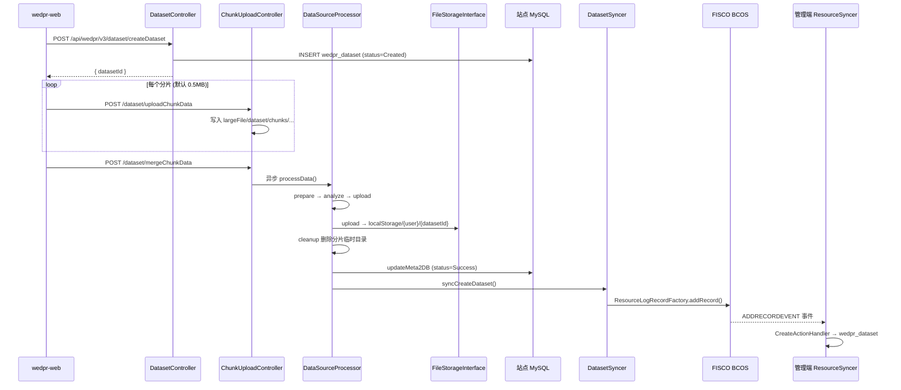
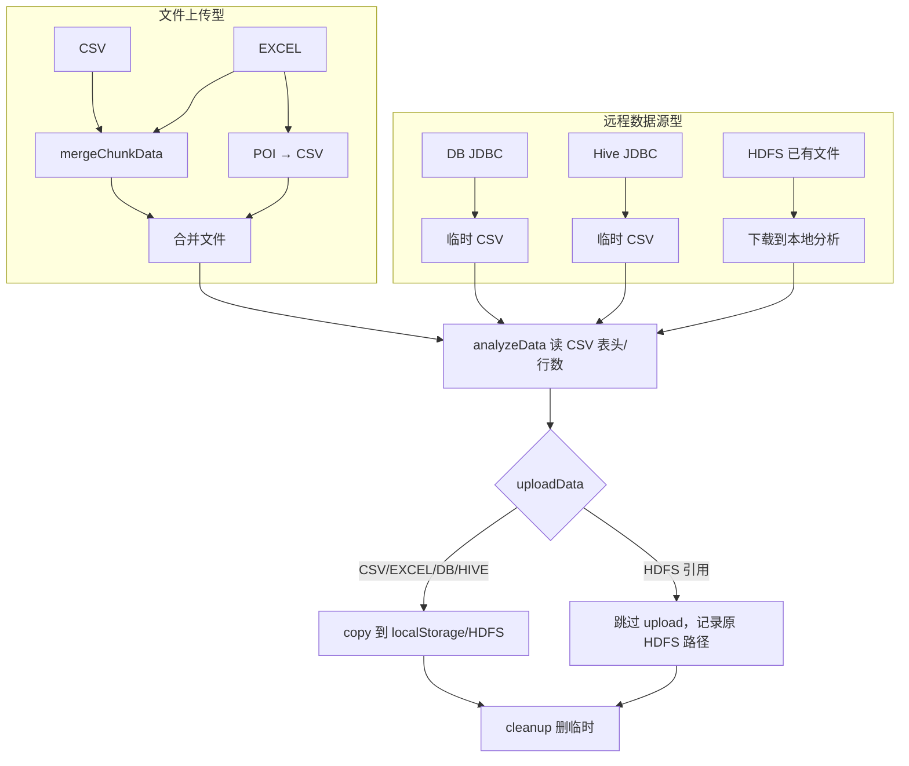

# Phase3：站点端数据上传全流程与隐私计算任务 I/O 规范

> 本文档基于 WeDPR 源码，详细说明**站点端数据上传**的完整链路（本地落盘、区块链存证、元数据同步），以及**不同格式数据在参与隐私计算任务时的统一输入/输出接口规范**。  
> 前置阅读：[`phase1_admin_site_integration.md`](phase1_admin_site_integration.md)、[`phase2_site_runtime.md`](phase2_site_runtime.md)。

---

## 1. 文档范围与核心结论

### 1.1 范围

| 模块 | 代码路径 | 说明 |
|------|---------|------|
| 数据集 API | `wedpr-components/dataset/controller/*` | 创建、分片上传、下载 |
| 数据源处理器 | `wedpr-components/dataset/datasource/processor/*` | 五种格式解析与落盘 |
| 存储抽象 | `wedpr-components/storage/*` | LOCAL / HDFS |
| 链上同步 | `wedpr-components/dataset/sync/*` + `wedpr-components/sync/*` | 元数据存证 |
| 任务调度 | `wedpr-components/scheduler/*` | PSI / MPC / ML / PIR 读数 |
| 前端上传 | `wedpr-web/src/mixin/uploadFile.js` | 分片与 MD5 |

### 1.2 核心结论

1. **原始数据文件始终落在站点端**（LOCAL 或 HDFS），**不会** HTTP 上传到管理端。
2. 除 HDFS「引用已有 CSV 文件」外，**所有格式最终归一化为 CSV** 再分析和持久化；隐私计算任务**只读 CSV 形态**的存储文件（**不支持图片、视频等非结构化媒体**，详见 §1.3）。
3. 处理成功后，站点通过 `DatasetSyncer` 将 **Dataset 元数据 JSON** 写入 FISCO BCOS 合约；管理端/其他站点通过 `ResourceSyncer` 订阅链上事件，镜像到本地 `wedpr_dataset`。
4. 链上同步会 **剥离 `dataSourceMeta`**（DB 密码、SQL 等敏感连接信息不上链）。
5. 任务侧统一通过 **`FileMeta` + `datasetID`** 引用数据集；运行时 `obtainDatasetInfo()` 从 DB 解析 `datasetStoragePath`，再 `FileStorageInterface.download()` 读本地/HDFS 文件。

### 1.3 支持的数据形态与边界说明

> **一句话**：WeDPR 当前版本是**表格型（Structured / Tabular）隐私计算平台**，不是通用的非结构化媒体存储或深度学习数据管道。

#### 1.3.1 支持 vs 不支持

| 类别 | 是否支持 | 说明 |
|------|---------|------|
| CSV 文本表格 | ✅ | 原生支持，直接上传 |
| Excel 表格（.xlsx 等） | ✅ | 上传后 POI 转为 CSV |
| 关系型数据库表（MySQL/PostgreSQL/达梦等） | ✅ | JDBC 导出为 CSV |
| Hive 表（SQL 查询结果） | ✅ | Hive JDBC 导出为 CSV |
| HDFS 上的 **CSV 文件** | ✅ | 引用已有路径，不复制 |
| 图片（PNG/JPG/GIF/WebP 等） | ❌ | 无数据源类型、无解码器 |
| 视频（MP4/AVI 等） | ❌ | 同上 |
| 音频、PDF、Word、二进制模型权重等 | ❌ | 同上 |
| JSON Lines / Parquet / ORC 等 | ❌ | 枚举与 Processor 均未实现 |

源码硬编码的数据源枚举（`DataSourceType`）仅有五种：

```java
public enum DataSourceType {
    CSV, EXCEL, DB, HDFS, HIVE;
}
```
站点前端「数据来源」下拉（`wedpr.dataset.dataSourceType` 配置）与此完全一致，**不包含** IMAGE、VIDEO 等选项。

#### 1.3.2 「归一化为 CSV」的准确含义

文档 §1.2 第 2 点应理解为两层含义：

| 层次 | 含义 |
|------|------|
| **产品能力** | 只接受**结构化表格数据**（行 + 列 + 字段名） |
| **内部实现** | 除 HDFS「引用已有 CSV 文件」外，其余来源在 `prepareData` 阶段都会**生成 CSV 文件**再落盘；任务侧统一用 `CSVFileParser` / `CsvUtils.readCsvHeader` 读取 |

因此：**不是「能存图片但不能算」，而是从上传入口到 PSI/MPC/ML/PIR 执行，整条链路都未为非表格媒体设计。**

#### 1.3.3 HDFS 也不能绕过表格限制

HDFS 类型语义是「引用 HDFS 上**已有的 CSV 文件**」，而非任意对象存储：

- `HdfsDataSourceProcessor.prepareData()` 将 HDFS 文件下载到本地临时目录
- `analyzeData()` 调用 `CsvUtils.readCsvHeader()` 解析表头

若在 HDFS 上放置 PNG/MP4 并填写其路径，**analyzeData 阶段会失败**，数据集无法进入 `Success` 状态，不能参与任务。

#### 1.3.4 强行上传非表格文件会怎样

| 途径 | 结果 |
|------|------|
| 通过 CSV 入口上传图片/视频 | 分片合并可能成功，但 `readCsvHeader` / 行数统计失败 → `status=Failure` |
| 通过 HDFS 引用二进制文件 | 下载后 CSV 解析失败 → 同上 |
| 数据集未 Success | `DatasetStoragePathRetriever` 拒绝被任务引用 |

#### 1.3.5 任务层对数据形态的假定

所有内置隐私计算任务均按 **CSV 列** 处理数据：

| 任务 | 读数方式 | 数据模型 |
|------|---------|---------|
| PSI | `CSVFileParser.extractFields(idFields)` | 按列名提取关联键 |
| MPC | `MpcUtils.makeDatasetToMpcDataDirect()` | 数值/文本列 → MPC 份额 |
| ML | `datasetPath` + `idFields` / `labelField` | 联邦表格机器学习 |
| PIR | `CSVFileParser.processCsvContent()` 逐行 INSERT | 键值型表格查询 |

没有图像解码、视频帧提取、Embedding 管道或多模态 Tensor 交换逻辑。

#### 1.3.6 若业务需要图片/视频/非结构化数据

标准产品**不提供**开箱能力，常见扩展路径如下（均需二次开发）：

1. **特征化后再入库（推荐）**  
   在站点外完成预处理（如 CNN 提取 Embedding、视频抽帧再提特征），将结果写成 CSV（每行一个样本，列为特征向量或元数据字段），再走现有 CSV 上传 + PSI/MPC/ML 流程。

2. **扩展 `DataSourceProcessor`**  
   新增如 `IMAGE` 类型，在 `prepareData` 中解码并转为自定义中间格式；同时扩展 Scheduler Executor Hook 与 C++ 算子，工作量较大，且与现有 PSI/MPC 管道不直接兼容。

3. **HDFS 存原始媒体 + 旁路 Worker**  
   原始二进制放 HDFS，在自定义任务 Worker 中读取；需重新定义 JobParam、Hook 及 Gateway 协议，基本属于新算子而非配置级扩展。

4. **联邦大模型 / 多模态**  
   不能复用当前「CSV → FileMeta → CSVFileParser」管道；需在站点端单独设计参数格式、分片传输与 C++ 推理接口（参见 §11.2）。

---

## 2. 数据上传全流程总览

### 2.1 端到端时序（以 CSV 文件上传为例）


### 2.2 两类入口

源码：`DataSourceType.isUploadDataSource()` 仅 **CSV、EXCEL** 为文件上传型。

| 分类 | 类型 | 创建数据集后 | 触发 `processData` |
|------|------|-------------|-------------------|
| **文件上传型** | CSV、EXCEL | 返回 `datasetId`，等待分片 | `mergeChunkData` 接口 |
| **远程数据源型** | DB、HDFS、HIVE | `createDataset` 后立即异步处理 | `DatasetServiceImpl.createDataset()` 内线程池 |
| **动态数据源** | DB/HIVE（`dynamicDataSource=true`） | 直接 Success，不跑 processData | **任务执行时** `DatasetStoragePathRetriever` |

### 2.3 统一处理管道

所有 Processor 实现 `DataSourceProcessor.processData()` 四阶段：

```
prepareData()  →  准备（合并分片 / 格式转换 / 拉取远程数据）
analyzeData()  →  分析（表头、行数、MD5、文件大小）
uploadData()   →  持久化到 FileStorageInterface
cleanupData()  →  清理临时文件（finally 块保证执行）
```
分发器：`DataSourceProcessorDispatcher`

| dataSourceType | Processor |
|----------------|-----------|
| CSV | `CsvDataSourceProcessor` |
| EXCEL | `XlsxDataSourceProcessor` |
| DB | `DBDataSourceProcessor` |
| HDFS | `HdfsDataSourceProcessor` |
| HIVE | `HiveDataSourceProcessor` |

---

## 3. 站点端 API 规范

**前缀**：`/api/wedpr/v3/dataset`（`DatasetConstant.WEDPR_DATASET_API_PREFIX`）

### 3.1 创建数据集

**接口**：`POST /createDataset`

**请求体**（`CreateDatasetRequest`）：

| 字段 | 必填 | 说明 |
|------|------|------|
| `datasetTitle` | 是 | 标题 |
| `datasetDesc` | 否 | 描述 |
| `datasetLabel` | 否 | 标签 |
| `datasetVisibility` | 是 | 0=私有，1=公开 |
| `datasetVisibilityDetails` | 公开时必填 | JSON，可见范围 |
| `dataSourceType` | 是 | CSV/EXCEL/DB/HDFS/HIVE |
| `dataSourceMeta` | 视类型 | JSON 字符串，见 §4 |
| `approvalChain` | 是 | 审批链 JSON |

**响应**（`CreateDatasetResponse`）：`{ "datasetId": "d-xxxx" }`

**DB 初始状态**：

- 上传型（CSV/EXCEL）：`status = Created(1)`，等待分片
- 静态远程型：`status = Created`，异步处理后变 `Success(0)`
- 动态远程型：`status = Success(0)`，无 storagePath

### 3.2 分片上传（仅 CSV/EXCEL）

**接口**：`POST /uploadChunkData`（`multipart/form-data`）

| 字段 | 说明 |
|------|------|
| `datasetId` | 数据集 ID |
| `identifier` | 文件 MD5（前端 SparkMD5 计算） |
| `index` | 分片序号，从 0 开始 |
| `totalCount` | 分片总数 |
| `filesChunk` | 二进制分片 |

**接口**：`POST /mergeChunkData`（JSON）

| 字段 | 说明 |
|------|------|
| `datasetId` | 数据集 ID |
| `identifier` | 与上传时一致的 MD5 |
| `totalCount` | 分片总数 |

合并成功后 **异步** 执行 `processData()`，并在 finally 中 `updateMeta2DB` + `syncCreateDataset`。

### 3.3 前端分片策略

源码：`wedpr-web/src/mixin/uploadFile.js`

- 分片大小：**0.5MB**（`DefualtChunkSize = 0.5 * 1024 * 1024`）
- 全文件 MD5 作为 `identifier`
- 并发上传上限：**3**，失败重试最多 **5** 次

---

## 4. 不同格式的解析与落盘

### 4.1 存储目录配置

站点配置（`wedpr-site/conf/application-wedpr.properties`）：

```properties
wedpr.dataset.largeFileDataDir=./wedpr/largeFile/     # 分片与临时 CSV
wedpr.storage.type=LOCAL                                 # 或 HDFS
wedpr.storage.local.basedir=./wedpr/localStorage/      # 正式数据
wedpr.datasource.datasetHash=SHA-256                   # 版本哈希算法
wedpr.dataset.datasource.excel.defaultSheet=0          # Excel 默认 Sheet
```
**路径规则**（`DatasetConfig`）：

| 用途 | 路径 |
|------|------|
| 分片目录 | `{largeFileDataDir}/dataset/chunks/{datasetId}/{identifier}/{totalCount}-{index}` |
| 合并临时文件 | `.../chunks/{datasetId}/{identifier}/merged-{identifier}` |
| 远程拉取临时 CSV | `{largeFileDataDir}/dataset/{datasetId}` |
| 正式存储（静态） | `{local.basedir}/{user}/{datasetId}` |
| 正式存储（动态 DB/Hive） | `{local.basedir}/{user}/dy/{timestamp}/{datasetId}` |

### 4.2 各格式处理差异


#### CSV

| 阶段 | 行为 |
|------|------|
| prepareData | `ChunkUploadImpl.mergeChunkData()` 合并分片，校验 MD5 |
| analyzeData | `CsvUtils.readCsvHeader()` + `FileUtils.getFileLinesNumber()` |
| uploadData | `LocalFileStorage.upload()` → `{user}/{datasetId}` |
| cleanupData | `cleanChunkData()` 删除 chunks 目录 |

合并时 MD5 校验（`ChunkUploadImpl`）：合并过程中对分片字节流计算 digest，与前端 `identifier` 比对，不一致则 `Hash value mismatch`。

#### EXCEL

继承 CSV，额外在 `prepareData` 中：

```java
CsvUtils.convertExcelToCsv(mergedFilePath, cvsFilePath, excelDefaultSheet);
```
- 使用 Apache POI 读取指定 Sheet（默认第 0 个）
- 按单元格类型（STRING/NUMERIC/BOOLEAN/BLANK）写入 CSV
- 后续分析与存储针对 **转换后的 CSV**

#### DB

**dataSourceMeta**（`DBDataSource` JSON）：

```json
{
  "dbType": "MYSQL",
  "dbIp": "127.0.0.1",
  "dbPort": 3306,
  "database": "test",
  "userName": "<加密>",
  "password": "<加密>",
  "sql": "SELECT id, name FROM t_user",
  "dynamicDataSource": false,
  "verifySqlSyntaxAndTestCon": true,
  "encryptionModel": true
}
```
| 阶段 | 行为 |
|------|------|
| parseDataSourceMeta | 解密账号密码；可选 SQL 校验 + 连通性测试；仅允许单条 SELECT |
| prepareData | `CsvUtils.convertDBDataToCsv(jdbcUrl, user, passwd, sql, tmpPath)` |
| analyzeData | 读 CSV 表头、行数、MD5、文件大小 |
| uploadData | 上传到 `{user}/{datasetId}` 或 `{user}/dy/{ts}/{datasetId}` |
| cleanupData | 删除 `{largeFileDataDir}/dataset/{datasetId}` 临时目录 |

#### HIVE

**dataSourceMeta**（`HiveDataSource`）：

```json
{
  "sql": "SELECT id, feature FROM hive_table",
  "dynamicDataSource": false
}
```
- JDBC 连接来自站点 `HiveConfig`（非 dataSourceMeta）
- 处理流程与 DB 相同：`convertDBDataToCsv` → analyze → upload → cleanup

#### HDFS

**dataSourceMeta**（`HdfsDataSource`）：

```json
{
  "filePath": "/user/wedpr/agency0/data.csv"
}
```
**前置条件**：`wedpr.storage.type` 必须为 **HDFS**，且文件已存在于 HDFS。

| 阶段 | 行为 |
|------|------|
| parseDataSourceMeta | 校验 HDFS 文件存在 |
| prepareData | `fileStorage.download(hdfsPath → 本地临时)` |
| analyzeData | 读 CSV 表头/行数；**直接设置 storagePath 为原 HDFS 路径** |
| uploadData | **空操作**（不复制文件） |
| cleanupData | 删除本地临时下载 |

### 4.3 落盘后的 Dataset 元数据字段

处理成功写入 `wedpr_dataset` 的关键字段：

| 字段 | 来源 |
|------|------|
| `datasetFields` | CSV 表头，逗号分隔 |
| `datasetColumnCount` | 列数 |
| `datasetRecordCount` | 行数（不含表头） |
| `datasetVersionHash` | 文件内容哈希（SHA-256 或配置算法） |
| `datasetSize` | 字节大小 |
| `datasetStorageType` | LOCAL 或 HDFS |
| `datasetStoragePath` | JSON，如 `{"storageType":"LOCAL","filePath":"/abs/path/..."}` |
| `status` | 0 = Success |

---

## 5. 区块链存证与元数据同步

### 5.1 站点端写入链

处理成功后（`ChunkUploadController.mergeChunkData` 或 `DatasetServiceImpl.createDataset` 异步回调）：

```java
datasetSyncer.syncCreateDataset(userInfo, dataset);
```
`DatasetSyncer.syncCreateDataset()`：

1. `dataset.resetMeta()` — **清空 `dataSourceMeta`**，保留 storagePath、fields、hash 等
2. 序列化 `Dataset` 为 JSON
3. 构建 `ResourceActionRecord`（agency + resourceType=Dataset + action=CREATE）
4. 调用 `ResourceSyncer.sync()` → `BlockChainResourceSyncImpl`

链上写入（`BlockChainResourceSyncImpl.sync()`）：

```
resourceLogRecordFactoryContract.addRecord(record.serialize(), version, callback)
```
状态流转：`WAITING_SUBMIT_TO_CHAIN` → `SUBMITTED_TO_CHAIN` → `SUBMITTED_TO_CHAIN_SUCCESS/FAILED`

### 5.2 订阅端消费（管理端 / 其他站点）

Leader 节点通过 `EventSubscribe` 订阅 `ADDRECORDEVENT`，`ResourceSyncEventHandler` 解析事件后调用已注册的 `CommitHandler`。

数据集处理器：`DatasetSyncerCommitHandler`

- **忽略本机构消息**：`if (agency.equals(myAgency)) return;`（防止重复写入）
- **CREATE** → `CreateActionHandler` → `transactionalAddDataset()` 写入本地 DB
- **UPDATE** → `UpdateActionHandler`
- **REMOVE** → `RemoveActionHandler`

### 5.3 管理端可见 vs 不可见

| 同步到管理端 | 不同步 |
|-------------|--------|
| datasetId、title、desc、label | 原始文件内容 |
| datasetFields、recordCount、columnCount | dataSourceMeta（DB 密码/SQL） |
| datasetVersionHash（链上存证哈希） | 分片临时文件 |
| datasetStorageType、datasetStoragePath（路径描述） | — |
| ownerAgencyName、ownerUserName、visibility | — |

管理端 API（只读）：`GET /api/wedpr/v3/admin/listDataset`、`GET /api/wedpr/v3/admin/queryDataset`

> 管理端 `datasetStoragePath` 仅为**路径描述**，文件仍在站点磁盘/HDFS，管理端无法通过标准接口读取原始内容（详见 phase1 §6.3）。

---

## 6. 隐私计算任务的统一数据模型

### 6.1 关键结论：任务只消费「已落盘的 CSV」

无论用户上传时是 CSV、Excel、DB 还是 Hive，**入库完成后**存储层文件均为 **CSV 格式**（HDFS 引用型除外，但内容也必须是 CSV 语义）。

任务参数中通过 **`FileMeta`** 引用数据集：

```java
public class FileMeta {
    private String datasetID;      // 推荐：只填 datasetID，运行时解析
    private String storageTypeStr; // LOCAL / HDFS
    private String path;           // 绝对或相对存储路径
    private String owner;
    private String ownerAgency;
}
```
运行时解析（`FileMeta.obtainDatasetInfo()`）：

```java
this.dataset = datasetMapper.getDatasetByDatasetId(this.datasetID, false);
setStorageTypeStr(this.dataset.getDatasetStorageType());
setPath(this.dataset.getStoragePathMeta().getFilePath());
setOwner(this.dataset.getOwnerUserName());
setOwnerAgency(this.dataset.getOwnerAgencyName());
```
读取文件（各 Executor Hook 统一模式）：

```java
storage.download(partyInfo.getDataset().getStoragePath(), localCachePath);
```
### 6.2 任务参数公共结构：`DatasetInfo`

```java
public class DatasetInfo {
    protected FileMeta dataset;           // 输入数据集
    protected FileMeta output;            // 输出（部分任务）
    protected Boolean labelProvider;      // ML：是否标签方
    protected String labelField;          // ML：标签列，默认 "y"
    protected Boolean receiveResult;      // 是否接收 PSI 结果
    protected List<String> idFields;      // PSI/ML：关联键列，默认 ["id"]
}
```
**任务创建时推荐写法**：`dataset.datasetID = "d-xxx"`，其余字段由服务端 `obtainDatasetInfo()` 填充。

### 6.3 动态数据源在任务时的刷新

若创建 DB/Hive 数据集时 `dynamicDataSource=true`：

- 创建时不生成 storagePath
- 任务执行前 `DatasetStoragePathRetriever.getDatasetStoragePath()` 会 **重新执行** `processData()`（JDBC 查库 → 临时 CSV → upload → 返回新 StoragePath）

适用场景：每次任务使用数据库最新快照。

---

## 7. 各任务类型的输入/输出规范

### 7.1 总览表

| 任务类型 | JobParam 类 | 输入 | 中间产物 | 输出 | 数据格式要求 |
|---------|------------|------|---------|------|-------------|
| PSI | `PSIJobParam` | 各方 `FileMeta`(datasetID) + `idFields` | `psi_prepare.csv` | `psi_result.csv` | CSV，含 idFields 列 |
| MPC | `MPCJobParam` | `dataSetList` + mpcContent/sql | `mpc_prepare.csv`、`.mpc` | `mpc_result.csv`、`mpc_output.txt` | CSV；可选先跑 PSI |
| ML 训练/预测 | `ModelJobParam` | `dataSetList` + modelSetting | 可选 PSI 流程 | 模型文件 / 预测结果 | CSV；需 labelProvider |
| PIR 服务构建 | `PirServiceSetting` | datasetId + idField | 本地缓存 CSV | MySQL 表 `pir_*` | CSV；发布时导入 DB |

### 7.2 PSI（Private Set Intersection）

**JobParam**：`PSIJobParam`

```json
{
  "jobID": "job-xxx",
  "taskID": "task-xxx",
  "user": "admin",
  "dataSetList": [
    {
      "dataset": { "datasetID": "d-aaa" },
      "idFields": ["id"],
      "receiveResult": true,
      "output": null
    },
    {
      "dataset": { "datasetID": "d-bbb" },
      "idFields": ["user_id"],
      "receiveResult": false
    }
  ]
}
```
**本机构 prepare 流程**（`PSIJobParam.prepare()`）：

```
1. storage.download(dataset.storagePath → .cache/jobs/{jobId}/文件名)
2. CSVFileParser.extractFields(全量CSV, idFields → psi_prepare.csv)
3. storage.upload(psi_prepare.csv → {user}/PSI/{jobId}/psi_prepare.csv)
4. 更新 partyInfo.dataset 为上传后的 FileMeta
5. 删除本地临时文件
```
**输出路径**（本机构自动生成）：

```
WeDPRCommonConfig.getUserJobCachePath(user, "PSI", jobId, "psi_result.csv")
```
**下发 C++ 层的 Party 结构**（`PartyInfo.PartyData`）：

| 字段 | 含义 |
|------|------|
| `input` | prepare 后的 `psi_prepare.csv` 路径 |
| `output` | 本机构 `psi_result.csv` 路径（仅 SERVER 方） |

**约束**：

- 至少 **2 方**参与
- 本机构必须在 `dataSetList` 中
- `idFields` 不可为空

### 7.3 MPC（Secure Multi-Party Computation）

**JobParam**：`MPCJobParam`

```json
{
  "sql": "SELECT ...",
  "mpcContent": "...",
  "dataSetList": [
    { "dataset": { "datasetID": "d-aaa" }, "idFields": ["id"] },
    { "dataset": { "datasetID": "d-bbb" }, "idFields": ["id"] }
  ]
}
```
- `sql` 与 `mpcContent` 二选一；`sql` 会经 `MpcCodeTranslator` 转为 MPC 代码
- `needRunPsi`：由 mpcContent 中是否含 `PSI_OPTION = True` 决定

**prepare 流程**（`MPCExecutorHook`）：

**无 PSI**：

```
storage.download(本机构 dataset → 本地)
MpcUtils.makeDatasetToMpcDataDirect(CSV → mpc_prepare.csv)
storage.upload(mpc_prepare.csv)
```
**有 PSI**（`prepareWithPsi`）：

```
download 本机构原始 CSV
download psi_result.csv
MpcUtils.mergeAndSortById(CSV + psi_result → mpc_prepare.csv)
upload mpc_prepare.csv、.mpc 脚本
```
**输出路径**（`getMpcPath()`）：

| 文件 | 路径模式 |
|------|---------|
| mpc_prepare.csv | `{user}/MPC/{jobId}/mpc_prepare.csv` |
| {jobId}.mpc | `{user}/MPC/{jobId}/{jobId}.mpc` |
| mpc_result.csv | `{user}/MPC/{jobId}/mpc_result.csv` |
| mpc_output.txt | `{user}/MPC/{jobId}/mpc_output.txt` |

### 7.4 ML（联邦机器学习）

**JobParam**：`ModelJobParam`

```json
{
  "modelSetting": { "...": "算法超参", "usePsi": true, "useIv": false },
  "modelPredictAlgorithm": "...",
  "dataSetList": [
    {
      "dataset": { "datasetID": "d-aaa" },
      "idFields": ["id"],
      "labelProvider": true,
      "labelField": "y",
      "receiveResult": true
    },
    {
      "dataset": { "datasetID": "d-bbb" },
      "idFields": ["id"],
      "labelProvider": false
    }
  ]
}
```
**约束**：

- 必须指定 **labelProvider** 方（持有标签列）
- 本机构必须在 `dataSetList` 中
- `usePsi=true` 时走 `MLPSIExecutorHook`，先执行 PSI 再训练/预测

**输入解析**（`parseLabelProviderInfo`）：

```
selfDataset.getDataset().obtainDatasetInfo(datasetMapper)
modelRequest.setDatasetPath(selfDataset.getDataset().getPath())
modelRequest.setIsLabelProvider(本机构是否为 labelProvider)
```
**PSI 输出作为 ML 输入**（`parseIDFilePath`）：

```
modelRequest.setIdFilePath(PSI 默认输出路径 psi_result.csv)
```
**下游请求转换**：

| 阶段 | 输出类型 |
|------|---------|
| Preprocessing | `PreprocessingRequest`（WEDPR_TRAIN / WEDPR_PREDICT） |
| FeatureEngineering | `FeatureEngineeringRequest`（useIv=true 时） |
| MultiParty ML | `ModelJobRequest` |

### 7.5 PIR（Private Information Retrieval）

PIR **不通过 JobParam.dataSetList**，而在 **服务发布** 时构建索引。

**入口**：`PirDatasetConstructorImpl.construct(PirServiceSetting)`

```
1. datasetMapper.getDatasetByDatasetId(datasetId)
2. StoragePathBuilder.getInstance(storageType, storagePath)
3. fileStorage.download → PirServiceConfig.getPirCacheDir()/datasetId
4. 解析 datasetFields（CSV 表头）
5. CREATE TABLE pir_{datasetId} (业务列 + wedpr_pir_id + wedpr_pir_id_hash)
6. CSVFileParser.processCsvContent 逐行 INSERT
```
**输入规范**：

| 项 | 要求 |
|----|------|
| 数据源 | 已 Success 的 datasetId |
| 文件格式 | 存储层 CSV |
| idField | 必须在 datasetFields 中存在 |
| 禁止字段名 | `wedpr_pir_id`、`wedpr_pir_id_hash`（系统保留） |

**输出**：MySQL 表 `pir_{tableId}`，供 PIR 查询引擎使用；查询结果文件默认 `{pirCache}/{user}/{jobId}/pir_result`。

---

## 8. 各数据源格式 → 任务输入的对照

| 原始 dataSourceType | 入库后存储形态 | 任务侧看到的类型 | idFields/labelField 对应 |
|--------------------|--------------|----------------|------------------------|
| CSV | LOCAL/HDFS 上 CSV 文件 | `FileMeta` → CSV | CSV 表头列名 |
| EXCEL | 转 CSV 后存储 | 同 CSV | 同 CSV |
| DB | JDBC 导出 CSV 后存储 | 同 CSV | SQL 结果列名 |
| HIVE | Hive SQL 导出 CSV 后存储 | 同 CSV | SQL 结果列名 |
| HDFS | HDFS 上 CSV（不复制） | `FileMeta` path 指向 HDFS | CSV 表头列名 |
| DB/HIVE 动态 | 任务时临时导出 CSV | 每次任务重新 processData | 同 CSV |

**重要**：任务创建 UI / API **不需要**也不应该传递 `dataSourceType`；只需传 `datasetID` 和列名配置（`idFields`、`labelField`）。

---

## 9. 任务缓存与文件命名约定

配置项（`ExecutorConfig`，可通过 `application-wedpr.properties` 覆盖）：

| 配置键 | 默认值 | 用途 |
|--------|--------|------|
| `wedpr.executor.job.cache.dir` | `./.cache/jobs` | 任务本地缓存根目录 |
| `wedpr.executor.psi.tmp.file.name` | `psi_prepare.csv` | PSI 字段提取临时名 |
| `wedpr.executor.psi.result.file.name` | `psi_result.csv` | PSI 结果 |
| `wedpr.executor.mpc.prepare.file.name` | `mpc_prepare.csv` | MPC 输入 |
| `wedpr.executor.mpc.result.file.name` | `mpc_result.csv` | MPC 结果 |
| `wedpr.executor.mpc.output.file.name` | `mpc_output.txt` | MPC 文本输出 |

用户级任务路径（`WeDPRCommonConfig.getUserJobCachePath`）：

```
{storageBase}/{user}/{JobType}/{jobId}/{fileName}
```
---

## 10. Dataset 状态机

| code | 枚举 | 含义 |
|------|------|------|
| 0 | Success | 可用，可参与任务 |
| 1 | Created | 已创建，等待上传/处理 |
| -1 | Failure | 失败，可重试 |
| -2 | Fatal | 致命失败 |
| 2–8 | DataAnalyzing / Uploading / Merging 等 | 处理中间态 |

任务读取数据集前会校验（`DatasetStoragePathRetriever`）：

```java
if (status != DatasetStatus.Success.getCode()) {
    throw new DatasetException("dataset is not available status");
}
```
---

## 11. 二次开发指引

### 11.1 新增数据源格式

1. 实现 `DataSourceProcessor` 四阶段，**prepareData 阶段归一化为 CSV**
2. 在 `DataSourceProcessorDispatcher` 注册
3. 在 `DataSourceType` 枚举中添加类型
4. 任务侧 **无需修改**（自动通过 FileMeta 读 CSV）

### 11.2 差分隐私 / 联邦大模型微调

- **数据上传链路**：复用现有 Processor + Storage，无需改管理端
- **任务 I/O**：在 `ModelJobParam` / Executor Hook 中扩展 prepare 逻辑；输入仍为 CSV path，输出写入 `{user}/MPC|ML/{jobId}/`
- **管理端**：继续只同步元数据；若需平台级模型 registry，可新增 ResourceType 走同一套 ResourceSyncer

### 11.3 管理端读取原始数据

标准架构 **不支持**。若业务必须，需自行实现站点代理下载 API，不在本文档范围内。

---

## 12. 关键源码索引

| 主题 | 路径 |
|------|------|
| 创建数据集 | `dataset/service/DatasetServiceImpl.java` |
| 分片上传 | `dataset/controller/ChunkUploadController.java` |
| 分片合并 | `dataset/service/ChunkUploadImpl.java` |
| CSV Processor | `dataset/datasource/processor/CsvDataSourceProcessor.java` |
| 链上同步 | `dataset/sync/DatasetSyncer.java` |
| 链订阅消费 | `dataset/sync/DatasetSyncerCommitHandler.java` |
| 区块链写入 | `sync/impl/BlockChainResourceSyncImpl.java` |
| 任务读数据集 | `dataset/datasource/storage/DatasetStoragePathRetriever.java` |
| FileMeta | `scheduler/executor/impl/model/FileMeta.java` |
| PSI 参数与 prepare | `scheduler/executor/impl/psi/model/PSIJobParam.java` |
| MPC 参数 | `scheduler/executor/impl/mpc/MPCJobParam.java` |
| ML 参数 | `scheduler/executor/impl/ml/model/ModelJobParam.java` |
| PIR 构建 | `task-plugin/pir/.../PirDatasetConstructorImpl.java` |
| 前端上传 | `wedpr-web/src/mixin/uploadFile.js` |

---

## 13. 相关文档

- [管理端与站点端接入规范](phase1_admin_site_integration.md) — 元数据同步通道、管理端 API
- [站点端运行机制](phase2_site_runtime.md) — 启动、调度、API 分层
- [WeDPR 系统架构说明](WeDPR系统架构说明.md) — 整体架构
