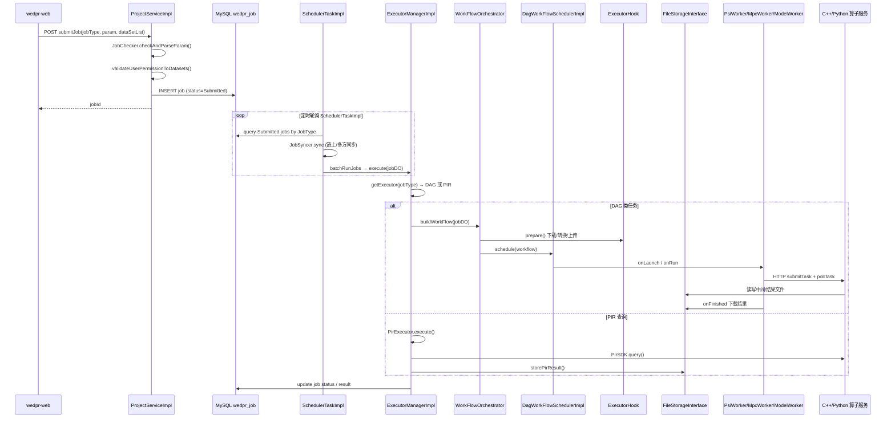
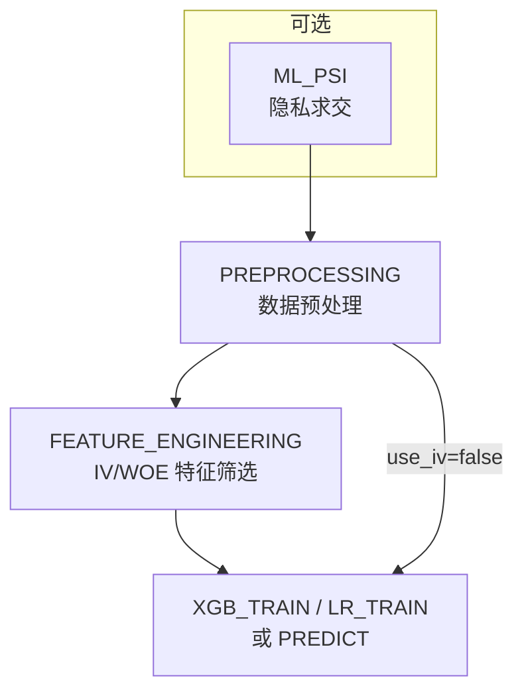

# Phase4：站点端隐私计算任务全流程与 I/O 接口规范

> 本文档基于 WeDPR 源码，详细说明**站点端项目空间**中各类隐私计算任务从**任务提交 → 调度编排 → 数据读取/prepare → 算子执行 → 结果落盘**的完整链路，并给出各任务类型的**输入/输出接口规范**。  
> 前置阅读：[`Phase3_数据上传全流程解析.md`](Phase3_数据上传全流程解析.md)（数据上传与数据集 I/O）、[`phase2_site_runtime.md`](phase2_site_runtime.md)（站点端运行机制）。

---

## 1. 文档范围与核心结论

### 1.1 范围

| 模块 | 代码路径 | 说明 |
|------|---------|------|
| 任务提交 | `meta/project/service/ProjectServiceImpl.java` | 校验参数、写 DB、权限检查 |
| 定时调度 | `scheduler/core/SchedulerTaskImpl.java` | 拉取 Submitted 任务、并发控制 |
| 执行器路由 | `scheduler/executor/manager/ExecutorManagerImpl.java` | DAG / PIR 分流 |
| 工作流编排 | `scheduler/workflow/WorkFlowOrchestrator.java` | PSI/MPC/ML 子流程拆分 |
| DAG 调度 | `scheduler/dag/DagWorkFlowSchedulerImpl.java` | Worker 链式执行 |
| Prepare Hook | `scheduler/executor/hook/*ExecutorHook.java` | 数据下载、转换、上传 |
| C++ 算子 | `backend/cpp/wedpr-computing/*` | PSI / MPC / PIR 计算 |
| Python 算子 | `backend/python/ppc_model/*` | ML 预处理 / 训练 / 预测 |
| 存储 | `storage/api/FileStorageInterface` | LOCAL / HDFS 读写 |

### 1.2 核心结论

1. **所有隐私计算任务的原始输入均为已 Success 的 CSV 数据集**（见 Phase3）；任务 API 通过 `FileMeta.datasetID` 引用，运行时 `obtainDatasetInfo()` 解析存储路径。
2. **调度架构分两路**：PSI / MPC / SQL / ML 类任务走 **DAG Executor**（多 Worker 链）；PIR 查询走 **PirExecutor**（直连 PIR SDK，无 DAG）。
3. **Prepare 与 Execute 分离**：Java 侧 Hook 负责 download → 转换 → upload 中间文件；Worker 通过 HTTP 调用 C++/Python 算子服务执行计算。
4. **ML 类任务（SecureLGBM / SecureLR）是 DAG 最长链路**：可选 PSI → 预处理 → 可选特征工程 → 训练/预测，各节点由 `JobWorkFlowBuilderManager` 的依赖 Handler 自动串联。
5. **PIR 分两段**：服务发布时将 CSV 导入 MySQL 索引；查询任务不读 `dataSetList`，而是查已发布服务。

### 1.3 产品名称与 JobType 映射

配置来源：`wedpr-builder/db/wedpr_dml.sql` → `wedpr_algorithm_templates`

| 产品名称 | JobType | ExecutorType | WorkerNodeType / 算子 |
|---------|---------|--------------|----------------------|
| 数据对齐 | `PSI` | DAG | PSI → C++ |
| 联表分析 | `SQL` | DAG | MPC → C++（SQL 转 MPC 代码） |
| 自定义计算 | `MPC` | DAG | MPC → C++ |
| SecureLGBM 训练 | `XGB_TRAINING` | DAG | MODEL → Python |
| SecureLGBM 预测 | `XGB_PREDICTING` | DAG | MODEL → Python |
| SecureLR 建模 | `LR_TRAINING` | DAG | MODEL → Python |
| SecureLR 预测 | `LR_PREDICTING` | DAG | MODEL → Python |
| 匿踪查询 | `PIR` | PIR | PIR SDK → C++ |
| （内部子任务） | `ML_PSI` / `MPC_PSI` / `PREPROCESSING` / `FEATURE_ENGINEERING` | DAG | 编排自动生成 |

---

## 2. 端到端总览

### 2.1 全流程时序


### 2.2 任务状态机

| 阶段 | JobStatus | 触发方 |
|------|-----------|--------|
| 用户提交 | `Submitted` | `ProjectServiceImpl.submitJob()` |
| 调度选中 | `Running` | `SchedulerImpl.batchRunJobs()` |
| 执行成功 | `RunSuccess` | `ExecutiveContext.onTaskFinished(SUCCESS)` |
| 执行失败 | `RunFailed` | 同上 FAILED |
| 用户取消 | `WaitToKill` → `Killing` → `Killed` | `SchedulerTaskImpl.killTasks()` |

PIR 任务 `JobType.shouldSync()` 返回 `false`，不参与多方 Job 同步。

### 2.3 执行器路由

```java
// JobType.getExecutorType()
PSI / MPC / SQL / ML* → ExecutorType.DAG → DagSchedulerExecutor
PIR                     → ExecutorType.PIR → PirExecutor
```
`DagSchedulerExecutor.innerExecute()` 调用 `WorkFlowOrchestrator.buildWorkFlow()` 构建 DAG，再交给 `DagWorkFlowSchedulerImpl.schedule()` 执行。

---

## 3. 统一数据模型与读取规范

> 数据集上传与落盘细节见 Phase3 §4；任务侧统一数据模型（FileMeta / DatasetInfo）见 [`Phase4_隐私计算任务详解.md`](Phase4_隐私计算任务详解.md) §1。本节聚焦**任务执行时**如何读数。

### 3.1 FileMeta — 数据集引用

```java
// scheduler/executor/impl/model/FileMeta.java
public class FileMeta {
    private String datasetID;      // 推荐：只填此项
    private String storageTypeStr; // LOCAL / HDFS（运行时填充）
    private String path;           // 存储绝对路径（运行时填充）
    private String owner;
    private String ownerAgency;
}
```
运行时解析：

```java
public void obtainDatasetInfo(DatasetMapper datasetMapper) {
    this.dataset = datasetMapper.getDatasetByDatasetId(this.datasetID, false);
    setStorageTypeStr(this.dataset.getDatasetStorageType());
    setPath(this.dataset.getStoragePathMeta().getFilePath());
    setOwner(this.dataset.getOwnerUserName());
    setOwnerAgency(this.dataset.getOwnerAgencyName());
}
```
读取文件：

```java
storage.download(partyInfo.getDataset().getStoragePath(), localCachePath);
```
### 3.2 DatasetInfo — 参与方数据集配置

```java
// scheduler/executor/impl/model/DatasetInfo.java
public class DatasetInfo {
    protected FileMeta dataset;
    protected FileMeta output;
    protected Boolean labelProvider = false;   // ML：是否标签方
    protected String labelField = "y";         // ML：标签列
    protected Boolean receiveResult = false;   // PSI：是否接收交集结果
    protected List<String> idFields = ["id"];  // 关联键列
}
```
### 3.3 动态数据源刷新

`DatasetStoragePathRetriever.getDatasetStoragePath()` 在 DB/Hive 且 `dynamicDataSource=true` 时，任务执行前重新 `processData()` 导出 CSV。

### 3.4 本地缓存与远程路径约定

| 配置键 | 默认值 | 用途 |
|--------|--------|------|
| `wedpr.executor.job.cache.dir` | `./.cache/jobs` | 任务本地临时目录 |
| `wedpr.executor.psi.prepare.file.name` | `psi_prepare.csv` | PSI 字段提取结果 |
| `wedpr.executor.psi.result.file.name` | `psi_result.csv` | PSI 交集结果 |
| `wedpr.executor.mpc.prepare.file.name` | `mpc_prepare.csv` | MPC 输入份额文件 |
| `wedpr.executor.mpc.result.file.name` | `mpc_result.csv` | MPC 数值结果 |
| `wedpr.executor.mpc.output.file.name` | `mpc_output.txt` | MPC 文本输出 |

用户级远程路径（`WeDPRCommonConfig.getUserJobCachePath`）：

```
{userShareDir}/{jobType}/{jobType}-{jobId}/{fileName}
```
示例：`admin/psi/psi-job123/psi_result.csv`

---

## 4. 工作流编排机制

### 4.1 WorkFlowOrchestrator 入口

```java
// WorkFlowOrchestrator.buildWorkFlow()
if (JobType.isPSIJob(jobType))       → buildPSIWorkFlow()
else if (JobType.isMultiPartyMlJob()) → buildXGBWorkFlow()  // 含 LR
else if (JobType.isMPCJob())          → buildMPCWorkFlow()  // 含 SQL
```
### 4.2 ML 工作流分支

```java
// buildXGBWorkFlow()
if (modelJobParam.usePSI()) {
    jobDO.setJobType(ML_PSI);           // 先跑 PSI
} else {
    jobDO.setJobRequest(toPreprocessingRequest());
    jobDO.setJobType(MLPreprocessing);  // 直接预处理
}
```
依赖 Handler 自动追加后续节点（`JobWorkFlowBuilderManager`）：

```
ML_PSI 完成 → PREPROCESSING
PREPROCESSING 完成 → FEATURE_ENGINEERING（use_iv=true）或 XGB_TRAIN/LR_TRAIN/PREDICT
FEATURE_ENGINEERING 完成 → XGB_TRAIN/LR_TRAIN/PREDICT
```
### 4.3 MPC 工作流分支

```java
// buildMPCWorkFlow()
if (mpcJobParam.isNeedRunPsi()) {  // mpcContent 含 PSI_OPTION = True
    jobDO.setJobType(MPC_PSI);     // 先 PSI
}
// MPC_PSI 完成 → Handler 追加 MPC 节点
```
### 4.4 DAG 节点执行

每个 `WorkFlowNode` 对应一个 `JobWorker` 记录：

1. **onLaunch**（部分 Worker）：如 `MpcWorker` 在此执行 `prepareWithoutPsi/prepareWithPsi`
2. **onRun**：LoadBalancer 选算子节点 → HTTP `submitTask` → `pollTask`
3. **onFinished**：如下载 MPC 结果、解析输出文件

Worker 与算子服务映射（HASH 策略，同 jobId 固定节点）：

| Worker | ServiceName | 客户端 |
|--------|-------------|--------|
| PsiWorker | `{agency}-psi` | PsiClient |
| MpcWorker | `{agency}-mpc` | MpcClient |
| ModelWorker | `model` | ModelClient |

---

## 5. 各任务类型详细流程

### 5.1 数据对齐（PSI）

#### 5.1.1 数据流向

```mermaid
flowchart LR
    A[原始 CSV<br/>dataset.storagePath] -->|download| B[.cache/jobs/jobId/文件名]
    B -->|CSVFileParser.extractFields| C[psi_prepare.csv 本地]
    C -->|upload| D[{user}/psi/psi-jobId/psi_prepare.csv]
    D -->|PSIRequest.parties.data.input| E[C++ PSI 算子]
    E -->|write| F[{user}/psi/psi-jobId/psi_result.csv]
    F -->|receiveResult=true 方| G[任务结果]
```
#### 5.1.2 Prepare 流程（本机构）

源码：`PSIJobParam.prepare()` → `PSIExecutorHook.preparePSIJob()`

```
1. obtainDatasetInfo(datasetID)
2. storage.download(dataset → .cache/jobs/{jobId}/)
3. CSVFileParser.extractFields(全量CSV, idFields → psi_prepare.csv)
4. storage.upload(psi_prepare.csv → {user}/PSI/{jobId}/psi_prepare.csv)
5. 更新 partyInfo.dataset 为上传后的 FileMeta
6. 删除本地临时文件
```
#### 5.1.3 下发 C++ 的请求结构

`PSIJobParam.convert()` → `PSIRequest`：

```json
{
  "taskID": "task-xxx",
  "algorithm": 0,
  "syncResult": true,
  "receiverList": ["agencyA"],
  "user": "admin",
  "parties": [
    {
      "id": "agencyA",
      "partyIndex": 1,
      "data": {
        "id": "job-xxx",
        "input": { "path": ".../psi_prepare.csv", "ownerAgency": "agencyA" },
        "output": { "path": ".../psi_result.csv", "ownerAgency": "agencyA" }
      }
    },
    {
      "id": "agencyB",
      "partyIndex": 0,
      "data": {
        "input": { "path": ".../psi_prepare.csv" },
        "output": null
      }
    }
  ]
}
```
算法选择：2 方 → `CM_PSI_2PC(0)`；多方 → `ECDH_PSI_MULTI(4)`。

C++ 侧约束（`PSIFramework.loadData()`）：数据源**只能一列**（关联键）。

#### 5.1.4 输入/输出规范

**JobParam 类**：`PSIJobParam`

| 字段 | 类型 | 必填 | 说明 |
|------|------|------|------|
| `jobID` | string | 是 | 任务 ID |
| `taskID` | string | 运行时 | 子任务 ID |
| `user` | string | 是 | 提交用户 |
| `dataSetList` | PartyResourceInfo[] | 是 | ≥2 方 |
| `dataSetList[].dataset.datasetID` | string | 是 | 数据集 ID |
| `dataSetList[].dataset.ownerAgency` | string | 是 | 机构名 |
| `dataSetList[].idFields` | string[] | 是 | 关联键列名，不可空 |
| `dataSetList[].receiveResult` | bool | 否 | 是否接收交集（ML_PSI/MPC_PSI 时全部方为 receiver） |
| `dataSetList[].output` | FileMeta | 否 | 本机构可省略，自动生成 |

**输出**：

| 文件 | 路径 | 接收方 |
|------|------|--------|
| `psi_prepare.csv` | `{user}/psi/psi-{jobId}/psi_prepare.csv` | 各方 input |
| `psi_result.csv` | `{user}/psi/psi-{jobId}/psi_result.csv` | `receiveResult=true` 或 ML/MPC 子流程 |

---

### 5.2 联表分析（SQL）/ 自定义计算（MPC）

SQL 与 MPC 共用 `MPCJobParam` 和 `MPCExecutorHook`；`SQL` 类型在 check 阶段经 `MpcCodeTranslator.translateSqlToMpcCode()` 转为 `mpcContent`。

#### 5.2.1 数据流向

**无 PSI**：

```mermaid
flowchart LR
    A[原始 CSV] -->|download| B[本地缓存]
    B -->|MpcUtils.makeDatasetToMpcDataDirect| C[mpc_prepare.csv]
    C -->|upload| D[远程 mpc_prepare.csv]
    E[mpcContent / SQL 翻译] -->|upload| F[{jobId}.mpc]
    D --> G[C++ MPC 算子]
    F --> G
    G --> H[mpc_output.txt / mpc_result.csv]
```
**有 PSI**（`PSI_OPTION = True`）：

```
DAG: MPC_PSI 节点 → PSI 全流程 → MPC 节点
MPC prepareWithPsi:
  download 原始 CSV + psi_result.csv
  MpcUtils.mergeAndSortById → mpc_prepare.csv
  upload mpc_prepare.csv + {jobId}.mpc
```
#### 5.2.2 下发 C++ 的请求结构

`MPCExecutorHook.buildJobRequest()` → `MpcRunJobRequest`：

```json
{
  "jobId": "task-xxx",
  "participantCount": 2,
  "selfIndex": 0,
  "isMalicious": false,
  "bitLength": 64,
  "receiveResult": true,
  "mpcFilePath": ".../MPC/mpc-{jobId}/{jobId}.mpc",
  "inputFilePath": ".../mpc_prepare.csv",
  "outputFilePath": ".../mpc_output.txt",
  "resultFilePath": ".../mpc_result.csv",
  "owner": "admin",
  "receiverNodeIp": "...",
  "mpcNodeDirectPort": 14000
}
```
#### 5.2.3 结果回收（MpcWorker.onFinished）

仅 `receiveResult=true` 方（`selfIndex==0` 的提交方）执行：

```
1. download mpc_output.txt → 本地
2. 若 needRunPsi：download psi_result.csv，提取 id 列
3. MpcResultFileResolver 解析输出，生成可读 mpc_result.csv
4. upload 到远程存储
```
#### 5.2.4 输入/输出规范

**JobParam 类**：`MPCJobParam`

| 字段 | 类型 | 必填 | 说明 |
|------|------|------|------|
| `sql` | string | 二选一 | SQL 语句，自动转 MPC 代码 |
| `mpcContent` | string | 二选一 | Python MPC 脚本 |
| `dataSetList` | DatasetInfo[] | 是 | 各方数据集 |
| `dataSetList[].dataset.datasetID` | string | 是 | 数据集 ID |
| `dataSetList[].idFields` | string[] | 否 | PSI 模式下需要 |
| `needRunPsi` | bool | 自动 | 由 mpcContent 正则 `PSI_OPTION\s*=\s*True` 决定 |

**中间/输出文件**（路径前缀 `{user}/MPC/mpc-{jobId}/`）：

| 文件 | 说明 |
|------|------|
| `mpc_prepare.csv` | MPC 输入（对齐后的列数据/份额） |
| `{jobId}.mpc` | MPC 脚本 |
| `mpc_output.txt` | C++ 算子原始文本输出 |
| `mpc_result.csv` | Java 解析后的结构化结果 |

---

### 5.3 SecureLGBM / SecureLR（联邦机器学习）

SecureLGBM（`XGB_TRAINING`/`XGB_PREDICTING`）与 SecureLR（`LR_TRAINING`/`LR_PREDICTING`）共用 `ModelJobParam` 和 ML DAG 编排，差异在 `modelSetting` 模板及 Python 引擎。

#### 5.3.1 完整 DAG 链路


#### 5.3.2 各阶段数据流

**阶段 0：ML_PSI（use_psi=true）**

- 复用 §5.1 PSI 全流程
- `MLPSIExecutorHook` 将 `ModelJobParam` 转为 `PSIJobParam`
- ML 场景下所有参与方均为 `receiver`（`syncResult=true`）

**阶段 1：PREPROCESSING**

Java 下发 `PreprocessingRequest`（继承 `ModelJobRequest`）：

```json
{
  "task_type": "PREPROCESSING",
  "algorithm_type": "Train",
  "need_run_psi": true,
  "job_id": "job-xxx",
  "dataset_path": "/storage/admin/d-aaa",
  "psi_result_path": "/storage/admin/psi/psi-job-xxx/psi_result.csv",
  "is_label_holder": true,
  "participant_id_list": ["agencyA", "agencyB"],
  "result_receiver_id_list": ["agencyA"],
  "model_dict": { "use_psi": 1, "fillna": 0, "...": "..." }
}
```
Python 侧（`local_processing_party.py`）：

```
1. storage_client.download_file(dataset_path, 本地)
2. 若 need_run_psi：download psi_result.csv
3. pd.read_csv → 可选 merge(on='id')
4. process_dataframe() 缺失值/异常值/归一化/PSI筛选/相关性筛选
5. 输出 model_prepare.csv + preprocessing_result.csv（训练）
6. upload 到 {user}/share/jobs/model/{jobId}/
```
**阶段 2：FEATURE_ENGINEERING（use_iv=true）**

下发 `FeatureEngineeringRequest`，Python 计算 WOE/IV，输出 `woe_iv.csv`、`iv_selected.csv`、`xgb_result_column_info_selected.csv`。

**阶段 3：XGB_TRAIN / LR_TRAIN / PREDICT**

下发 `ModelJobRequest`（含 `task_type`、`algorithm_type`）：

Python 侧（`secure_model_context.py` / `SecureDataset`）：

```
1. download model_prepare.csv（及 eval_column 等辅助文件）
2. pd.read_csv → 划分 train/test
3. VerticalLGBM* / VerticalLR* 纵向联邦训练或预测
4. 输出 model.kpl、metric 文件、predict output 等
5. upload 到远程 share 目录
```
#### 5.3.3 ML 中间/结果文件清单

来源：`ppc_model/common/base_context.py`

| 文件 | 阶段 | 说明 |
|------|------|------|
| `psi_result.csv` | PSI | 交集 ID |
| `model_prepare.csv` | 预处理 | 入模数据 |
| `preprocessing_result.csv` | 预处理 | 列元信息（训练） |
| `woe_iv.csv` | 特征工程 | WOE/IV 统计 |
| `iv_selected.csv` | 特征工程 | IV 筛选结果 |
| `model.kpl` / `model_enc.kpl` | 训练 | 模型文件 |
| `train_model_output.csv` | 训练 | 训练集预测输出 |
| `test_model_output.csv` | 预测 | 测试/预测输出 |
| `*_metric_*.csv` / 图表 | 训练 | AUC/KS/PR 等评估 |

远程路径前缀：`{user}/share/jobs/model/{jobId}/`

#### 5.3.4 输入/输出规范

**JobParam 类**：`ModelJobParam`

| 字段 | 类型 | 必填 | 说明 |
|------|------|------|------|
| `modelSetting` | object | 是 | 算法超参，见 `wedpr_setting_template` |
| `modelPredictAlgorithm` | string | 预测必填 | 预测用模型配置 JSON |
| `dataSetList` | DatasetInfo[] | 是 | 各方数据集 |
| `dataSetList[].dataset.datasetID` | string | 是 | 数据集 ID |
| `dataSetList[].idFields` | string[] | 是 | 关联键 |
| `dataSetList[].labelProvider` | bool | 是 | 必须且仅一方为 true |
| `dataSetList[].labelField` | string | 否 | 默认 `y` |
| `dataSetList[].receiveResult` | bool | 否 | 结果接收方 |

**modelSetting 关键开关**（XGB/LR 共用）：

| 字段 | 说明 |
|------|------|
| `use_psi` | 是否先跑 ML_PSI |
| `use_iv` | 是否跑特征工程 |
| `fillna` / `normalized` / `standardized` | 预处理选项 |
| `train_features` | 指定入模特征列 |

**约束**：

- 本机构必须在 `dataSetList` 中
- 必须指定唯一的 `labelProvider` 方
- 数据必须为 CSV 表格，含 `idFields` 和标签列（标签方）

---

### 5.4 匿踪查询（PIR）

PIR 是唯一不走 DAG 的隐私计算任务，分**服务发布**和**查询任务**两阶段。

#### 5.4.1 阶段 A：服务发布（构建索引）

入口：`PirDatasetConstructorImpl.construct(PirServiceSetting)`

```mermaid
flowchart LR
    A[datasetId] --> B[getDatasetByDatasetId]
    B --> C[fileStorage.download CSV]
    C --> D[解析 datasetFields 表头]
    D --> E[CREATE TABLE pir_{datasetId}]
    E --> F[CSVFileParser.processCsvContent 逐行 INSERT]
    F --> G[(MySQL pir_* 表)]
```
**PirServiceSetting 规范**：

| 字段 | 必填 | 说明 |
|------|------|------|
| `datasetId` | 是 | 已 Success 的数据集 |
| `idField` | 是 | 查询键列，须在 datasetFields 中 |
| `searchType` | 是 | 查询类型 |
| `accessibleValueQueryFields` | 视类型 | 值查询可返回字段 |

系统保留列名：`wedpr_pir_id`、`wedpr_pir_id_hash`（不可用作业务列）。

#### 5.4.2 阶段 B：查询任务

`PirExecutor` 直接调用 `PirSDK.query()`，**不读 dataSetList**。

**JobParam 类**：`PirQueryParam`

| 字段 | 类型 | 必填 | 说明 |
|------|------|------|------|
| `serviceId` | string | 是 | 已发布 PIR 服务 ID |
| `searchIdList` | string[] | 视类型 | 查询键值列表 |
| `queriedFields` | string[] | 是 | 返回字段 |
| `searchType` | string | 是 | 如 SearchExist / SearchValue |
| `pirAlgorithmType` | string | 否 | 默认 idFilter |
| `obfuscationOrder` | int | 否 | 哈希混淆复杂度，默认 9 |
| `filterLength` | int | 否 | 前缀长度，默认 4 |

**输出**：

```
本地：{pirCacheDir}/{user}/{jobId}/pir_result
经 PirResult.persistentResult() 持久化
```
---

## 6. 输入/输出接口规范总表

### 6.1 JobParam 类与 Executor 映射

| 产品任务 | JobType | JobParam 类 | Executor | 下发算子请求类 |
|---------|---------|------------|----------|--------------|
| 数据对齐 | PSI | `PSIJobParam` | DAG | `PSIRequest` |
| 联表分析 | SQL | `MPCJobParam` | DAG | `MpcRunJobRequest` |
| 自定义计算 | MPC | `MPCJobParam` | DAG | `MpcRunJobRequest` |
| SecureLGBM 训练/预测 | XGB_* | `ModelJobParam` | DAG | `PreprocessingRequest` / `FeatureEngineeringRequest` / `ModelJobRequest` |
| SecureLR 建模/预测 | LR_* | `ModelJobParam` | DAG | 同上 |
| 匿踪查询 | PIR | `PirQueryParam` | PIR | `PirQueryParam`（+ CredentialInfo） |
| PIR 服务发布 | — | `PirServiceSetting` | 服务插件 | — |

### 6.2 公共 dataSetList 条目规范

```json
{
  "dataset": {
    "datasetID": "d-xxxxxxxx",
    "ownerAgency": "agency0"
  },
  "idFields": ["id"],
  "labelProvider": false,
  "labelField": "y",
  "receiveResult": true,
  "output": null
}
```
| 任务 | datasetID | idFields | labelProvider | receiveResult |
|------|-----------|----------|---------------|---------------|
| PSI | 必填 | 必填 | — | 可选 |
| MPC/SQL | 必填 | PSI 模式必填 | — | 自动（index=0 方） |
| ML | 必填 | 必填 | 必填（唯一 true） | 可选 |
| PIR 查询 | **不使用** | — | — | — |

### 6.3 各任务输出汇总

| 任务 | 主要输出 | 存储位置 | 格式 |
|------|---------|---------|------|
| PSI | `psi_result.csv` | `{user}/psi/psi-{jobId}/` | CSV（交集 ID） |
| MPC/SQL | `mpc_result.csv`、`mpc_output.txt` | `{user}/MPC/mpc-{jobId}/` | CSV / 文本 |
| SecureLGBM/LR | `model.kpl`、预测 CSV、metric 文件 | `{user}/share/jobs/model/{jobId}/` | 模型 + CSV |
| PIR 查询 | `pir_result` | `{pirCache}/{user}/{jobId}/` | 查询结果文件 |
| PIR 服务 | MySQL 表 `pir_{datasetId}` | 站点 MySQL | 关系表 |

---

## 7. 任务提交 API 与参数校验

### 7.1 提交入口

```
POST /api/wedpr/v3/project/submitJob
```
源码：`ProjectServiceImpl.submitJob()`

```
1. JobRequest.check() — 项目/参与方校验
2. jobChecker.checkAndParseParam() — 按 JobType 反序列化 JobParam
3. validateUserPermissionToDatasets() — 数据集授权
4. insertJob(status=Submitted)
5. 返回 jobId
```
### 7.2 JobChecker 注册

各 JobType 在 `SchedulerLoader` / `JobCheckerConfig` 中注册对应的 `*ExecutorParamChecker`，负责：

- 反序列化 JSON param
- 调用 `obtainDatasetInfo()` 填充 FileMeta
- 业务约束校验（方数、labelProvider、sql/mpcContent 等）

---

## 8. 调度与并发

### 8.1 SchedulerTaskImpl 轮询逻辑

```
每 wedpr.scheduler.interval.ms：
  1. killTasks() — 处理 WaitToKill
  2. 遍历 JobType.values()
  3. concurrency = 算子节点数 × wedpr.scheduler.job.concurrency
  4. 若 runningJobs < concurrency，拉取 Submitted/WaitToRetry 任务
  5. JobSyncer.sync() — 多方任务状态同步（PIR 除外）
  6. SchedulerImpl.batchRunJobs() — 线程池 execute
```
### 8.2 本机构参与判定

`SchedulerImpl.batchRunJobs()` 仅执行 `jobDO.isJobParty(agency)` 为 true 的任务；非本机构参与的任务跳过。

---

## 9. C++ 算子层数据读取（PSI / MPC / PIR）

Java prepare 上传的中间文件，由 C++ 通过 `DataResourceLoader` 读取：

```cpp
// PSIFramework.loadData()
auto reader = _dataResourceLoader->loadReader(_dataResource->desc(), DataSchema::Bytes, true);
// 约束：columnSize 必须为 1（单列关联键）
```
| 算子 | 输入 | 读取方式 |
|------|------|---------|
| PSI | `psi_prepare.csv` | LineReader，单列 Bytes/String |
| MPC | `mpc_prepare.csv` | 按 MPC 脚本列定义读份额 |
| PIR | MySQL `pir_*` 表 | JDBC 索引，非 FileMeta |

---

## 10. 二次开发指引

### 10.1 新增隐私计算任务类型

1. 在 `JobType` 枚举添加类型
2. 实现 `JobParam` + `*ExecutorParamChecker`
3. 实现 `ExecutorHook.prepare()`（download/convert/upload）
4. 注册 `JobWorkFlowBuilder` 和 Worker（或独立 Executor）
5. 若需多方编排，添加 `WorkFlowBuilderDependencyHandler`

### 10.2 扩展 ML 算法

1. 在 `ppc_model` 添加 TrainingEngine / Context
2. 在 `JobWorkFlowBuilderManager` 注册 JobType
3. 复用现有 `ModelJobRequest` 字段或扩展 JSON 协议

### 10.3 数据形态限制

当前所有内置任务仅支持 **CSV 表格**。图像/视频等需特征化后入库，或全链路二次开发（见 Phase3 §1.3）。

---

## 11. 关键源码索引

| 主题 | 路径 |
|------|------|
| 任务提交 | `meta/project/service/ProjectServiceImpl.java` |
| 参数校验 | `scheduler/config/JobCheckerConfig.java` |
| 定时调度 | `scheduler/core/SchedulerTaskImpl.java` |
| 执行器管理 | `scheduler/executor/manager/ExecutorManagerImpl.java` |
| DAG 执行 | `scheduler/executor/impl/dag/DagSchedulerExecutor.java` |
| 工作流编排 | `scheduler/workflow/WorkFlowOrchestrator.java` |
| 工作流依赖 | `scheduler/workflow/builder/JobWorkFlowBuilderManager.java` |
| PSI prepare | `scheduler/executor/impl/psi/model/PSIJobParam.java` |
| MPC prepare | `scheduler/executor/hook/MPCExecutorHook.java` |
| ML 参数 | `scheduler/executor/impl/ml/model/ModelJobParam.java` |
| ML 请求 | `scheduler/executor/impl/ml/request/ModelJobRequest.java` |
| PIR 执行 | `scheduler/executor/impl/pir/PirExecutor.java` |
| PIR 索引构建 | `task-plugin/pir/.../PirDatasetConstructorImpl.java` |
| PSI Worker | `scheduler/dag/worker/PsiWorker.java` |
| MPC Worker | `scheduler/dag/worker/MpcWorker.java` |
| ML Worker | `scheduler/dag/worker/ModelWorker.java` |
| Python 预处理 | `backend/python/ppc_model/preprocessing/` |
| Python 训练 | `backend/python/ppc_model/secure_lgbm/`、`secure_lr/` |
| C++ PSI | `backend/cpp/wedpr-computing/ppc-psi/` |
| 文件命名配置 | `scheduler/executor/impl/ExecutorConfig.java` |
| 数据集路径解析 | `dataset/datasource/storage/DatasetStoragePathRetriever.java` |
| FileMeta | `scheduler/executor/impl/model/FileMeta.java` |

---

## 12. 相关文档

- [Phase3：数据上传与任务 I/O 基础](Phase3_数据上传全流程解析.md) — 数据集入库、FileMeta 模型
- [Phase2：站点端运行机制](phase2_site_runtime.md) — 启动、调度、API 分层
- [Phase1：管理端与站点端接入](phase1_admin_site_integration.md) — 元数据同步、Job 链上同步
- [WeDPR 系统架构说明](WeDPR系统架构说明.md) — 整体架构
