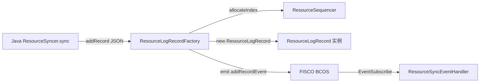
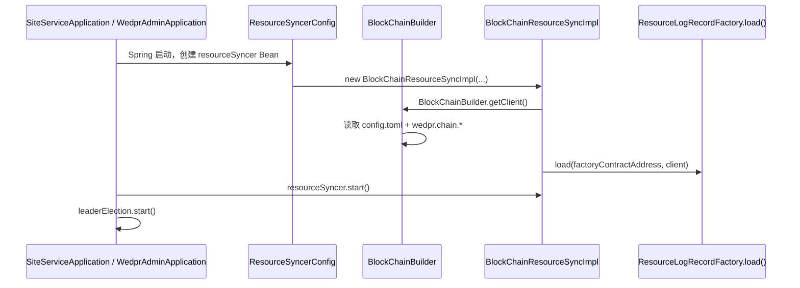
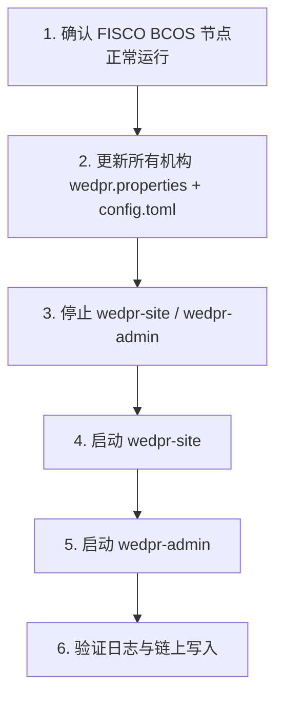
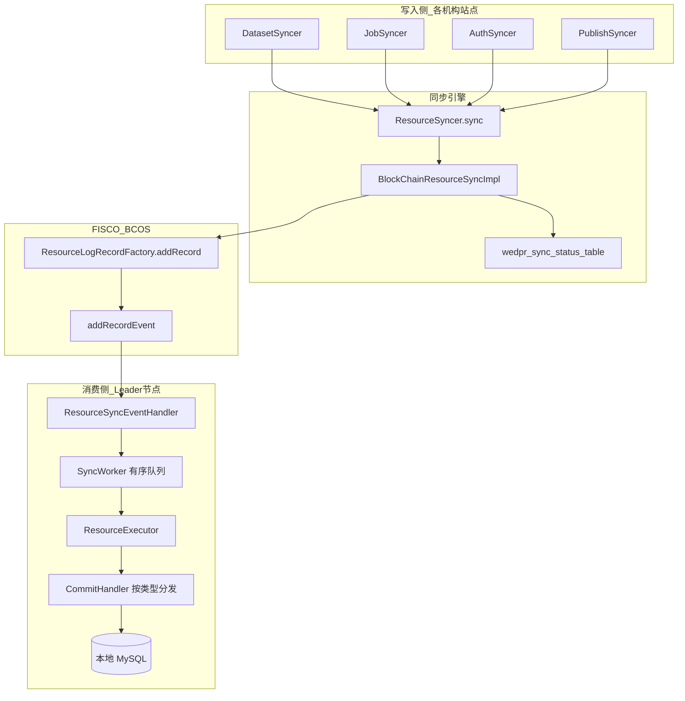
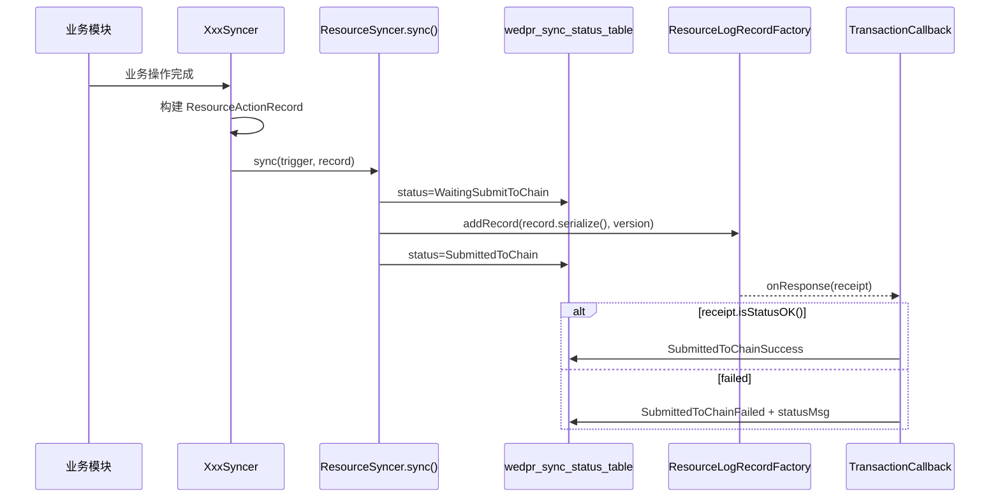
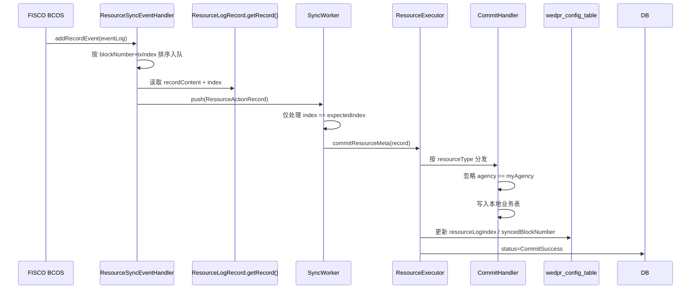
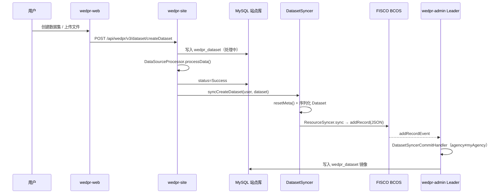

# Phase5：区块链合约部署与数据上链全流程规范

> 本文档基于 WeDPR 源码，详细说明 **FISCO BCOS 智能合约的部署流程**、**合约如何接入 Java 同步引擎**、**部署后如何重启系统使配置生效**，以及 **四类资源元数据上链的完整链路与数据规范**。  
> 前置阅读：[`phase1_admin_site_integration.md`](phase1_admin_site_integration.md)（管理端与站点端接入）、[`phase2_site_runtime.md`](phase2_site_runtime.md)（站点端运行机制）、[`phase3_dataset_upload_and_compute_io.md`](phase3_dataset_upload_and_compute_io.md)（数据集上传与 I/O）。

---

## 1. 文档范围与核心结论

### 1.1 范围

| 模块 | 代码路径 | 说明 |
|------|---------|------|
| 智能合约源码 | `frontend/wedpr-sol/` | `ResourceSequencer` / `ResourceLogRecordFactory` / `ResourceLogRecord` |
| 区块链连接层 | `wedpr-components/blockchain/` | `BlockChainBuilder` / `BlockChainConfig` |
| 同步引擎 | `wedpr-components/sync/` | `ResourceSyncer` / `BlockChainResourceSyncImpl` |
| 业务 Syncer | `dataset/sync`、`scheduler/core/JobSyncer`、`authorization/.../AuthSyncer`、`publish/sync/PublishSyncer` | 各资源类型的上链触发与消费 |
| 配置与构建 | `wedpr-site/conf/`、`wedpr-admin/conf/`、`wedpr-builder/` | 链连接、合约地址、证书 |

### 1.2 核心结论

1. **仓库内没有一键合约部署脚本**；合约需通过 FISCO BCOS Console 或 Java SDK 手动部署，再将地址写入配置。
2. **仅需预部署 2 个合约**：`ResourceSequencer` → `ResourceLogRecordFactory`；`ResourceLogRecord` 由 Factory 在每次 `addRecord()` 时动态创建。
3. **所有参与同步的 Java 服务必须共用同一链群组、同一套合约地址**（站点端、管理端、各机构站点）。
4. **上链的是元数据 JSON，不是原始数据文件**；统一封装为 `ResourceActionRecord` 序列化字符串。
5. **合约地址变更后必须重启 `wedpr-site` 和 `wedpr-admin`**（及所有机构站点），使 `BlockChainResourceSyncImpl` 重新加载合约并订阅事件。
6. **消费侧通过 Leader 选举保证单实例订阅链上事件**，按全局 `index` 严格有序落库。

---

## 2. 智能合约架构

### 2.1 合约文件与依赖关系

源码位于 `frontend/wedpr-sol/`：

```
wedpr-sol/
├── ResourceSequencer.sol          # 全局递增序号分配器
├── ResourceLogRecord.sol          # 单条记录存储（动态部署）
└── ResourceLogRecordFactory.sol   # 工厂合约，写入并发出事件
```
依赖与调用关系：


**ResourceSequencer**（无构造函数参数）：

```solidity
// ResourceSequencer.sol
int256 private latestIndex = 0;
function allocateIndex() public returns(int256) {
    latestIndex += 1;
    return latestIndex;
}
```
**ResourceLogRecordFactory**（构造函数需传入 Sequencer 地址）：

```solidity
// ResourceLogRecordFactory.sol
constructor(address sequencerAddress) public {
    sequencer = ResourceSequencer(sequencerAddress);
}
function addRecord(string memory recordContent, int256 contractVersion) public {
    ResourceLogRecord record = new ResourceLogRecord(recordContent);
    int256 index = sequencer.allocateIndex();
    record.setIndex(index);
    emit addRecordEvent(address(record), index, contractVersion);
}
```
**ResourceLogRecord**（运行时由 Factory 部署，无需手动部署）：

```solidity
// ResourceLogRecord.sol
constructor(string memory _resourceRecord) public {
    resourceRecord = _resourceRecord;  // 完整 ResourceActionRecord JSON
}
function getRecord() public view returns(int256, string memory) {
    return (index, resourceRecord);
}
```
### 2.2 Java 侧合约封装

FISCO BCOS SDK 生成的 Java Wrapper 位于：

- `sync/impl/generated/v1/ResourceSequencer.java`
- `sync/impl/generated/v1/ResourceLogRecordFactory.java`
- `sync/impl/generated/v1/ResourceLogRecord.java`

均内置 ABI/BINARY，并提供 `deploy()` / `load()` 静态方法。运行时 `BlockChainResourceSyncImpl` 通过 `load()` 加载已部署地址，通过 `addRecord()` 写入链。

---

## 3. 合约部署流程（详细步骤）

### 3.1 前置条件 Checklist

| 步骤 | 操作 | 说明 |
|------|------|------|
| 1 | 部署 FISCO BCOS 3.x 节点 | 开发环境可用 Air 版，RPC 默认如 `127.0.0.1:20200` |
| 2 | 确认群组 ID | 默认 `group0`，须与 `wedpr.chain.group_id` 一致 |
| 3 | 准备 SDK 证书 | `ca.crt`、`sdk.crt`、`sdk.key` 须与链节点匹配 |
| 4 | 准备部署账户 | Console 或 SDK 账户须有发交易权限 |
| 5 | 拷贝合约文件 | 三个 `.sol` 放至 Console 的 `contracts/solidity/` 目录 |

### 3.2 方式一：FISCO BCOS Console 部署（推荐）

#### 步骤 1：拷贝合约

```bash
CONSOLE_SOL=<fisco-console>/contracts/solidity
cp frontend/wedpr-sol/ResourceSequencer.sol       $CONSOLE_SOL/
cp frontend/wedpr-sol/ResourceLogRecord.sol       $CONSOLE_SOL/
cp frontend/wedpr-sol/ResourceLogRecordFactory.sol $CONSOLE_SOL/
```
> `ResourceLogRecordFactory.sol` 通过 `import "./ResourceSequencer.sol"` 引用，三个文件必须在同一目录。

#### 步骤 2：配置 Console

Console 的 `config.toml` 须与 WeDPR 服务指向同一节点和群组，参考 `wedpr-site/conf/config.toml`：

```toml
[network]
defaultGroup = "group0"
peers = ["127.0.0.1:20200"]

[cryptoMaterial]
certPath = "conf"
disableSsl = "false"
useSMCrypto = "false"
```
#### 步骤 3：启动 Console 并部署

```bash
cd <fisco-console>
bash start.sh
```
在 Console 交互界面依次执行：

```text
# 1. 部署 Sequencer（无构造参数）
[group0]: /> deploy ResourceSequencer
contract address: 0x<SEQUENCER_ADDRESS>

# 2. 部署 Factory（构造参数 = Sequencer 地址）
[group0]: /> deploy ResourceLogRecordFactory 0x<SEQUENCER_ADDRESS>
contract address: 0x<FACTORY_ADDRESS>

# 3. 验证：查询当前最大 index（应为 0）
[group0]: /> call ResourceLogRecordFactory 0x<FACTORY_ADDRESS> getLatestIndex

# 4. 可选：试写一条记录
[group0]: /> call ResourceLogRecordFactory 0x<FACTORY_ADDRESS> addRecord "{\"test\":1}" 1
```
记录两个地址：

- `SEQUENCER_ADDRESS` → 写入 `wedpr.sync.sequencer.contract_address`
- `FACTORY_ADDRESS` → 写入 `wedpr.sync.recorder.factory.contract_address`

### 3.3 方式二：Java SDK 部署

利用源码中已生成的 Wrapper，可编写独立部署程序（仓库内**无现成脚本**）：

```java
Client client = BlockChainBuilder.getClient();
CryptoKeyPair keyPair = client.getCryptoSuite().getCryptoKeyPair();

// 1. 部署 Sequencer
ResourceSequencer sequencer = ResourceSequencer.deploy(client, keyPair);
String sequencerAddr = sequencer.getContractAddress();

// 2. 部署 Factory（传入 Sequencer 地址）
ResourceLogRecordFactory factory =
        ResourceLogRecordFactory.deploy(client, keyPair, sequencerAddr);
String factoryAddr = factory.getContractAddress();
```
对应源码：

- `ResourceSequencer.deploy(Client, CryptoKeyPair)` — 无构造参数
- `ResourceLogRecordFactory.deploy(Client, CryptoKeyPair, String sequencerAddress)` — 构造参数为 Sequencer 地址

> 注意：`getBinary()` 会根据 `CryptoSuite` 自动选择 ECDSA 或国密 bytecode，部署链的加密类型须与运行时一致。

### 3.4 部署产物对照

| 部署合约 | 配置项 | 是否必须手动部署 |
|---------|--------|----------------|
| `ResourceSequencer` | `wedpr.sync.sequencer.contract_address` | **是** |
| `ResourceLogRecordFactory` | `wedpr.sync.recorder.factory.contract_address` | **是** |
| `ResourceLogRecord` | 无（运行时动态创建） | **否** |

---

## 4. 合约接入系统（配置与加载链路）

### 4.1 配置项全表

#### 区块链连接（`BlockChainConfig.java`）

| 配置项 | 默认值 | 说明 |
|--------|--------|------|
| `wedpr.chain.group_id` | — | FISCO BCOS 群组，如 `group0` |
| `wedpr.chain.config_path` | `config.toml` | SDK 配置文件（classpath 或 conf 目录） |

#### 同步模块（`WeDPRSyncConfig.java`）

| 配置项 | 是否必填 | 说明 |
|--------|---------|------|
| `wedpr.sync.recorder.factory.contract_address` | **是** | Factory 合约地址 |
| `wedpr.sync.sequencer.contract_address` | **是** | Sequencer 合约地址 |
| `wedpr.sync.recorder.contract_version` | 否（默认 `1`） | 写入 `addRecord` 的版本号 |
| `wedpr.sync.queue_limit` | 否（默认 `100000`） | 同步队列上限 |
| `wedpr.sync.worker_idle_ms` | 否（默认 `10`） | Worker 空闲轮询间隔 |
| `wedpr.sync.pipline_size` | 否（默认 `50`） | 事件解析流水线阈值 |

#### SDK 网络（`config.toml`）

| 配置段 | 关键字段 | 说明 |
|--------|---------|------|
| `[network]` | `peers` | 链节点 RPC 地址列表 |
| `[network]` | `defaultGroup` | 须与 `wedpr.chain.group_id` 一致 |
| `[cryptoMaterial]` | `certPath` | 证书目录（相对 conf） |
| `[account]` | `keyStoreDir` | 发交易账户目录 |

### 4.2 需修改的配置文件清单

部署完成后，**所有参与链上同步的服务**须同步更新以下文件：

| 服务 | 配置文件路径 |
|------|------------|
| 站点端 | `frontend/wedpr-site/conf/wedpr.properties` |
| 站点端 | `frontend/wedpr-site/conf/config.toml`（节点地址/证书） |
| 管理端 | `frontend/wedpr-admin/conf/wedpr.properties` |
| 管理端 | `frontend/wedpr-admin/conf/config.toml` |
| 各机构站点（builder 生成） | `wedpr-builder/wedpr_builder/tpl/site/conf/wedpr.properties` 模板变量 |

示例（`wedpr-site/conf/wedpr.properties`）：

```properties
wedpr.chain.group_id=group0
wedpr.chain.config_path=config.toml

wedpr.sync.recorder.factory.contract_address=0x<FACTORY_ADDRESS>
wedpr.sync.sequencer.contract_address=0x<SEQUENCER_ADDRESS>
wedpr.sync.recorder.contract_version=1
```
使用 `wedpr-builder` 批量部署时，在 `conf/config-example.toml` 的 `[blockchain]` 段填写：

```toml
[blockchain]
blockchain_group = "group0"
blockchain_peers = ["127.0.0.1:20200"]
blockchain_cert_path = "conf"
recorder_factory_contract_address = "0x<FACTORY_ADDRESS>"
sequencer_contract_address = "0x<SEQUENCER_ADDRESS>"
```
`BlockchainConfig.to_properties()` 会将其转换为各机构 `wedpr.properties` 中的 `wedpr.chain.*` 和 `wedpr.sync.*` 项。

### 4.3 系统加载合约的源码链路


关键源码：

**1. Bean 注册**（`ResourceSyncerConfig.java`）：

```java
@Bean(name = "resourceSyncer")
public ResourceSyncer resourceSyncer() {
    return new BlockChainResourceSyncImpl(weDPRSysConfig, leaderElection, ...);
}
```
**2. 合约加载**（`BlockChainResourceSyncImpl` 构造函数）：

```java
this.blockChainClient = BlockChainBuilder.getClient();
this.resourceLogRecordFactoryContract = ResourceLogRecordFactory.load(
    WeDPRSyncConfig.getResourceLogRecordFactoryContractAddress(),
    blockChainClient);
this.eventSubscribe = BlockChainBuilder.buildEventSubscribe(blockChainClient);
topics.add(BlockChainBuilder.buildEventEncoder(blockChainClient)
    .encode(ResourceLogRecordFactory.ADDRECORDEVENT_EVENT));
```
**3. 业务 Syncer 注册 CommitHandler**（启动时 Spring 自动完成）：

| 资源类型 | 注册类 | CommitHandler |
|---------|--------|--------------|
| `Dataset` | `DatasetSyncerConfig` | `DatasetSyncerCommitHandler` |
| `Job` | `JobSyncerConfig` | `JobSyncer.JobCommitHandler`（内嵌） |
| `Authorization` | `AuthSyncConfig` | `AuthSyncer.AuthCommitHandler`（内嵌） |
| `Publish` | `ServicePublisherLoader` | `PublishSyncerCommitHandler` |

**4. 应用启动顺序**（`SiteServiceApplication.java` / `WedprAdminApplication.java`）：

```java
// 必须先启动 ResourceSyncer，再启动 LeaderElection
resourceSyncer.start();    // 启动 SyncWorker + 事件解析线程
leaderElection.start();    // 竞选 Leader → 触发事件订阅
```
> `JobSyncerConfig` 注释明确要求：`jobSyncer` 须在 `ResourceSyncer` 启动前初始化（Spring Bean 创建阶段已完成注册）。

---

## 5. 部署后重启系统

### 5.1 为什么必须重启

合约地址、群组 ID、证书等配置在 `BlockChainBuilder` 的 **static 初始化块** 和 `BlockChainResourceSyncImpl` **构造函数** 中加载，运行期不会热更新。修改 `wedpr.properties` 或 `config.toml` 后，必须重启 Java 进程。

需重新初始化的组件：

| 组件 | 重启后行为 |
|------|-----------|
| `BlockChainBuilder` | 重新读取 `config.toml`，建立 SDK 连接 |
| `BlockChainResourceSyncImpl` | 重新 `load()` Factory 合约，重建 `EventSubscribe` |
| `LeaderElection` | 重新竞选 Leader，从 `wedpr_synced_block_number` 恢复订阅起点 |
| 各业务 Syncer | 重新注册 CommitHandler（Spring 上下文刷新） |

### 5.2 重启顺序（推荐）


### 5.3 各环境重启命令参考

#### 开发环境（Gradle 直启）

```bash
# 停止旧进程后
cd frontend/wedpr-site
./gradlew bootRun   # 或 java -jar dist/wedpr-site.jar

cd frontend/wedpr-admin
./gradlew bootRun   # 或 java -jar dist/wedpr-admin.jar
```
#### 生产 / Docker 环境

```bash
# 按实际部署方式重启各机构 wedpr-site 容器/进程
# 重启管理端 wedpr-admin
```
若使用 `wedpr-builder` 生成的 Docker 脚本：

```bash
# wedpr-builder 输出目录下
bash stop_docker.sh
# 更新配置后
bash start_docker.sh
```
### 5.4 重启后验证 Checklist

| # | 验证项 | 期望日志/现象 |
|---|--------|-------------|
| 1 | SDK 连接成功 | 无 `Load blockchain config for empty config` 或连接超时 |
| 2 | 合约加载成功 | `BlockChainResourceSyncImpl, event list: [...]` |
| 3 | Leader 选举成功 | `tryCampaignToLeader: AS Leader` 或 `AS Follower` |
| 4 | 事件订阅成功 | `switch to leader success, event: <eventID>` |
| 5 | 同步进度初始化 | `fetchResourceLogIndex, resourceLogIndex: X, blockNumber: Y` |
| 6 | 业务写入成功 | 创建数据集后 `wedpr_sync_status_table` 出现 `SubmittedToChainSuccess` |
| 7 | 跨机构消费成功 | 对端站点 `CommitSuccess`，本地表有镜像数据 |

### 5.5 换链 / 换合约后的数据清理

若部署了**全新合约**（非同一链上升级），建议：

1. 重置 `wedpr_config_table` 中的同步进度键（`WeDPRSysConfig` 启动时自动初始化，已存在则保留旧值）：

| config_key | 默认值 | 含义 |
|-----------|--------|------|
| `wedpr_resource_log_index` | `0` | 已消费的最大链上 record index |
| `wedpr_synced_block_number` | `1` | 事件订阅起始区块（`0/-1` 含义见源码注释） |

2. 若新合约从区块 0 开始，可将 `wedpr_synced_block_number` 更新为 Factory 部署所在区块号，避免重复扫描历史块。

3. 旧 `wedpr_sync_status_table` 记录可保留作审计，不影响新合约运行。

---

## 6. 数据上链全流程

### 6.1 总体架构


### 6.2 写入路径（上链）


核心写入代码（`BlockChainResourceSyncImpl.sync()`）：

```java
this.resourceLogRecordFactoryContract.addRecord(
    record.serialize(),
    BigInteger.valueOf(WeDPRSyncConfig.getResourceRecordContractVersion()),
    new ResourceSyncTransactionCallback(this.syncStatusMapper, record));
```
### 6.3 消费路径（下链同步）


**Leader 选举机制**：

- 仅 Leader 节点的 `SyncWorker` 处理 `push()` 的记录；Follower 直接丢弃。
- Leader 切换时：新 Leader 从 `wedpr_synced_block_number` 恢复 `EventSubscribe`；旧 Leader 取消订阅并清空队列。

**有序消费**（`SyncWorker.execute()`）：

- 优先队列按 `index` 排序。
- 仅当 `record.index == expectedIndex`（= `resourceLogIndex + 1`）时才 commit。
- 保证跨机构严格有序，避免并发乱序。

### 6.4 状态机

`ResourceRecordStatus` 枚举定义了完整生命周期：

```
WaitingSubmitToChain
    → SubmittedToChain
        → SubmittedToChainSuccess / SubmittedToChainFailed   （链上交易回调）
            → CommitSuccess / CommitFailed                     （本地消费回调）
```
状态持久化在 `wedpr_sync_status_table`（`wedpr_ddl.sql`）：

| 字段 | 说明 |
|------|------|
| `resource_id` | 资源 ID（主键） |
| `resource_type` | Dataset / Job / Authorization / Publish |
| `agency` | 发起机构 |
| `resource_action` | 动作名，如 CreateDataset |
| `index` | 链上全局序号 |
| `block_number` | 所在区块 |
| `transaction_hash` | 交易哈希 |
| `status` | 上述状态机值 |
| `status_msg` | 失败原因 |
| `trigger` | 触发者（用户名） |

---

## 7. 上链数据规范

### 7.1 统一封装：ResourceActionRecord

所有资源上链前均序列化为同一 JSON 结构（`ResourceActionRecord.java`）：

```json
{
  "resourceID": "uuid",
  "agency": "agency0",
  "resourceType": "Dataset",
  "resourceAction": "CreateDataset",
  "resourceContent": "<业务对象 JSON 字符串>",
  "index": null,
  "blockNumber": null,
  "transactionHash": null,
  "trigger": "username",
  "step": 1
}
```
| 字段 | 写入时填充 | 消费时填充 | 说明 |
|------|-----------|-----------|------|
| `resourceID` | ✅ | — | 由 `WeDPRUuidGenerator` 生成 |
| `agency` | ✅ | — | = `wedpr.agency` |
| `resourceType` | ✅ | — | 四类枚举值之一 |
| `resourceAction` | ✅ | — | 见 7.2~7.5 各表 |
| `resourceContent` | ✅ | — | 业务对象 JSON |
| `trigger` | ✅ | — | 操作用户名 |
| `index` | — | ✅ | 链上 Sequencer 分配 |
| `blockNumber` | — | ✅ | 事件所在区块 |
| `transactionHash` | — | ✅ | 链上交易哈希 |

序列化方法：`record.serialize()` → `ObjectMapper.writeValueAsString(this)`。

链上物理存储：`recordContent` 整个 JSON 作为 string 存入 `ResourceLogRecord` 合约。

### 7.2 资源类型一：Dataset

**resourceType**：`Dataset`  
**Syncer**：`DatasetSyncer`（`dataset/sync/DatasetSyncer.java`）  
**CommitHandler**：`DatasetSyncerCommitHandler`

#### 动作枚举（`DatasetSyncerAction`）

| resourceAction | 触发场景 | resourceContent 格式 |
|---------------|---------|---------------------|
| `CreateDataset` | 数据集处理成功 | 单个 `Dataset` 对象 JSON |
| `UpdateDataset` | 更新数据集元数据 | `List<Dataset>` JSON |
| `RemoveDataset` | 删除数据集 | `List<String>`（datasetId 列表）JSON |

#### 触发点（源码）

| 场景 | 调用链 |
|------|--------|
| 非上传类数据源创建成功 | `DatasetServiceImpl.createDataset()` → `datasetSyncer.syncCreateDataset()` |
| 分片上传合并成功 | `ChunkUploadController.mergeChunkData()` → `datasetSyncer.syncCreateDataset()` |
| 更新数据集 | `DatasetServiceImpl.updateDatasetList()` → `datasetSyncer.syncUpdateDataset()` |
| 删除数据集 | `DatasetServiceImpl.deleteDatasetList()` → `datasetSyncer.syncDeleteDataset()` |

#### CreateDataset 的 Dataset 字段规范

上链前调用 `dataset.resetMeta()`，清空敏感字段：

```java
// Dataset.resetMeta()
dataSourceMeta = "";   // 清空 DB 连接密码/SQL 等
permissions = null;    // 清空权限对象
```
**上链字段**（`Dataset.java`）：

| 字段 | 上链 | 说明 |
|------|------|------|
| `datasetId` | ✅ | 数据集 ID，前缀 `d-` |
| `datasetLabel` | ✅ | 标签 |
| `datasetTitle` | ✅ | 标题 |
| `datasetDesc` | ✅ | 描述 |
| `datasetFields` | ✅ | 字段定义 JSON |
| `datasetVersionHash` | ✅ | 数据哈希（存证） |
| `datasetSize` | ✅ | 数据大小 |
| `datasetRecordCount` | ✅ | 记录数 |
| `datasetColumnCount` | ✅ | 列数 |
| `datasetStorageType` | ✅ | LOCAL / HDFS 等 |
| `datasetStoragePath` | ✅ | 存储路径描述（非文件内容） |
| `dataSourceType` | ✅ | CSV / HDFS / HIVE / DB 等 |
| `dataSourceMeta` | ❌ | **resetMeta 清空** |
| `differentialPrivacyMeta` | ✅ | 差分隐私配置 |
| `ownerAgencyName` | ✅ | 所属机构 |
| `ownerUserName` | ✅ | 所属用户 |
| `visibility` | ✅ | 可见性级别 |
| `visibilityDetails` | ✅ | 可见性详情 |
| `approvalChain` | ✅ | 审批链 |
| `status` / `statusDesc` | ✅ | 数据集状态 |
| `createAt` / `updateAt` | ✅ | 时间戳 |
| `permissions` | ❌ | **resetMeta 清空** |

**明确不上链**：原始数据文件、DB 连接凭证、分片临时文件。

#### 消费规则（`DatasetSyncerCommitHandler`）

```java
if (agency.equals(myAgency)) {
    return;  // 忽略本机构自身消息
}
// 按 action 分发 CreateActionHandler / UpdateActionHandler / RemoveActionHandler
```
管理端配置 `wedpr.agency=WeBank`（或平台标识），站点配置 `wedpr.agency=agency0`，因此管理端会镜像各站点数据集到 `wedpr_dataset`。

### 7.3 资源类型二：Job

**resourceType**：`Job`  
**Syncer**：`JobSyncer`（`scheduler/core/JobSyncer.java`）  
**CommitHandler**：`JobSyncer.JobCommitHandler`（内嵌，写入方与消费方同一模块）

#### 动作枚举（`JobSyncer.JobAction`）

| resourceAction | 触发场景 | resourceContent 格式 |
|---------------|---------|---------------------|
| `RunAction` | 跨机构任务调度 | `BatchJobList` JSON（`List<JobDO>`） |
| `KillAction` | 跨机构任务终止 | `BatchJobList` JSON |

#### 触发点

| 场景 | 调用链 |
|------|--------|
| 调度待运行任务 | `SchedulerTaskImpl.syncJobs()` → `jobSyncer.sync(RunAction, ...)` |
| 终止任务 | `SchedulerTaskImpl.killTasks()` → `jobSyncer.sync(KillAction, ...)` |

#### 上链条件

任务须满足 `job.getShouldSync() == true`。`JobType.shouldSync()` 规则：

```java
// JobType.java — PIR 任务不上链
public boolean shouldSync() {
    if (this.ordinal() == PIR.ordinal()) {
        return false;
    }
    return true;
}
```
即：**PSI / MPC / SQL / ML 等跨机构任务上链同步；PIR 任务不上链**。

#### JobDO 上链字段（`BatchJobList` 中每个 Job）

| 字段 | 说明 |
|------|------|
| `id` | 任务 ID |
| `name` | 任务名称 |
| `parties` | 参与机构 JSON |
| `jobType` | PSI / MPC / SQL / XGB_TRAINING 等 |
| `owner` / `ownerAgency` | 任务所有者 |
| `projectId` | 所属项目 |
| `param` | 任务参数 JSON |
| `status` | 上链时重置为 Running（RunAction）或 Killing（KillAction） |
| `datasetList` | 关联数据集 ID 列表 |
| `shouldSync` | 是否需链上同步 |
| `createTime` / `lastUpdateTime` | 时间戳 |

#### 消费规则

```java
// JobSyncer.onReceiveRunAction()
for (JobDO jobDO : jobList.getJobs()) {
    if (!jobDO.isJobParty(this.agency)) {
        continue;  // 仅处理本机构参与的任务
    }
    projectMapperWrapper.recordJobStatus(jobDO);
    scheduler.batchRunJobs(jobs);
}
```
`isJobParty(agency)`：`ownerAgency == agency` 或 `taskParties` 包含该机构。

### 7.4 资源类型三：Authorization

**resourceType**：`Authorization`  
**Syncer**：`AuthSyncer`（`authorization/.../AuthSyncer.java`）  
**CommitHandler**：`AuthSyncer.AuthCommitHandler`

#### 动作枚举（`AuthAction`）

| resourceAction | 触发场景 | resourceContent 格式 |
|---------------|---------|---------------------|
| `CreateAuth` | 创建审批单 | `AuthRequest` JSON |
| `UpdateAuth` | 更新审批单（含审批流转） | `AuthRequest` JSON |
| `CreateAuthTemplates` | 创建审批模板 | `AuthTemplateRequest` JSON |
| `UpdateAuthTemplates` | 更新审批模板 | `AuthTemplateRequest` JSON |
| `DeleteAuthTemplates` | 删除审批模板 | `AuthTemplatesDeleteRequest` JSON |

#### 触发点（`AuthorizationServiceImpl`）

| API 操作 | 调用 |
|---------|------|
| `createAuth()` | `authSyncer.sync(applicant, CreateAuth, ...)` |
| `updateAuth()` | `authSyncer.sync(applicant, UpdateAuth, ...)` |
| `updateAuthResult()` → 流转 | 间接调用 `updateAuth()` |
| `createAuthTemplates()` | `authSyncer.sync(user, CreateAuthTemplates, ...)` |
| `updateAuthTemplates()` | `authSyncer.sync(user, UpdateAuthTemplates, ...)` |
| `deleteAuthTemplates()` | `authSyncer.sync(user, DeleteAuthTemplates, ...)` |

#### 消费规则

按 `resourceAction` 分发到 `onCreateAuth` / `onUpdateAuth` / `onCreateAuthTemplates` 等，写入 `wedpr_authorization_table` 等本地表。`UpdateAuth` 审批通过时会触发 `authExecutor.onApproveSuccess()` 执行后续资源授权。

### 7.5 资源类型四：Publish

**resourceType**：`Publish`  
**Syncer**：`PublishSyncer`（`publish/sync/PublishSyncer.java`）  
**CommitHandler**：`PublishSyncerCommitHandler`

#### 动作枚举（`PublishSyncAction`）

| resourceAction | 触发场景 | resourceContent 格式 |
|---------------|---------|---------------------|
| `SyncPublish` | 服务发布成功待同步 | `PublishedServiceInfo` JSON |
| `RevokePublish` | 收回已发布服务 | `PublishedServiceInfo` JSON |

#### 触发点

`PublishQuartzJob`（站点端 Quartz 定时任务，`SiteServiceApplication.startQuartz()` 注册）：

```java
// 扫描 syncStatus=0 且 serviceStatus=PublishSuccess 的服务
for (PublishedServiceInfo serviceInfo : resultList) {
    publishSyncer.publishSync(serviceInfo.serialize());
    updatedServiceInfo.setSyncStatus(1);  // 标记已同步
}
```
#### 消费规则（`PublishSyncerCommitHandler`）

```java
if (agency.equalsIgnoreCase(WeDPRCommonConfig.getAgency())) {
    return;  // 忽略本机构消息
}
// SyncPublish → SyncPublishActionHandler
// RevokePublish → RevokePublishActionHandler
```
### 7.6 上链数据边界总结

| 类别 | 上链 | 不上链 |
|------|------|--------|
| 数据集 | 元数据、哈希、存储路径描述、字段定义 | 原始文件、DB 密码、dataSourceMeta |
| 任务 | 任务参数、参与方、状态、关联 datasetId | 计算中间结果、原始数据 |
| 授权 | 审批单内容、审批链、模板 | — |
| 服务发布 | 已发布服务元信息 | 服务底层数据 |
| 项目/任务统计 | — | 走 Gateway Transport 上报，**非区块链** |

---

## 8. 端到端示例：数据集创建上链


---

## 9. 故障排查

| 现象 | 排查方向 | 关键配置/日志 |
|------|---------|-------------|
| 启动报 `Load blockchain config for empty config` | `config.toml` 不在 classpath | `wedpr.chain.config_path` |
| 合约调用 revert | 地址填错或 Sequencer/Factory 不匹配 | `wedpr.sync.*.contract_address` |
| 写入成功但对端无数据 | 对端未启动 / 非 Leader / agency 相同被忽略 | Leader 日志、`wedpr.agency` |
| 消费卡住 | index 不连续，前序记录未 commit | `wedpr_resource_log_index` |
| 收不到历史事件 | `wedpr_synced_block_number` 过大 | `wedpr_config_table` |
| 多实例重复消费 | Leader 选举异常 | `wedpr.leader.election.*`、`wedpr_config_table` 中 `leader` 键 |

---

## 10. 关键源码索引

| 主题 | 文件路径 |
|------|---------|
| 合约源码 | `frontend/wedpr-sol/*.sol` |
| SDK 连接 | `blockchain/BlockChainBuilder.java` |
| 链配置 | `blockchain/BlockChainConfig.java` |
| 同步配置 | `sync/impl/WeDPRSyncConfig.java` |
| 写入实现 | `sync/impl/BlockChainResourceSyncImpl.java` |
| 事件消费 | `sync/impl/ResourceSyncEventHandler.java` |
| 有序队列 | `sync/impl/SyncWorker.java` |
| 资源提交 | `sync/impl/ResourceExecutor.java` |
| 同步接口 | `sync/ResourceSyncer.java` |
| 上链记录 | `sync/core/ResourceActionRecord.java` |
| 数据集 Syncer | `dataset/sync/DatasetSyncer.java` |
| 任务 Syncer | `scheduler/core/JobSyncer.java` |
| 授权 Syncer | `authorization/.../AuthSyncer.java` |
| 发布 Syncer | `publish/sync/PublishSyncer.java` |
| 站点启动 | `wedpr-site/.../SiteServiceApplication.java` |
| 管理端启动 | `wedpr-admin/.../WedprAdminApplication.java` |
| 同步状态表 DDL | `wedpr-builder/db/wedpr_ddl.sql` |
| Builder 链配置 | `wedpr-builder/wedpr_builder/config/wedpr_deploy_config.py` |

---

## 11. 附录：配置变更快速参考

合约部署完成后，至少修改以下配置并重启：

```properties
# === wedpr.properties（站点端 + 管理端均需） ===
wedpr.chain.group_id=group0
wedpr.chain.config_path=config.toml
wedpr.sync.recorder.factory.contract_address=0x<你的Factory地址>
wedpr.sync.sequencer.contract_address=0x<你的Sequencer地址>
wedpr.sync.recorder.contract_version=1
```
```toml
# === config.toml（站点端 + 管理端 conf 目录） ===
[network]
peers=["<链节点IP>:<RPC端口>"]
defaultGroup="group0"
```
重启命令（开发环境）：

```bash
# 1. 停止现有 wedpr-site / wedpr-admin 进程
# 2. 重新启动
cd frontend/wedpr-site && ./gradlew bootRun
cd frontend/wedpr-admin && ./gradlew bootRun
```
验证：创建数据集 → 检查 `wedpr_sync_status_table` 状态为 `SubmittedToChainSuccess` → 对端/管理端 `wedpr_dataset` 出现镜像记录。
