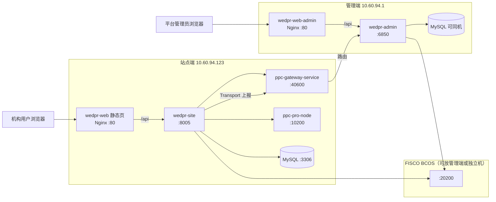
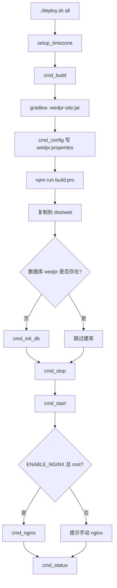

# WeDPR 站点端：本地构建与服务器部署指南

> 本文档面向**零基础**读者，手把手说明如何在本地电脑**编译构建**站点端，以及如何打包部署到**目标服务器**上运行。  
> 站点端 = **管理后台页面（wedpr-web）** + **业务后端（wedpr-site）**，是本机构使用隐私计算平台的核心入口。
>
> **推荐**：项目根目录提供一键部署脚本 [`deploy.sh`](../deploy.sh)，配置 [`deploy.conf`](../deploy.conf) 后执行 `./deploy.sh all` 即可完成大部分步骤，详见 **第十四章**。

---

## 一、先搞清楚：站点端是什么？

可以把站点端理解为一个「机构内部的隐私计算管理网站」：

| 组成部分 | 代码目录 | 作用 | 默认端口 |
|---------|---------|------|---------|
| **前端页面** | `frontend/wedpr-web` | 用户在浏览器里操作的界面（上传数据、建项目、跑任务） | 开发：3000；生产：由 Nginx 提供 80/443 |
| **后端服务** | `frontend/wedpr-site` | 提供 REST API，处理业务逻辑 | **8005** |

浏览器访问前端 → 前端调用 `/api` → 转发到后端 8005 端口。

### 1.1 站点端还依赖哪些外部服务？

根据你要用的功能，依赖分三档：

| 档位 | 必须安装 | 用途 | 不装会怎样 |
|------|---------|------|-----------|
| **最低可运行** | MySQL | 存用户、数据集、项目、任务等 | 后端启动失败 |
| **推荐** | MySQL + C++ 网关/计算节点 | PSI、PIR、MPC 等隐私计算任务 | 能登录、管数据，但**跑不了计算任务** |
| **完整跨机构** | MySQL + C++ 节点 + FISCO BCOS 区块链 | 跨机构资源同步、链上存证 | 单机构内可用，跨机构同步不可用 |

**建议路径**：先按「最低可运行」把页面和后端跑起来，确认能登录、能上传数据，再按需加 C++ 节点和区块链。

### 1.2 本仓库目录说明

```
WeDPR/                          ← 工作区根目录（你的项目根路径）
├── frontend/                   ← Java 后端 + Vue 前端（本文重点）
│   ├── wedpr-site/             ← 站点端后端
│   ├── wedpr-web/              ← 站点端前端
│   └── wedpr-builder/db/       ← 数据库建表脚本
├── backend/                    ← C++ 隐私计算核心（PSI/MPC 等，可选）
└── docs/                       ← 文档（含本文）
```

下文用 `项目根目录` 代指 `WeDPR/` 这一层。

---

## 二、环境要求一览

### 2.1 硬件建议

| 场景 | CPU | 内存 | 磁盘 |
|------|-----|------|------|
| 本地开发构建 | 4 核+ | 8 GB+ | 20 GB 可用空间 |
| 生产单机部署 | 8 核+ | 16 GB+ | 100 GB+（含数据文件） |

### 2.2 软件版本要求

| 软件 | 版本要求 | 说明 |
|------|---------|------|
| 操作系统 | Ubuntu 20.04/22.04、CentOS 7/8 等 Linux | 本文以 **Ubuntu 22.04** 为例 |
| **JDK** | **1.8（Java 8）** | 源码 `sourceCompatibility = 1.8`，不要用 JDK 17+ 直接编译 |
| **Gradle** | 无需单独安装 | 项目自带 `gradlew` 包装脚本 |
| **Node.js** | **14.x ~ 16.x** | 前端构建用，推荐 14.17 或 16 LTS |
| **npm** | 6.x+ | 随 Node.js 安装 |
| **MySQL** | **5.7 或 8.0** | 存业务数据 |

---

## 三、第一步：在构建机上安装环境依赖

以下命令在 **Ubuntu 22.04** 上验证过。如果你是 CentOS，包管理器换成 `yum`/`dnf` 即可，软件版本保持一致。

### 3.1 更新系统并安装基础工具

```bash
sudo apt update
sudo apt install -y curl wget git unzip vim net-tools
```

### 3.2 安装 JDK 8

```bash
# 安装 OpenJDK 8
sudo apt install -y openjdk-8-jdk

# 验证（应显示 1.8.x）
java -version
javac -version

# 可选：设置 JAVA_HOME（写入 ~/.bashrc 后 source 一下）
echo 'export JAVA_HOME=/usr/lib/jvm/java-8-openjdk-amd64' >> ~/.bashrc
echo 'export PATH=$JAVA_HOME/bin:$PATH' >> ~/.bashrc
source ~/.bashrc
```

### 3.3 安装 Node.js 16（推荐用 nvm，不污染系统）

```bash
# 安装 nvm
curl -o- https://raw.githubusercontent.com/nvm-sh/nvm/v0.39.7/install.sh | bash
source ~/.bashrc

# 安装并使用 Node 16
nvm install 16
nvm use 16

# 验证
node -v    # 应显示 v16.x.x
npm -v
```

> 若公司网络无法访问 GitHub，可改用 Node 官方二进制包手动安装，或使用内部镜像源。

### 3.4 安装 MySQL 8

```bash
sudo apt install -y mysql-server

# 启动并设置开机自启
sudo systemctl start mysql
sudo systemctl enable mysql

# 安全配置（按提示设置 root 密码，本文示例密码为 wedpr1234）
sudo mysql_secure_installation
```

### 3.5 给 Gradle 构建加大内存（可选但推荐）

```bash
echo 'export GRADLE_OPTS="-Xmx4096m -XX:MaxMetaspaceSize=512m"' >> ~/.bashrc
source ~/.bashrc
```

---

## 四、第二步：初始化 MySQL 数据库

站点端后端启动前，**必须先建好库、建表、导入初始数据**。

### 4.1 创建数据库和用户

```bash
sudo mysql -u root -p
```

在 MySQL 命令行里执行（密码按你实际设置修改）：

```sql
-- 创建数据库
CREATE DATABASE IF NOT EXISTS wedpr DEFAULT CHARACTER SET utf8mb4 COLLATE utf8mb4_bin;

-- 创建专用用户（生产环境请换成强密码）
CREATE USER IF NOT EXISTS 'wedpr'@'%' IDENTIFIED BY 'wedpr1234';
CREATE USER IF NOT EXISTS 'wedpr'@'localhost' IDENTIFIED BY 'wedpr1234';

-- 授权
GRANT ALL PRIVILEGES ON wedpr.* TO 'wedpr'@'%';
GRANT ALL PRIVILEGES ON wedpr.* TO 'wedpr'@'localhost';
FLUSH PRIVILEGES;

-- 退出
EXIT;
```

### 4.2 导入建表脚本和初始数据

```bash
cd 项目根目录/frontend/wedpr-builder/db

# 1. 建表
mysql -u wedpr -p wedpr < wedpr_ddl.sql

# 2. 导入初始数据（含默认管理员 admin）
mysql -u wedpr -p wedpr < wedpr_dml.sql

# 3. 差分隐私字段迁移（新库执行一次即可，已包含在 ddl 里可跳过；老库升级时执行）
mysql -u wedpr -p wedpr < wedpr_dml_differential_privacy.sql
```

### 4.3 默认登录账号

| 用户名 | 密码 | 说明 |
|--------|------|------|
| `admin` | `123456` | 站点端管理员，拥有全部菜单权限 |

> **安全提示**：上线前务必在系统里修改默认密码，并修改 `wedpr.properties` 中的 JWT 密钥等敏感配置。

---

## 五、第三步：本地构建 Java 后端（wedpr-site）

### 5.1 进入 frontend 目录

```bash
cd 项目根目录/frontend
```

### 5.2 执行 Gradle 构建

首次构建会下载大量 Maven 依赖，需要 **10~30 分钟**（视网络而定）。

```bash
# 给 gradlew 执行权限
chmod +x gradlew

# 只构建站点端模块，跳过测试（加快速度）
./gradlew :wedpr-site:jar -x test
```

构建成功后，产物在：

```
frontend/wedpr-site/dist/
├── apps/          ← 站点端 JAR 包
├── lib/           ← 全部依赖 JAR
├── conf/          ← 配置文件（构建时从 bin/conf 复制，需再同步最新配置）
├── start.sh       ← 启动脚本
├── stop.sh        ← 停止脚本
└── start.out      ← 启动日志（运行后生成）
```

### 5.3 同步最新配置文件到 dist

**每次修改 `wedpr-site/conf/` 下的配置后，都要执行这一步**：

```bash
cd 项目根目录/frontend

cp wedpr-site/conf/*.properties wedpr-site/dist/conf/
cp wedpr-site/conf/config.toml wedpr-site/dist/conf/
# 若 conf 目录下有证书文件，一并复制
cp wedpr-site/conf/*.crt wedpr-site/dist/conf/ 2>/dev/null || true
cp wedpr-site/conf/*.key wedpr-site/dist/conf/ 2>/dev/null || true
cp wedpr-site/conf/sdk.nodeid wedpr-site/dist/conf/ 2>/dev/null || true
```

### 5.4 常见构建问题

| 现象 | 可能原因 | 处理 |
|------|---------|------|
| `JAVA_HOME not set` | 未装 JDK 8 | 按 3.2 节安装并设置 JAVA_HOME |
| 内存不足 `GC overhead` | 内存太小 | 加大 `GRADLE_OPTS` 到 4G+ |
| 依赖下载超时 | 网络问题 | 项目已配阿里云 Maven 镜像，多试几次或配代理 |

---

## 六、第四步：本地构建 Vue 前端（wedpr-web）

### 6.1 安装依赖并构建

```bash
cd 项目根目录/frontend/wedpr-web

# 安装依赖（首次较慢）
npm install

# 开发环境构建（带调试信息，可选）
# npm run build:dev

# 生产环境构建（部署到服务器用这个）
npm run build:pro
```

构建完成后，静态文件在：

```
frontend/wedpr-web/dist/
├── index.html
├── js/
├── css/
└── ...
```

### 6.2 前端 API 地址说明

前端通过环境变量指定后端 API 前缀：

| 文件 | 配置项 | 值 |
|------|--------|-----|
| `.env.development` | `VUE_APP_BASE_URL` | `/api/wedpr/v3` |
| `.env.production` | `VUE_APP_BASE_URL` | `/api/wedpr/v3` |

> **重要**：上述 `.env.*` 文件通常**不在 Git 仓库中**（被 `.gitignore` 忽略）。克隆代码后需**手工创建**，否则生产构建的 `baseURL` 为空，会导致登录页验证码、公钥接口等全部失败。详见 **§17.3**。

- **开发模式**（`npm run serve`）：`vue.config.js` 会把 `/api` 代理到 `http://127.0.0.1:8005`
- **生产模式**：由 **Nginx** 把 `/api` 反向代理到后端 8005，前端只发相对路径请求

---

## 七、第五步：配置文件详解（必改项）

所有配置文件源文件在 `frontend/wedpr-site/conf/`，运行时使用 `frontend/wedpr-site/dist/conf/`。

> **阅读建议**：先看完 **§7.1 双机部署示例**，再对照 **§7.3～7.11** 逐项改配置。  
> 下文以你的实际环境为例：**站点端 `10.60.94.123`，管理端 `10.60.94.1`**。

---

### 7.1 双机部署示例：你的环境怎么理解？

假设你要部署：

| 角色 | 服务器 IP | 跑什么 | 用户访问地址（示例） |
|------|-----------|--------|---------------------|
| **站点端** | `10.60.94.123` | 机构业务：页面 + 后端 + MySQL + C++ 网关 | `http://10.60.94.123/` |
| **管理端** | `10.60.94.1` | 平台治理：管理页面 + 后端 + 聚合大屏 | `http://10.60.94.1/` |

约定本机构英文名为 **`agency0`**（全平台唯一，可自定，但站点与管理端登记必须一致）。

#### 7.1.1 整体关系（先看懂这张图）



**三个关键结论（小白必记）：**

1. **站点用户只访问 `10.60.94.123`**，管理用户只访问 `10.60.94.1`，两套页面互不替代。
2. **站点端不会自动出现在管理端**，必须在管理端网页「机构管理」里**手工登记** `agency0`。
3. **站点与管理端不直接 HTTP 互调**；项目/任务靠 **Gateway Transport** 上报，数据集元数据靠 **区块链** 同步。

#### 7.1.2 各组件部署在哪台机器？

| 组件 | 部署机器 | 端口 | 说明 |
|------|---------|------|------|
| wedpr-web（站点前端） | 10.60.94.123 | 80（Nginx） | 用户登录上传数据 |
| wedpr-site（站点后端） | 10.60.94.123 | 8005 | 由 Nginx 反代，可不对外直接暴露 |
| MySQL（站点库） | 10.60.94.123 | 3306 | 建议仅本机访问 |
| ppc-gateway-service | 10.60.94.123 | **40600** | 管理端要能访问此端口 |
| ppc-pro-node | 10.60.94.123 | 10200 | 隐私计算任务用 |
| wedpr-web-admin | 10.60.94.1 | 80（Nginx） | 平台管理员登录 |
| wedpr-admin | 10.60.94.1 | 6850 | 管理后端 |
| MySQL（管理库） | 10.60.94.1 | 3306 | 可与站点分库 |
| FISCO BCOS | 10.60.94.1（示例） | 20200 | 两边 config.toml 填同一节点 |

#### 7.1.3 防火墙需放通的端口

**站点端 10.60.94.123**

| 端口 | 对谁开放 | 用途 |
|------|---------|------|
| 80 / 443 | 机构用户网段 | 访问站点页面 |
| 40600 | **管理端 10.60.94.1** | 管理端经 Gateway 收上报 |
| 3306 | 仅本机 127.0.0.1 | MySQL（若装在本机） |

**管理端 10.60.94.1**

| 端口 | 对谁开放 | 用途 |
|------|---------|------|
| 80 / 443 | 管理员网段 | 访问管理页面 |
| 20200 | 站点端 10.60.94.123 | 区块链 RPC（若链在管理机） |
| — | 管理端**出站**访问站点 40600 | 检测机构在线、接收路由 |

---

### 7.2 配置项「必须一致」对照表

| 配置含义 | 站点端 `10.60.94.123` | 管理端 `10.60.94.1` | 不一致的后果 |
|---------|----------------------|----------------------|-------------|
| 机构英文名 | `wedpr.agency=agency0` | 机构管理登记 `agencyName=agency0` | 管理端无法识别该机构 |
| Gateway 地址 | 网关监听 `10.60.94.123:40600` | 登记 `gatewayEndpoint=10.60.94.123:40600` | 机构显示离线 |
| 管理端连网关 | 站点 `gateway_targets` 指本机网关 | `gateway_targets=ipv4:10.60.94.123:40600` | 上报到不了管理端 |
| 区块链群组 | `wedpr.chain.group_id=group0` | 同为 `group0` | 链上同步失败 |
| 合约地址 | `wedpr.sync.*.contract_address` | **完全相同** | 数据集元数据不同步 |
| PSI Token | `wedpr.executor.psi.token=...` | 与网关 `wedpr_api_token` 一致 | 计算任务鉴权失败 |

---

### 7.3 站点端 `10.60.94.123`：`wedpr.properties` 完整示例

路径：`frontend/wedpr-site/conf/wedpr.properties`  
改完后执行：`cp wedpr-site/conf/*.properties wedpr-site/dist/conf/`

```properties
# ---------- 机构标识 ----------
wedpr.zone=wedpr.zone.default
# 【必改】机构英文名，与管理端登记的 agencyName 必须一致
wedpr.agency=agency0

# ---------- UUID（单机默认即可） ----------
wedpr.uuid.generator.worker.id.bit.len=6
wedpr.uuid.generator.seq.bit.length=10
wedpr.uuid.generator.worker.id=10

# ---------- 加密/JWT【生产必改】 ----------
wedpr.crypto.symmetric.key=请换成随机32位字符串
wedpr.crypto.symmetric.iv=请换成随机16位字符串
wedpr.user.jwt.secret=请换成随机密钥
wedpr.user.jwt.expireTime=3600000
wedpr.user.jwt.delimiter=|
wedpr.user.jwt.cacheSize=10000
wedpr.user.jwt.privateKey=请换成64位十六进制
wedpr.user.jwt.sessionKey=请换成32位十六进制

# ---------- MySQL【必改】 ----------
# MySQL 在本机时用 127.0.0.1；独立数据库机则写数据库 IP
wedpr.mybatis.url=jdbc:mysql://127.0.0.1:3306/wedpr?characterEncoding=UTF-8&allowMultiQueries=true&useSSL=false&allowPublicKeyRetrieval=true&serverTimezone=GMT%2B8
wedpr.mybatis.username=wedpr
wedpr.mybatis.password=wedpr1234
wedpr.mybatis.driverClassName=com.mysql.cj.jdbc.Driver
wedpr.mybatis.mapperLocations=classpath*:mapper/*Mapper.xml
wedpr.mybatis.BasePackage=com.webank.wedpr.components.meta.resource.follower.dao,com.webank.wedpr.components.meta.sys.config.dao,com.webank.wedpr.components.project.dao,com.webank.wedpr.components.meta.setting.template.dao,com.webank.wedpr.components.sync.dao,com.webank.wedpr.components.authorization.dao,com.webank.wedpr.components.user.mapper,com.webank.wedpr.components.meta.agency.dao,com.webank.wedpr.components.api.credential.dao,com.webank.wedpr.components.integration.jupyter.dao,com.webank.wedpr.components.db.mapper.service.publish.dao,com.webank.wedpr.components.db.mapper.dataset.mapper,com.webank.wedpr.components.scheduler.mapper

# ---------- 区块链【对接管理端时必改】 ----------
wedpr.chain.group_id=group0
wedpr.chain.config_path=config.toml
# 以下地址必须与管理端、链上部署结果完全一致
wedpr.sync.recorder.factory.contract_address=0x4721d1a77e0e76851d460073e64ea06d9c104194
wedpr.sync.sequencer.contract_address=0x6849f21d1e455e9f0712b1e99fa4fcd23758e8f1
wedpr.sync.recorder.contract_version=1
wedpr.sync.queue_limit=100000
wedpr.sync.worker_idle_ms=10

# ---------- 调度/执行器 ----------
wedpr.leader.election.keep.alive.seconds=30
wedpr.leader.election.expire.seconds=60
wedpr.thread.max.blocking.queue.size=1000
wedpr.scheduler.job.concurrency=5
wedpr.scheduler.query.job.status.interval.ms=30000
wedpr.scheduler.interval.ms=30000
wedpr.executor.job.cache.dir=./.cache/jobs

# ---------- PSI/MPC Token【与网关配置一致】 ----------
wedpr.executor.psi.token=wedpr_api_token_agency0
wedpr.executor.mpc.token=wedpr_api_token_agency0

# ---------- Transport【对接管理端时重点】 ----------
wedpr.transport.threadpool_size=4
wedpr.transport.nodeID=wedpr-site-node-agency0
# 【必改】连本机 C++ 网关
wedpr.transport.gateway_targets=ipv4:10.60.94.123:40600
# 【必改】本机对外 IP
wedpr.transport.host_ip=10.60.94.123
wedpr.transport.listen_ip=0.0.0.0
wedpr.transport.listen_port=6001

wedpr.service.debugMode=false
```

**逐项解释：**

| 配置键 | 你的示例值 | 通俗解释 |
|--------|-----------|---------|
| `wedpr.agency` | `agency0` | 机构身份证号；管理端登记时必须一字不差 |
| `wedpr.mybatis.url` | `127.0.0.1:3306/wedpr` | 站点业务数据库地址 |
| `wedpr.transport.gateway_targets` | `ipv4:10.60.94.123:40600` | 站点后端通过哪台 Gateway 发上报 |
| `wedpr.transport.host_ip` | `10.60.94.123` | 告诉 Gateway「本站点在哪台机器」 |
| `wedpr.executor.psi.token` | `wedpr_api_token_agency0` | 调计算能力的口令，与网关 token 相同 |

---

### 7.4 站点端：`application-wedpr.properties` 示例

路径：`frontend/wedpr-site/conf/application-wedpr.properties`

```properties
logging.level.root=INFO
spring.jackson.date-format=yyyy-MM-dd HH:mm:ss
spring.jackson.time-zone=GMT+8

server.port=8005
spring.application.name=WEDPR-SITE
server.type=site_end

spring.servlet.multipart.max-file-size=20MB
spring.servlet.multipart.max-request-size=-1

wedpr.storage.type=LOCAL
wedpr.storage.local.basedir=./wedpr/localStorage/
wedpr.dataset.largeFileDataDir=./wedpr/largeFile/

# 定时向 Gateway 上报项目/任务（对接管理端必需）
quartz-cron-report-job=0/2 * * * * ? *
```

`server.type=site_end` 表示**站点端**；管理端为 `admin_end`。

---

### 7.5 站点端：`config.toml`（连区块链）示例

假设 FISCO BCOS 部署在 **管理端 `10.60.94.1:20200`**：

```toml
[cryptoMaterial]
certPath = "conf"
disableSsl = "false"
useSMCrypto = "false"

[network]
messageTimeout = "10000"
defaultGroup = "group0"
peers = ["10.60.94.1:20200"]

[account]
keyStoreDir = "account"
accountFileFormat = "pem"
```

证书复制到站点 `conf/`：

```bash
cp /path/to/chain/ca.crt  /data/home/wedpr/wedpr-site/conf/
cp /path/to/chain/sdk.crt /data/home/wedpr/wedpr-site/conf/
cp /path/to/chain/sdk.key /data/home/wedpr/wedpr-site/conf/
```

---

### 7.6 站点端 Nginx（`10.60.94.123`）

```nginx
upstream wedpr_site_backend {
    server 127.0.0.1:8005;
}

server {
    listen 80;
    server_name 10.60.94.123;
    client_max_body_size 100M;

    location / {
        root /data/home/wedpr/wedpr-site/web;
        index index.html;
        try_files $uri $uri/ /index.html;
    }

    location /api {
        proxy_pass http://wedpr_site_backend;
        proxy_set_header Host $host;
        proxy_set_header X-Real-IP $remote_addr;
        proxy_set_header X-Forwarded-For $proxy_add_x_forwarded_for;
        proxy_read_timeout 600s;
    }
}
```

---

### 7.7 管理端 `10.60.94.1`：`wedpr.properties` 示例

管理端代码：`frontend/wedpr-admin/`，配置：`frontend/wedpr-admin/conf/wedpr.properties`。

```properties
wedpr.zone=wedpr.zone.default
wedpr.agency=ADMIN

wedpr.mybatis.url=jdbc:mysql://127.0.0.1:3306/wedpr_admin?characterEncoding=UTF-8&allowMultiQueries=true&useSSL=false&allowPublicKeyRetrieval=true&serverTimezone=GMT%2B8
wedpr.mybatis.username=wedpr
wedpr.mybatis.password=wedpr1234
wedpr.mybatis.driverClassName=com.mysql.cj.jdbc.Driver

wedpr.chain.group_id=group0
wedpr.chain.config_path=config.toml
wedpr.sync.recorder.factory.contract_address=0x4721d1a77e0e76851d460073e64ea06d9c104194
wedpr.sync.sequencer.contract_address=0x6849f21d1e455e9f0712b1e99fa4fcd23758e8f1
wedpr.sync.recorder.contract_version=1

wedpr.transport.threadpool_size=4
wedpr.transport.nodeID=wedpr-admin-node
# 【必改】管理端连接站点 Gateway
wedpr.transport.gateway_targets=ipv4:10.60.94.123:40600
wedpr.transport.host_ip=10.60.94.1
wedpr.transport.listen_ip=0.0.0.0
wedpr.transport.listen_port=6002
```

管理端 `application-wedpr.properties`：

```properties
server.port=6850
server.type=admin_end
spring.application.name=WEDPR-ADMIN
spring.jackson.time-zone=GMT+8
```

管理端 `config.toml`（链在本机时）：

```toml
peers = ["127.0.0.1:20200"]
```

---

### 7.8 管理端 Nginx（`10.60.94.1`）

```nginx
upstream wedpr_admin_backend {
    server 127.0.0.1:6850;
}

server {
    listen 80;
    server_name 10.60.94.1;

    location / {
        root /data/home/wedpr/wedpr-admin/web;
        index index.html;
        try_files $uri $uri/ /index.html;
    }

    location /api {
        proxy_pass http://wedpr_admin_backend;
        proxy_set_header Host $host;
        proxy_set_header X-Real-IP $remote_addr;
        proxy_set_header X-Forwarded-For $proxy_add_x_forwarded_for;
    }
}
```

---

### 7.9 管理端网页登记机构（必做）

1. 浏览器打开 `http://10.60.94.1/`，用管理端账号登录（角色 `agency_admin`）。
2. 进入 **机构管理** → **新建机构**。
3. 填写：

| 表单字段 | 填写值 | 对应站点配置 |
|---------|--------|-------------|
| 机构名称 | `agency0` | `wedpr.agency=agency0` |
| Gateway 地址 | `10.60.94.123:40600` | 站点网关 gRPC 端口 |
| 联系人/电话/描述 | 随意 | — |

4. 保存后确认机构状态为 **在线**。
5. 在站点 `http://10.60.94.123/` 上传数据集、建项目，数秒后在管理端查看聚合数据。

**联通自检（在 10.60.94.1 上执行）：**

```bash
nc -zv 10.60.94.123 40600   # 管理端能否访问站点 Gateway
nc -zv 127.0.0.1 20200      # 区块链是否在本机监听
```

---

### 7.10 C++ 网关（`10.60.94.123`）与站点配置的对应

| 网关项 | 值 | 站点对应项 |
|--------|-----|-----------|
| `grpc_listen_port` | `40600` | `gateway_targets` 端口 |
| `wedpr_api_token` | `wedpr_api_token_agency0` | `wedpr.executor.psi.token` |
| agency | `agency0` | `wedpr.agency` |

参考配置：`backend/cpp/tools/ppc-builder/conf/config-local.toml`。

---

### 7.11 你的环境操作 Checklist

**站点端 10.60.94.123**

- [ ] MySQL 建库导入 `wedpr_ddl.sql`、`wedpr_dml.sql`
- [ ] 按 §7.3～7.5 改配置并复制到 `dist/conf/`
- [ ] 启动 `ppc-gateway-service`（40600）、`ppc-pro-node`（10200）
- [ ] `./start.sh` 启动 wedpr-site（8005）
- [ ] Nginx（§7.6）→ 访问 `http://10.60.94.123/`

**管理端 10.60.94.1**

- [ ] 部署 FISCO BCOS，部署合约，合约地址写入两边 `wedpr.properties`
- [ ] 按 §7.7 改配置，`gateway_targets` 指向 `10.60.94.123:40600`
- [ ] 启动 wedpr-admin（6850）、Nginx（§7.8）
- [ ] 网页登记 `agency0` / `10.60.94.123:40600`（§7.9）

**验证**

- [ ] 站点建数据集 → 管理端「数据资源」可见
- [ ] 站点建项目 → 管理端「项目空间」可见
- [ ] 管理端机构显示在线

---

### 7.12 时区配置（UTC+8 / 北京时间）

部署后若发现**创建时间、日志时间比北京时间慢 8 小时**，通常是服务器或 JVM 使用了 **UTC（零时区）**，需要三层一起对齐：

| 层级 | 作用 | 推荐配置 |
|------|------|---------|
| **操作系统** | 影响系统命令、`date` 输出 | `Asia/Shanghai` |
| **JVM** | 影响 Java 日志、定时任务、`new Date()` | `-Duser.timezone=Asia/Shanghai` |
| **MySQL** | 影响 `CURRENT_TIMESTAMP` 写入 | `+08:00` |
| **Spring Jackson** | 影响 API 返回 JSON 中的时间格式 | `GMT+8`（已写在配置里） |

#### （1）设置操作系统时区（目标服务器执行）

```bash
# Ubuntu / Debian
sudo timedatectl set-timezone Asia/Shanghai

# 验证（应显示 CST +0800）
timedatectl
date
```

CentOS 可用：

```bash
sudo ln -sf /usr/share/zoneinfo/Asia/Shanghai /etc/localtime
echo 'Asia/Shanghai' | sudo tee /etc/timezone
date
```

#### （2）JVM 时区（启动脚本已内置）

`wedpr-site/bin/start.sh` 已增加：

```bash
JAVA_OPTS+=" -Duser.timezone=Asia/Shanghai"
```

若你**手动**启动 Java，务必带上该参数：

```bash
java -Dfile.encoding=UTF-8 \
  -Duser.timezone=Asia/Shanghai \
  -DserviceName=WEDPR-SITE \
  ...
```

> 修改 `bin/start.sh` 后，若使用 `dist/` 运行，需重新构建或手动复制：  
> `cp frontend/wedpr-site/bin/start.sh frontend/wedpr-site/dist/start.sh`

#### （3）MySQL 时区

JDBC 连接串里已有 `serverTimezone=GMT%2B8`（即 GMT+8），但 **MySQL 服务端自身**也建议设为东八区：

```bash
mysql -u root -p
```

```sql
-- 查看当前时区
SELECT @@global.time_zone, @@session.time_zone, NOW();

-- 临时设置（重启 MySQL 后失效）
SET GLOBAL time_zone = '+08:00';

-- 永久设置：编辑 /etc/mysql/mysql.conf.d/mysqld.cnf，在 [mysqld] 下增加：
-- default-time-zone = '+08:00'
-- 然后 sudo systemctl restart mysql
```

#### （4）Spring 配置（一般无需改）

`application-wedpr.properties` 中已有：

```properties
spring.jackson.time-zone=GMT+8
spring.jackson.date-format=yyyy-MM-dd HH:mm:ss
```

这只管 **API 返回给前端的时间字符串**；若 JVM 时区仍是 UTC，部分业务逻辑和日志仍可能偏差，所以 **JVM 参数不能省略**。

### 7.13 配置文件修改后的标准流程

```bash
# 1. 编辑源配置
vim 项目根目录/frontend/wedpr-site/conf/wedpr.properties

# 2. 复制到运行目录
cp 项目根目录/frontend/wedpr-site/conf/*.properties 项目根目录/frontend/wedpr-site/dist/conf/
cp 项目根目录/frontend/wedpr-site/conf/config.toml 项目根目录/frontend/wedpr-site/dist/conf/

# 3. 重启后端
cd 项目根目录/frontend/wedpr-site/dist
./stop.sh
./start.sh
```

---

## 八、第六步：本地开发模式启动（适合改代码调试）

开发模式下，**前端和后端分开启动**，支持热更新。

### 8.1 启动后端

```bash
cd 项目根目录/frontend/wedpr-site/dist
./start.sh
```

查看是否启动成功：

```bash
# 看启动日志
tail -f start.out

# 看端口是否在监听
ss -tlnp | grep 8005
```

也可以不用脚本，手动启动（方便排错）：

```bash
cd 项目根目录/frontend/wedpr-site/dist

java -Dfile.encoding=UTF-8 \
  -Duser.timezone=Asia/Shanghai \
  -DserviceName=WEDPR-SITE \
  -DserviceConfigPath=$(pwd)/conf \
  -Xmx512m \
  -cp "conf/:apps/*:lib/*" \
  com.webank.wedpr.site.main.SiteServiceApplication
```

### 8.2 启动前端开发服务

**另开一个终端**：

```bash
cd 项目根目录/frontend/wedpr-web
npm run serve
```

### 8.3 访问

浏览器打开：

```
http://本机IP:3000
```

使用 `admin` / `123456` 登录。

> 前端 devServer 监听 `0.0.0.0:3000`，局域网内其他机器也可访问。

### 8.4 停止服务

```bash
# 停止后端
cd 项目根目录/frontend/wedpr-site/dist
./stop.sh

# 停止前端：在 npm run serve 的终端按 Ctrl+C
```

---

## 九、第七步：部署到目标服务器（生产环境）

生产环境推荐：**Nginx 托管前端静态文件 + 反向代理 API + 后端 Java 进程**。

### 9.1 部署架构

```
用户浏览器
    │
    ▼
Nginx :80（或 443）
    ├── /          → 静态文件（wedpr-web/dist）
    └── /api       → 反向代理 → Java 后端 :8005
                              │
                              ├── MySQL :3306
                              ├── C++ 网关 :40600（可选）
                              └── FISCO BCOS :20200（可选）
```

### 9.2 在构建机上打包

```bash
# 假设项目已在构建机编译完成

DEPLOY_VERSION=$(date +%Y%m%d)
PACK_DIR=/tmp/wedpr-site-deploy-${DEPLOY_VERSION}
mkdir -p ${PACK_DIR}

# 打包后端运行目录
cp -r 项目根目录/frontend/wedpr-site/dist ${PACK_DIR}/wedpr-site

# 打包前端静态文件
cp -r 项目根目录/frontend/wedpr-web/dist ${PACK_DIR}/wedpr-site/web

# 打成 tar 包
cd /tmp
tar czvf wedpr-site-deploy-${DEPLOY_VERSION}.tar.gz wedpr-site-deploy-${DEPLOY_VERSION}
```

### 9.3 上传到目标服务器

```bash
# 在构建机上执行（把 192.168.1.100 换成你的服务器 IP）
scp /tmp/wedpr-site-deploy-*.tar.gz root@192.168.1.100:/opt/
```

### 9.4 在目标服务器上解压

```bash
ssh root@192.168.1.100

cd /opt
tar xzvf wedpr-site-deploy-*.tar.gz

# 建议放到固定目录
mkdir -p /data/home/wedpr
mv wedpr-site-deploy-*/wedpr-site /data/home/wedpr/
```

最终目录结构：

```
/data/home/wedpr/wedpr-site/
├── apps/
├── lib/
├── conf/          ← 部署前按服务器环境修改配置
├── web/           ← 前端静态文件（index.html 等）
├── start.sh
└── stop.sh
```

### 9.5 在服务器上安装运行依赖

目标服务器至少需要：

```bash
# JDK 8
sudo apt update
sudo apt install -y openjdk-8-jdk

# Nginx
sudo apt install -y nginx

# 验证
java -version
nginx -v
```

> MySQL 可以装在同一台服务器，也可以单独一台数据库服务器（此时改 `wedpr.properties` 里的数据库地址）。

### 9.6 按服务器环境修改配置

```bash
vim /data/home/wedpr/wedpr-site/conf/wedpr.properties
```

**至少修改**：

1. `wedpr.mybatis.url` → 数据库实际地址
2. `wedpr.mybatis.username` / `wedpr.mybatis.password`
3. `wedpr.transport.gateway_targets` → C++ 网关实际地址（若启用计算）
4. `config.toml` 中 `peers` → 区块链节点地址（若启用链上同步）
5. JWT 密钥、加密密钥（生产必改）

改完后无需重新编译，直接重启服务即可。

### 9.7 配置 Nginx

创建站点配置（Ubuntu 示例）：

```bash
sudo vim /etc/nginx/sites-available/wedpr-site
```

写入以下内容（把 `your-server-ip` 换成实际 IP 或域名）：

```nginx
upstream wedpr_backend {
    server 127.0.0.1:8005;
}

server {
    listen 80;
    server_name your-server-ip;

    client_max_body_size 100M;

    # 前端静态页面
    location / {
        root /data/home/wedpr/wedpr-site/web;
        index index.html;
        try_files $uri $uri/ /index.html;
    }

    # 后端 API 反向代理
    location /api {
        proxy_pass http://wedpr_backend;
        proxy_set_header Host $host;
        proxy_set_header X-Real-IP $remote_addr;
        proxy_set_header X-Forwarded-For $proxy_add_x_forwarded_for;
        proxy_http_version 1.1;
        proxy_connect_timeout 60s;
        proxy_read_timeout 600s;
        proxy_send_timeout 60s;
    }
}
```

启用配置：

```bash
sudo ln -sf /etc/nginx/sites-available/wedpr-site /etc/nginx/sites-enabled/
sudo rm -f /etc/nginx/sites-enabled/default
sudo nginx -t
sudo systemctl reload nginx
```

### 9.8 启动后端服务

```bash
cd /data/home/wedpr/wedpr-site
chmod +x start.sh stop.sh
./start.sh

# 查看日志
tail -f start.out
tail -f logs/wedpr-site/wedpr-site.log
```

### 9.9 配置开机自启（推荐 systemd）

```bash
sudo vim /etc/systemd/system/wedpr-site.service
```

```ini
[Unit]
Description=WeDPR Site Service
After=network.target mysql.service

[Service]
Type=forking
User=root
WorkingDirectory=/data/home/wedpr/wedpr-site
ExecStart=/data/home/wedpr/wedpr-site/start.sh
ExecStop=/data/home/wedpr/wedpr-site/stop.sh
Restart=on-failure
RestartSec=10

[Install]
WantedBy=multi-user.target
```

```bash
sudo systemctl daemon-reload
sudo systemctl enable wedpr-site
sudo systemctl start wedpr-site
sudo systemctl status wedpr-site
```

### 9.10 生产环境访问

```
http://your-server-ip/
```

使用 `admin` / `123456` 登录（上线后请立即改密）。

---

## 十、第八步（可选）：部署 C++ 隐私计算节点

若需要运行 **PSI（隐私求交）、PIR（匿踪查询）、MPC** 等任务，还需部署 C++ 组件。

### 10.1 组件说明

| 组件 | 作用 | 默认端口 |
|------|------|---------|
| `ppc-gateway-service` | 隐私计算网关，负责跨节点通信 | gRPC **40600** |
| `ppc-pro-node` | 全功能计算节点 | RPC **10200** |

源码在 `项目根目录/backend/`。

### 10.2 编译 C++ 组件（概要）

C++ 编译依赖较多（CMake、vcpkg 等），完整步骤请参考 `backend/README.md`。本地快速配置示例见：

```
backend/cpp/tools/ppc-builder/conf/config-local.toml
```

编译完成后，二进制在：

```
backend/cpp/build/bin/
├── ppc-gateway-service
└── ppc-pro-node
```

### 10.3 与站点端对接

确保 `wedpr-site/conf/wedpr.properties` 中：

```properties
wedpr.transport.gateway_targets=ipv4:<网关IP>:40600
wedpr.executor.psi.token=wedpr_api_token_agency0
```

网关侧的 token 须与站点端配置一致。

---

## 十一、第九步（可选）：FISCO BCOS 区块链

跨机构资源同步需要将数据集、项目、任务等元数据写入区块链。

简要步骤：

1. 部署 FISCO BCOS 节点（默认 RPC 端口 **20200**）
2. 部署智能合约（源码在 `frontend/wedpr-sol/`）
3. 将合约地址写入 `wedpr.properties`
4. 将节点证书和 `config.toml` 配置到 `conf/` 目录

详细说明见：`docs/architecture/phase5_blockchain_contract_deploy_and_onchain_data_sync.md`

---

## 十二、验证部署是否成功

### 12.1 检查清单

| 检查项 | 命令 | 期望结果 |
|--------|------|---------|
| MySQL 可连 | `mysql -u wedpr -p -e "USE wedpr; SHOW TABLES;"` | 显示多张 `wedpr_*` 表 |
| 后端端口 | `ss -tlnp \| grep 8005` | 有 java 进程监听 |
| 后端健康 | `curl -s -o /dev/null -w "%{http_code}" http://127.0.0.1:8005/` | 返回非 000（如 404 也说明服务在跑） |
| Nginx | `curl -s -o /dev/null -w "%{http_code}" http://127.0.0.1/` | 返回 200 |
| 前端页面 | 浏览器访问 | 出现登录页 |
| 登录 | admin / 123456 | 进入首页 |

### 12.2 常用日志位置

| 日志 | 路径 |
|------|------|
| 后端启动日志 | `wedpr-site/dist/start.out` |
| 后端业务日志 | `wedpr-site/dist/logs/wedpr-site/wedpr-site.log` |
| 网关 SDK 日志 | `wedpr-site/dist/log/gateway_sdk_log_*.log` |
| Nginx 访问日志 | `/var/log/nginx/access.log` |
| Nginx 错误日志 | `/var/log/nginx/error.log` |

### 12.3 常见问题

| 问题 | 原因 | 解决 |
|------|------|------|
| 后端启动报数据库连接失败 | MySQL 地址/账号/密码错误 | 检查 `wedpr.properties` 中 `wedpr.mybatis.*` |
| 页面能开但登录报网络错误 | 后端没启动或 Nginx 代理配置错误 | 检查 8005 端口和 `/api` 代理 |
| 上传大文件失败 | Nginx 请求体限制 | 增大 `client_max_body_size` |
| 任务一直排队不执行 | C++ 网关/计算节点未启动 | 按第十节部署 C++ 组件 |
| 跨机构数据不同步 | 区块链未配置或合约地址错误 | 按第十一节配置 FISCO BCOS |
| 时间比北京时间慢 8 小时 | 系统/JVM/MySQL 使用 UTC | 按 **7.4 节** 设置三层时区后重启 |
| **登录页验证码不显示** | 见 **§17.3**（缺 `.env`、浏览器缓存旧 JS、Nginx/SELinux 等） | 创建 `.env.*`、重建前端、清静态缓存、检查 `/api` 代理 |
| 3000 有验证码、80 没有 | 开发模式有 `.env`，生产静态资源为旧包或浏览器缓存 | 按 **§17.3** 处理 |
| 远程开发浏览器访问内网 IP 失败 | Cursor/SSH 远程机 IP 本地电脑不可达 | 使用端口转发，见 **§17.2** |

---

## 十三、端口汇总

| 端口 | 服务 | 是否必须 |
|------|------|---------|
| 80 / 443 | Nginx（生产前端入口） | 生产推荐 |
| 3000 | Vue 开发服务器 | 仅开发模式 |
| **8005** | wedpr-site 后端 | **必须** |
| 3306 | MySQL | **必须** |
| 40600 | C++ 网关 gRPC | 计算任务需要 |
| 40300 | C++ 网关 P2P | 计算任务需要 |
| 10200 | C++ 计算节点 RPC | 计算任务需要 |
| 20200 | FISCO BCOS RPC | 跨机构同步需要 |
| 6001 | 站点端 Transport 监听 | 与管理端通信时需要 |

---

## 十四、一键部署脚本 `deploy.sh`

项目根目录提供 Bash 脚本，将第七章中的**配置生成、编译构建、数据库初始化、服务启停、Nginx 反代**等步骤封装为可重复执行的命令，适合在站点服务器上一键完成部署。

### 14.1 脚本文件说明

| 文件 | 路径 | 作用 |
|------|------|------|
| 部署脚本 | `deploy.sh` | 主入口，执行各类部署子命令 |
| 配置模板 | `deploy.conf.example` | 参数示例，复制后修改 |
| 实际配置 | `deploy.conf` | 本机部署参数（**勿提交敏感信息到 Git**） |

首次执行时若不存在 `deploy.conf`，脚本会自动从 `deploy.conf.example` 复制一份，并提示修改后重新运行。

### 14.2 脚本能做什么 / 不能做什么

**自动完成：**

| 能力 | 说明 |
|------|------|
| 生成站点配置 | 根据 `deploy.conf` 写入 `frontend/wedpr-site/conf/wedpr.properties`、`config.toml` 等 |
| 备份旧配置 | 每次 `config` / `build` 前备份到 `frontend/wedpr-site/conf.bak.时间戳/` |
| 同步运行目录 | 将配置、`start.sh`/`stop.sh` 复制到 `wedpr-site/dist/` |
| 编译后端 | `./gradlew :wedpr-site:jar`（可跳过测试） |
| 编译前端 | `npm install` + `npm run build:pro`，产物复制到 `dist/web/` |
| 初始化数据库 | 建库、建用户、导入 `wedpr_ddl.sql`、`wedpr_dml.sql`、差分隐私迁移 |
| 启停服务 | 启动/停止 `wedpr-site`，停止 C++ 网关/计算节点进程 |
| 配置 Nginx | 生成 `/etc/nginx/sites-available/wedpr-site` 并 reload |
| 设置时区 | root 下自动 `timedatectl set-timezone`；JVM 使用 `-Duser.timezone` |

**不能自动完成（需手工或另按文档操作）：**

- 编译部署 **C++ 网关/计算节点**（`ppc-gateway-service`、`ppc-pro-node`）
- 部署 **FISCO BCOS** 区块链及智能合约
- 在 **管理端网页**登记机构（`agencyName` + `gatewayEndpoint`）
- 安装 **Node.js**（`install-deps` 仅装 JDK/MySQL/Nginx，Node 需 nvm 自行安装）

### 14.3 命令一览

```bash
cd 项目根目录
./deploy.sh <命令>
```

| 命令 | 是否需要 root | 作用 |
|------|--------------|------|
| `all` | 建议 `sudo`（配置 Nginx） | **一键全流程**：时区 → 构建 → 建库（若库不存在）→ 停旧服务 → 启动 → Nginx → 状态检查 |
| `build` | 否 | 仅编译后端+前端，并刷新配置、同步到 `dist/` |
| `config` | 否 | 仅根据 `deploy.conf` 更新 `wedpr-site/conf/` 并同步到 `dist/conf/` |
| `init-db` | 否 | 初始化 MySQL（建库、授权、导入 SQL） |
| `start` | 否 | 启动 wedpr-site（端口 8005） |
| `stop` | 否 | 停止 wedpr-site 及 C++ 相关进程 |
| `restart` | 否 | `stop` 后 `start` |
| `dev` | 否 | `build` + `start` + 前台运行 `npm run serve`（开发模式，端口 3000） |
| `nginx` | **是** | 根据 `deploy.conf` 生成并加载 Nginx 站点配置 |
| `status` | 否 | 打印 wedpr-site / Nginx / Gateway / 开发前端 运行状态 |
| `install-deps` | **是** | Ubuntu/Debian 安装 JDK8、MySQL、Nginx 等基础包 |
| `help` | 否 | 显示帮助 |

**常用组合示例：**

```bash
# 首次在站点服务器 10.60.94.123 上一键部署
cp deploy.conf.example deploy.conf
vim deploy.conf
sudo ./deploy.sh all

# 只改了 deploy.conf 里的 IP/密码，重新刷配置并重启
./deploy.sh config
./deploy.sh restart

# 改了 Java/Vue 源码后重新编译部署
./deploy.sh build
./deploy.sh restart

# 本地开发（前后端热更新）
./deploy.sh dev
```

### 14.4 `all` 命令执行流程



### 14.5 配置文件 `deploy.conf` 参数详解

复制模板并开始编辑：

```bash
cp deploy.conf.example deploy.conf
```

以下按分组说明每个参数的含义、默认值，以及会写入哪个运行时配置。

#### （1）部署角色

| 参数 | 示例 | 默认值 | 说明 |
|------|------|--------|------|
| `DEPLOY_ROLE` | `site` | `site` | 预留字段；当前脚本仅实现**站点端**部署 |

#### （2）网络地址

| 参数 | 示例 | 默认值 | 写入目标 / 用途 |
|------|------|--------|----------------|
| `SITE_IP` | `10.60.94.123` | `127.0.0.1` | `wedpr.transport.host_ip`；Nginx `server_name` |
| `ADMIN_IP` | `10.60.94.1` | `127.0.0.1` | `status` 提示管理端地址；`BLOCKCHAIN_PEER` 默认前缀 |
| `AGENCY_NAME` | `agency0` | `agency0` | `wedpr.agency`、`wedpr.transport.nodeID` 后缀 |

#### （3）MySQL

| 参数 | 示例 | 默认值 | 写入目标 / 用途 |
|------|------|--------|----------------|
| `MYSQL_HOST` | `127.0.0.1` | `127.0.0.1` | JDBC 连接主机 |
| `MYSQL_PORT` | `3306` | `3306` | JDBC 连接端口 |
| `MYSQL_DB` | `wedpr` | `wedpr` | 数据库名 |
| `MYSQL_USER` | `wedpr` | `wedpr` | `wedpr.mybatis.username` |
| `MYSQL_PASSWORD` | `wedpr1234` | `wedpr1234` | `wedpr.mybatis.password` |
| `MYSQL_ROOT_USER` | `root` | `root` | `init-db` 建库时使用的管理员账号 |
| `MYSQL_ROOT_PASSWORD` | （空） | 空 | 非空时 `init-db` 用 root 建库；为空则用 `MYSQL_USER` |

脚本自动拼接的 JDBC URL 形如：

```
jdbc:mysql://127.0.0.1:3306/wedpr?...&serverTimezone=GMT%2B8
```

#### （4）C++ 隐私计算网关

| 参数 | 示例 | 默认值 | 写入目标 / 用途 |
|------|------|--------|----------------|
| `GATEWAY_GRPC_PORT` | `40600` | `40600` | `wedpr.transport.gateway_targets` 端口；管理端登记 `gatewayEndpoint` |
| `GATEWAY_API_TOKEN` | `wedpr_api_token_agency0` | 同上 | `wedpr.executor.psi.token`、`wedpr.executor.mpc.token` |
| `SITE_TRANSPORT_PORT` | `6001` | `6001` | `wedpr.transport.listen_port` |

脚本生成的 Gateway 目标串：

```
wedpr.transport.gateway_targets=ipv4:10.60.94.123:40600
```

#### （5）区块链 FISCO BCOS

| 参数 | 示例 | 默认值 | 写入目标 / 用途 |
|------|------|--------|----------------|
| `BLOCKCHAIN_GROUP` | `group0` | `group0` | `wedpr.chain.group_id`、`config.toml` 的 `defaultGroup` |
| `BLOCKCHAIN_PEER` | `10.60.94.1:20200` | `${ADMIN_IP}:20200` | `config.toml` 的 `peers` |
| `RECORDER_FACTORY_CONTRACT` | `0x4721...` | 仓库示例值 | `wedpr.sync.recorder.factory.contract_address` |
| `SEQUENCER_CONTRACT` | `0x6849...` | 仓库示例值 | `wedpr.sync.sequencer.contract_address` |

> 合约地址必须与管理端、链上实际部署一致；示例值仅供本地联调，生产环境务必替换。

#### （6）安装路径与 Nginx

| 参数 | 示例 | 默认值 | 说明 |
|------|------|--------|------|
| `DEPLOY_DIR` | `/data/home/wedpr/wedpr-site` | 空（= `frontend/wedpr-site/dist`） | 后端运行目录，内含 `apps/`、`lib/`、`conf/`、`web/` |
| `ENABLE_NGINX` | `true` | `true` | `all` 是否尝试配置 Nginx |
| `NGINX_PORT` | `80` | `80` | Nginx 监听端口 |

#### （7）构建与时区

| 参数 | 示例 | 默认值 | 说明 |
|------|------|--------|------|
| `SKIP_TESTS` | `true` | `true` | Gradle 构建是否加 `-x test` |
| `SKIP_NPM_INSTALL` | `false` | `false` | 为 `true` 时跳过 `npm install`（加快重复构建） |
| `JAVA_XMX` | `512m` | `512m` | 备用启动路径的 JVM 堆内存（`start.sh` 内有独立默认值） |
| `TIMEZONE` | `Asia/Shanghai` | `Asia/Shanghai` | 系统时区 + JVM `-Duser.timezone` |

### 14.6 双机环境配置示例（10.60.94.123 + 10.60.94.1）

在**站点服务器** `10.60.94.123` 上的 `deploy.conf` 推荐填写：

```bash
SITE_IP=10.60.94.123
ADMIN_IP=10.60.94.1
AGENCY_NAME=agency0

MYSQL_HOST=127.0.0.1
MYSQL_PORT=3306
MYSQL_DB=wedpr
MYSQL_USER=wedpr
MYSQL_PASSWORD=你的强密码
MYSQL_ROOT_PASSWORD=你的root密码

GATEWAY_GRPC_PORT=40600
GATEWAY_API_TOKEN=wedpr_api_token_agency0
SITE_TRANSPORT_PORT=6001

BLOCKCHAIN_GROUP=group0
BLOCKCHAIN_PEER=10.60.94.1:20200
RECORDER_FACTORY_CONTRACT=0x你的工厂合约地址
SEQUENCER_CONTRACT=0x你的排序合约地址

DEPLOY_DIR=/data/home/wedpr/wedpr-site
ENABLE_NGINX=true
NGINX_PORT=80
TIMEZONE=Asia/Shanghai
```

执行：

```bash
sudo ./deploy.sh install-deps   # 仅首次，装 JDK/MySQL/Nginx
# 安装 Node.js 16（nvm），见第三章
sudo ./deploy.sh all
```

部署完成后，登录管理端 `http://10.60.94.1/` 登记机构：

- 机构名称：`agency0`
- Gateway：`10.60.94.123:40600`

### 14.7 `config` 命令会修改哪些文件

| 源文件 | 修改的配置项 |
|--------|-------------|
| `frontend/wedpr-site/conf/wedpr.properties` | `wedpr.agency`、MySQL、区块链合约、Transport、PSI/MPC Token |
| `frontend/wedpr-site/conf/config.toml` | `peers`、`defaultGroup` |
| `frontend/wedpr-site/conf/application-wedpr.properties` | `server.port=8005`、`server.type=site_end` |

随后 `sync_dist_conf` 复制到 `${DEPLOY_DIR}/conf/`，并更新 `${DEPLOY_DIR}/start.sh`、`stop.sh`。

**不会修改**：JWT 私钥、`wedpr.user.jwt.privateKey` 等安全字段（若需轮换请手工编辑 `wedpr.properties`）。

### 14.8 `init-db` 执行内容

1. `CREATE DATABASE wedpr`（utf8mb4）
2. 创建用户 `wedpr` 并授权
3. 导入 `frontend/wedpr-builder/db/wedpr_ddl.sql`
4. 导入 `frontend/wedpr-builder/db/wedpr_dml.sql`（含默认用户 `admin` / `123456`）
5. 若不存在 `differential_privacy_meta` 列，执行 `wedpr_dml_differential_privacy.sql`

`all` 命令在检测到数据库已存在时会**跳过** `init-db`，避免覆盖生产数据。若要重建库，需手工删库后执行 `./deploy.sh init-db`。

### 14.9 Nginx 配置说明

`./deploy.sh nginx`（或 `sudo ./deploy.sh all`）会生成：

- 配置文件：`/etc/nginx/sites-available/wedpr-site`
- 软链：`/etc/nginx/sites-enabled/wedpr-site`
- 静态根目录：`${DEPLOY_DIR}/web`
- API 反代：`/api` → `127.0.0.1:8005`
- 上传限制：`client_max_body_size 100M`

访问地址：`http://${SITE_IP}:${NGINX_PORT}/`

### 14.10 前置依赖与权限

| 命令 | 依赖 |
|------|------|
| `build` | JDK 8、`frontend/gradlew`、Node.js 14+、npm |
| `init-db` | `mysql` 客户端、数据库管理员权限 |
| `start` | JDK 8、已构建的 `${DEPLOY_DIR}/apps/*.jar` |
| `nginx` | 已安装的 `nginx`、root 权限、已构建的 `dist/web/` |
| `install-deps` | root、Ubuntu/Debian 的 `apt-get` |

环境检查失败时，脚本会提示执行 `./deploy.sh install-deps` 或参考本文档第三章手工安装。

### 14.11 常见问题

| 现象 | 可能原因 | 处理 |
|------|---------|------|
| 首次运行就退出 | 自动生成了 `deploy.conf` 未编辑 | 修改 `deploy.conf` 后重新执行 |
| `init-db` 权限不足 | `MYSQL_ROOT_PASSWORD` 未填或错误 | 填写 root 密码，或手工建库后只执行 `build` + `start` |
| `all` 未配置 Nginx | 非 root 运行 | `sudo ./deploy.sh nginx` |
| 8005 未监听 | 数据库/配置错误 | 查看 `${DEPLOY_DIR}/start.out` 和 `logs/wedpr-site/` |
| 页面 502 | 后端未启动或 Nginx 上游错误 | `./deploy.sh status`；`./deploy.sh restart` |
| 管理端看不到机构数据 | 未登记机构或 Gateway 不通 | `./deploy.sh status` 按提示登记；检查 40600 防火墙 |
| 时间慢 8 小时 | 系统时区 UTC | 设置 `TIMEZONE=Asia/Shanghai`，`sudo ./deploy.sh restart` |
| 验证码空白 / 502 | SELinux 或缺 `.env` | `setsebool -P httpd_can_network_connect 1`；补 `.env.production` 后 `build` |
| `ClassNotFoundException: WeDPRApplication` | 仅构建了 `:wedpr-site:jar`，`dist/lib` 缺组件包 | 执行 `./gradlew jar` 构建全部子模块 |

### 14.12 与手动部署章节的关系

| 手动章节 | 对应脚本命令 |
|---------|-------------|
| 第三章 安装依赖 | `install-deps` + 手工装 Node.js |
| 第四章 初始化数据库 | `init-db` |
| 第五、六章 构建前后端 | `build` |
| 第七章 配置文件 | `config`（参数来自 `deploy.conf`） |
| 第八章 本地开发启动 | `dev` |
| 第九章 Nginx 生产部署 | `nginx` / `all` |
| 第十二章 验证 | `status` |

手动命令仍可用于排错；日常推荐以 `deploy.sh` 为准，保证配置与文档第七章示例一致。

---

## 十五、手动命令速查（不使用脚本时）

适合已经装好环境、希望逐步手工执行的场景：

```bash
# ========== 变量：改成你的实际路径 ==========
export WEDPR_ROOT=/root/Project/WeDPR

# ========== 1. 数据库（仅首次） ==========
mysql -u wedpr -pwedpr1234 wedpr < ${WEDPR_ROOT}/frontend/wedpr-builder/db/wedpr_ddl.sql
mysql -u wedpr -pwedpr1234 wedpr < ${WEDPR_ROOT}/frontend/wedpr-builder/db/wedpr_dml.sql

# ========== 2. 构建后端 ==========
cd ${WEDPR_ROOT}/frontend
chmod +x gradlew
./gradlew :wedpr-site:jar -x test
cp wedpr-site/conf/*.properties wedpr-site/conf/config.toml wedpr-site/dist/conf/

# ========== 3. 构建前端 ==========
cd ${WEDPR_ROOT}/frontend/wedpr-web
npm install
npm run build:pro

# ========== 4. 启动后端 ==========
cd ${WEDPR_ROOT}/frontend/wedpr-site/dist
./start.sh

# ========== 5. 开发模式启动前端（另开终端） ==========
cd ${WEDPR_ROOT}/frontend/wedpr-web
npm run serve

# ========== 访问 http://本机IP:3000 ，账号 admin / 123456 ==========
```

等价的一键操作：`./deploy.sh all` 或开发模式 `./deploy.sh dev`。

---

## 十七、CentOS 8 + 远程开发环境：实际部署踩坑记录

> 本章记录在 **CentOS Linux 8** 上、通过 **Cursor/SSH 远程开发** 完成站点端部署时遇到的典型问题与处理方式。环境示例：站点机 `10.60.95.89`，管理端/Gateway/BCOS 同机 `10.60.94.123`，机构名 `Bank01`。

### 17.1 环境与依赖安装

| 问题 | 现象 | 原因 | 处理 |
|------|------|------|------|
| Gradle 下载失败 | `./gradlew` 报 `SSLException: Connection reset` | 腾讯云 Gradle 镜像网络不稳定 | 从华为云镜像手动下载 `gradle-7.3-bin.zip` 放入 `~/.gradle/wrapper/dists/gradle-7.3-bin/<hash>/` 后重试 |
| `npm install` 依赖冲突 | `ERRESOLVE unable to resolve dependency tree` | `eslint-plugin-vue` 版本与 `@vue/eslint-config-standard` 不兼容 | 使用 `npm install --legacy-peer-deps`（`deploy.sh build` 已内置） |
| `npm install` 极慢 | 首次安装 30～40 分钟 | 依赖包多、网络慢 | 耐心等待；重复构建可设 `SKIP_NPM_INSTALL=true` |
| CentOS 无 `apt` | `install-deps` 不可用 | 脚本面向 Ubuntu/Debian | CentOS 使用 `dnf install` 手工安装：`java-1.8.0-openjdk-devel`、`mysql-server`、`nginx`、`git` 等 |
| Node.js 未安装 | `node: command not found` | `install-deps` 不装 Node | 使用 nvm 安装 Node 16：`nvm install 16 && nvm use 16` |

### 17.2 远程开发环境访问

通过 Cursor **Remote SSH** 在远程机上部署后，**本地浏览器无法直接访问**远程内网 IP（如 `http://10.60.95.89/`），会出现 `ERR_EMPTY_RESPONSE` 或连接超时。

**正确做法：**

1. 打开 Cursor 底部 **「端口 / Ports」** 面板
2. 转发远程 **80**（Nginx 生产）或 **3000**（开发模式）
3. 在本地浏览器打开 Cursor 生成的地址（如 `http://localhost:62143`）

开发模式启动：

```bash
cd frontend/wedpr-web
npm run serve    # 监听 0.0.0.0:3000，API 代理到 127.0.0.1:8005
```

### 17.3 登录页验证码不显示（重点）

#### 现象

- 登录页「请输入验证码」右侧**图片区域空白**
- **3000 端口（开发模式）正常**，**80 端口（Nginx 生产）异常**
- 浏览器 Network 中可能看到请求 `/image-code` 而非 `/api/wedpr/v3/image-code`

#### 根因（可能叠加）

| 序号 | 根因 | 说明 |
|------|------|------|
| 1 | **缺少 `.env` 文件** | 仓库未包含 `.env.development` / `.env.production`，生产构建后 `VUE_APP_BASE_URL` 为空，前端请求 `/image-code`、`/pub` 等错误路径 |
| 2 | **浏览器缓存旧版 JS** | Nginx 曾部署旧包 `app.d45468b4.js`（无 API 前缀），浏览器缓存后持续加载旧脚本 |
| 3 | **Nginx 将 API 路径当静态页** | 错误请求 `/image-code` 命中 `try_files`，返回 `index.html`（约 652 字节），前端解析 JSON 失败 |
| 4 | **SELinux 拦截反代** | Nginx 无法连接 `127.0.0.1:8005`，`/api/*` 返回 **502**；error.log 有 `connect() to 127.0.0.1:8005 failed (13: Permission denied)` |
| 5 | **静态目录权限** | 直接以 `/root/.../dist/web` 为 `root` 时，nginx 用户无权读取，返回 500 |

#### 完整修复步骤

**步骤 1：创建前端环境变量文件**

```bash
cat > frontend/wedpr-web/.env.development <<'EOF'
VUE_APP_BASE_URL=/api/wedpr/v3
EOF

cat > frontend/wedpr-web/.env.production <<'EOF'
VUE_APP_BASE_URL=/api/wedpr/v3
EOF
```

**步骤 2：重新构建并部署静态资源（CentOS 推荐目录）**

```bash
cd frontend/wedpr-web
npm run build:pro

# 清空旧文件，避免浏览器继续命中旧 hash 的 JS
rm -rf /var/www/wedpr-site/*
cp -r dist/* /var/www/wedpr-site/
chown -R nginx:nginx /var/www/wedpr-site
restorecon -Rv /var/www/wedpr-site    # SELinux 环境必做
```

**步骤 3：允许 Nginx 连接后端（SELinux）**

```bash
setsebool -P httpd_can_network_connect 1
```

**步骤 4：Nginx 配置要点（`/etc/nginx/conf.d/wedpr-site.conf`）**

```nginx
upstream wedpr_site_backend {
    server 127.0.0.1:8005;
}

server {
    listen 80 default_server;
    server_name _;

    # index.html 禁止缓存，避免继续加载旧版 JS
    location = /index.html {
        root /var/www/wedpr-site;
        add_header Cache-Control "no-cache, no-store, must-revalidate";
    }

    location / {
        root /var/www/wedpr-site;
        index index.html;
        try_files $uri $uri/ /index.html;
    }

    # 兼容旧版前端误请求的路径（可选但建议保留）
    location = /image-code {
        proxy_pass http://wedpr_site_backend/api/wedpr/v3/image-code;
    }
    location = /pub {
        proxy_pass http://wedpr_site_backend/api/wedpr/v3/pub;
    }

    location /api {
        proxy_pass http://wedpr_site_backend;
        proxy_read_timeout 600s;
    }
}
```

```bash
nginx -t && systemctl reload nginx
```

**步骤 5：浏览器强制刷新**

在 80 端口对应的标签页执行 **Ctrl+Shift+R**（Mac：**Cmd+Shift+R**），或无痕模式重新打开。

#### 自检命令

```bash
# 后端直连应返回 JSON（code=0，含 imageBase64）
curl -s http://127.0.0.1:8005/api/wedpr/v3/image-code | head -c 120

# 经 Nginx 反代应同样成功
curl -s -o /dev/null -w "%{http_code}\n" http://127.0.0.1:80/api/wedpr/v3/image-code

# 查看浏览器实际请求路径（access.log）
grep -E "image-code|/pub" /var/log/nginx/access.log | tail -5

# 确认当前 index.html 引用的 JS 文件名
grep -o 'app\.[^"]*\.js' /var/www/wedpr-site/index.html
```

期望：`index.html` 引用带 `/api/wedpr/v3` 的新版 `app.*.js`；access.log 中出现 `/api/wedpr/v3/image-code` 且状态码 200。

### 17.4 后端构建与启动

| 问题 | 现象 | 处理 |
|------|------|------|
| `NoClassDefFoundError: WeDPRApplication` | `start.sh` 启动后立即失败 | 不要只跑 `:wedpr-site:jar`；需 `./gradlew jar` 构建**全部子模块**，确保 `dist/lib/` 含 `webank-wedpr-components-initializer-*.jar` 等 |
| Quartz 表缺失 | 启动报 `Table 'wedpr.QRTZ_JOB_DETAILS' doesn't exist` | 导入 `frontend/wedpr-builder/db/tables_quartz.sql` |
| MySQL 用户权限 | `init-db` 报 `Access denied for user 'wedpr'` | 先用 root 建库建用户，或手工执行 `CREATE USER` / `GRANT` |
| 区块链证书缺失 | 日志 `File not found, path: conf/sdk.key` | 从管理端 BCOS 节点复制 `ca.crt`、`sdk.crt`、`sdk.key` 到 `wedpr-site/conf/`；临时联调可设 `config.toml` 中 `disableSsl = "true"` |
| Gateway 不在本机 | 站点与管理端分机部署 | `deploy.conf` 中设置 `GATEWAY_IP=管理端IP`（与 `SITE_IP` 区分） |

### 17.5 deploy.conf 双机示例补充

管理端、Gateway、BCOS 均在 `10.60.94.123`，站点部署在 `10.60.95.89`：

```bash
SITE_IP=10.60.95.89
ADMIN_IP=10.60.94.123
GATEWAY_IP=10.60.94.123
AGENCY_NAME=Bank01
BLOCKCHAIN_PEER=10.60.94.123:20200
MYSQL_PASSWORD=你的密码
GATEWAY_API_TOKEN=wedpr_api_token_Bank01
```

管理端「机构管理」登记：`agencyName=Bank01`，`gatewayEndpoint=10.60.94.123:40600`。

---

## 十六、相关文档

| 文档 | 内容 |
|------|------|
| `deploy.sh` | 一键部署脚本源码 |
| `deploy.conf.example` | 部署参数模板 |
| `docs/architecture/phase1_admin_site_integration.md` | 站点端接入管理端规范 |
| `docs/architecture/phase2_site_runtime.md` | 站点端运行机制与源码分析 |
| `docs/architecture/phase3_dataset_upload_and_compute_io.md` | 数据集上传与差分隐私 |
| `docs/architecture/phase5_blockchain_contract_deploy_and_onchain_data_sync.md` | 区块链合约部署 |
| 本文 **§17** | CentOS 8 + 远程开发踩坑（验证码、SELinux、Gradle、`.env` 等） |
| `.cursor/rules/wedpr-project.mdc` | 快速启动命令备忘 |

---

*文档版本：2026-06-09，基于当前工作区 `frontend/` + `backend/` 目录结构编写；§17 补充 CentOS 8 远程开发部署踩坑记录。*
